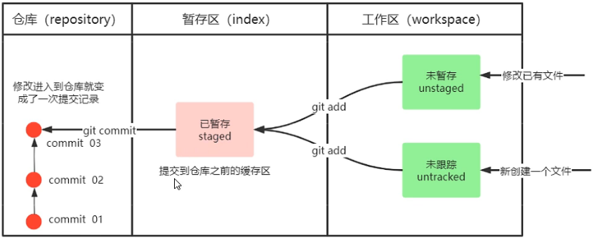

# Git从入门到精通

## 基本使用

- ### 下载git

[Git (git-scm.com)](https://git-scm.com/)

- ### 设置个用户名和邮箱[一次即可]

```xml
git config --global user.name "xxxx"
git config --global user.email "xxxx@qq.com"
```

- ### 初始化仓库

```xml
git init
```

- ### 过程图




- ### 基本命令

```xml
git init //初始化仓库
git status	//查看状态
git add [文件名]	//添加到暂存区
git commit -m "xxx"	//提交到本地仓库
git reflog	//简介查看日志
git reset --hard [版本号]	//返回历史版本
```

> 分支操作

```xml
git branch [分支名]	//创建分支
git branch -v	//查看分支
git branch -d [分支名]	//删除本地分支
git branch -b [分支名] [远程地址]	//克隆指定分支
git checkout [分支名]	//切换分支
git merge [分支名]	//合并分支，把输入的分支合并到当前分支
```

> 远程仓库

```xml
git remote add [别名] [远程地址]	//创建别名
git remote -v	//查看别名
git push [别名|地址] [分支]	//推送到远程仓库
git pull [别名|地址] [分支]	//拉取代码到本地仓库 
git clone [别名|地址] [分支]	//克隆别人的代码到本地仓库

pull和clone的区别：pull是本地有版本库存在的情况，拉取最新的代码合并到本地库。clone是本地啥都没有，直接将代码下载下来
```

## IDEA集成Git

### 设置忽略文件【可选】

- **创建git.ignore文件**

```
*.class

*.log

*.ctxt

.mtj.tmp/

*.jar
*.war
*.nar
*.ear
*.zip
*.tar.gz
*.rar

hs_err_pid*

.classpath
.project
.settings
target
.idea
*.iml
```

- 配置.gitconfig文件

> 文件在C:\Users\HP

```
[user]
	name = Sky
	email = 1146285187@qq.com
[core]
	excludesfile = C:/Users/HP/git.ignore
```

### IEDA集成配置

- **IDEA配置git**

> settings中找到git，选择git.exe文件位置，点击test后点击apply，出现版本表示成功

- **在菜单栏找到VCS里面的创建git仓库选项**

- **后面进行正常操作即可**

> **详细操作请看**https://www.bilibili.com/video/BV1vy4y1s7k6

## GitLab

https://www.bilibili.com/video/BV1vy4y1s7k6?p=41&t=320.3

## 实例教程

### 拉取远程仓库并且推送

```xml
git init //初始化
git pull https://gitee.com/sky6600/noteRep.git 你的分支名  //拉取远程仓库
git add .   //添加暂存区
git commit -m "xxxx"   //提交到本地仓库
git branch "你的分支名"   //创建你的分支
git push https://gitee.com/sky6600/noteRep.git 你的分支名 //推送你的分支到远程对应分支
```

