# Spring框架

## 内容目录

[TOC]

## 收获

> **基于SpringBoot实现基础SSM框架整合**
>
> **掌握第三方技术与SpringBoot整合思想**             

## 优点

> **简化开发，降低企业级开发的复杂性**
>
> **框架整合，高效整合其他技术，提高企业级应用开发与运行效率**

## 核心概念

**IoC（Inversion of Control）控制反转**

> **使用对象时，由主动new产生对象转换为由外部提供对象，此过程中对象创建控制权由程序转移到外部，此思想称为控制反转**

**Bean**

> **Ioc容器负责对象的创建、初始化等一系列工作，被创建或被管理的对象在Ioc容器中统称为Bean**


## Spring的发展

------


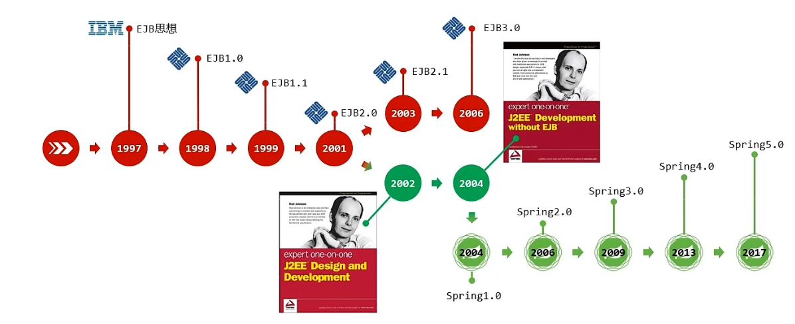

## Spring Framework系统架构图

------

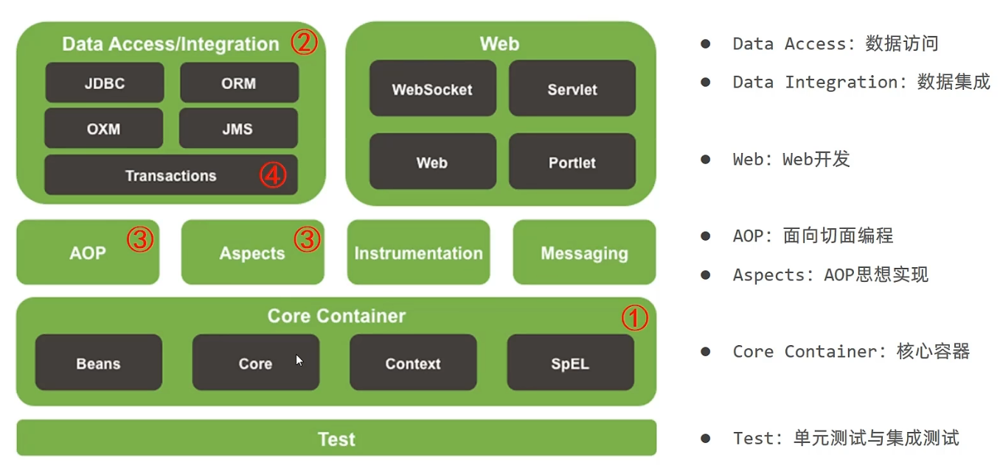

## XML配置文件开发

### IoC入门案例

- **导入Spring依赖**

```xml
<dependency>
    <groupId>org.springframework</groupId>
    <artifactId>spring-context</artifactId>
    <version>5.3.19</version>
</dependency>
```

- **创建Spring配置文件 名称一般为applicationContext.xml**

```xml
<bean id="bookDao" class="dao.BookDaoImpl"></bean>
```

- **初始化Ioc容器**

```java
//获取ioc容器
ClassPathXmlApplicationContext ctx = new ClassPathXmlApplicationContext("applicationContext.xml");
//获得bean
BookDao bookDao = (BookDao) ctx.getBean("bookDao");
//执行
bookDao.save();
```

### DI入门案例

- **删除使用new的形式创建对象的代码**
- **在service层提供setter方法**

```java
public void setBookDao(BookDao bookDao) {
    this.bookDao = bookDao;
}
```

- **绑定service与dao之间的关系**

```xml
<bean id="bookDao" class="dao.BookDaoImpl"/>
    <bean id="bookService" class="service.BookServiceImpl">
<!--第一个bookDao指代变量名称  第二个bookDao指代bean的id-->
        <property name="bookDao" ref="bookDao"></property>
    </bean>
```

### bean的各种属性关键字解释

- **name（起别名）**

> **service2和service3都与bookService等同**

```xml
<bean id="bookService" name="service2 service3" class="service.BookServiceImpl">
<!--第一个bookDao指代变量名称  第二个bookDao指代bean的id-->
        <property name="bookDao" ref="bookDao"></property>
    </bean>
```

- **scope（设置单例or非单例）**

> 单例

```xml
<bean id="bookDao" class="dao.BookDaoImpl" scope="singleton"/>
```

> 非单例

```xml
<bean id="bookDao" class="dao.BookDaoImpl" scope="prototype"/>
```

- **其他**

------


**适合交给容器进行管理的bean**

> *表现层对象*
>
> *业务层对象*
>
> *数据层对象*
>
> *工具对象*

**不适合交给容器进行管理的bean**

> *封装实体的域对象*

### bean的实例化

- **构造方法**

  > 提供可访问的构造方法，若无参构造方法如果不存在，将抛出异常BeanCreationException

  - 配置

  ```xml
  <bean id="bookDao" class="dao.BookDaoImpl"/>
  ```

- **静态工厂**

  - 配置

  ```xml
  <bean id="orderDao" class="skyblog.factory.OrderDaoFactory" factory-method="getorderDao/>
  ```

- **实例工厂**

  - 配置

  ```xml
  <bean id="userFactory" class="skyblog.factory.UserDaoFactory"/>
  <bean id="userDao" factory-method="getuserDao" factory-bean="userFactory"/>
  ```

- **FactoryBean**

  - **配置**

  ```xml
  <bean id="bookDao" class="factory.bookDaoFactoryBean"></bean>
  ```

  - **工厂代码部分**

  ```java
  public class bookDaoFactoryBean implements FactoryBean<BookDao> {//泛型填要创建的bean
  
      @Override
      public BookDao getObject() throws Exception {
          return new BookDaoImpl();
      }
  
      @Override
      public Class<?> getObjectType() {
          return BookDao.class;
      }
  }
  ```

### bean的生命周期

### 生命周期流程

- **初始化容器**

> 1.创建对象（内存分配）
>
> 2.执行构造方法
>
> 3.执行属性注入（set操作）
>
> 4.执行bean初始化方法

- **使用bean**

> 1.执行业务操作

- **关闭/销毁容器**

> 1.执行bean销毁方法

### 生命周期的控制

- **方法一(实现接口法)**

> **主函数代码**

```java
public static void main(String[] args) {
        //获取ioc容器
        ClassPathXmlApplicationContext ctx = new ClassPathXmlApplicationContext("applicationContext.xml");
        //设置关闭钩子
        ctx.registerShutdownHook();
        //获得bean
//        BookDao bookDao = (BookDao) ctx.getBean("bookDao");
        BookService bookService = (BookService) ctx.getBean("bookService");
        //执行
        bookService.save();
    }
```

> **配置**

```xml
<bean id="bookDao" class="dao.BookDaoImpl"></bean>
<bean id="bookService" class="service.BookServiceImpl">
    <property name="bookDao" ref="bookDao"></property>
</bean>
```

> **Service层**

```java
public class BookServiceImpl implements BookService, InitializingBean, DisposableBean {//实现两个接口
    private BookDao bookDao;

    public void setBookDao(BookDao bookDao) {
        this.bookDao = bookDao;
    }

    @Override
    public void save() {
        System.out.println("service...");
        bookDao.save();
    }


    @Override
    public void destroy() throws Exception {
        System.out.println("bean销毁ing");
    }

    @Override
    public void afterPropertiesSet() throws Exception {
        System.out.println("bean初始化ing");
    }
}
```

> **Dao层代码实现**

```java
public class BookDaoImpl implements BookDao{
    @Override
    public void save() {
        System.out.println("Dao...");
    }
}
```

- 方法二(配置法)

> init-method
> destroy-method

### bean的获取

- 使用bean名称获取

```java
BookDao bookDao = (BookDao) ctx.getBean("bookDao");
```

- 使用bean名称获取指定类型

```java
BookDao bookDao = ctx.getBean("bookDao", BookDao.class);
```

- 使用bean类型获取

> 只能有一个同类型的bean

```
BookDao bookDao = ctx.getBean(BookDao.class);
```

### 依赖注入方式

### setter注入

- **删除使用new的形式创建对象的代码**

- **在service层提供setter方法**

```java
public void setBookDao(BookDao bookDao) {
  this.bookDao = bookDao;
}
```

- **绑定service与dao之间的关系**

```xml
<bean id="bookDao" class="dao.BookDaoImpl"/>
    <bean id="bookService" class="service.BookServiceImpl">
<!--第一个bookDao指代变量名称  第二个bookDao指代bean的id-->
        <property name="bookDao" ref="bookDao"></property>
    </bean>	
```

### 构造器注入

- **提供一个有参构造器**

```java
public BookServiceImpl(BookDao bookDao) {
    this.bookDao = bookDao;
}
```

- **配置**

```xml
<bean id="bookDao" class="dao.BookDaoImpl"></bean>
<bean id="bookService" class="service.BookServiceImpl">
    <!--第一个bookDao指代构造器形参名称  第二个bookDao指代bean的id-->
    <constructor-arg name="bookDao" ref="bookDao"></constructor-arg>
</bean>
```

> **解决参数重复问题**

```xml
<bean id="bookDao" class="com.itheima.dao.impl.BookDaoImpl">
 <!--index代表参数位置-->
<constructor-arg index="0" value="mysq1"/>
<constructor-arg index="1" value="100"/>
</bean>
```

### 自动装配

> 需要setter方法
>
> 自动装配用于引用类型依赖注入，不能对简单类型进行操作
> 使用按类型装配时（byType）必须保障容器中相同类型的bean唯一，推荐使用
> 使用按名称装配时（byName）必须保障容器中具有指定名称的bean，因变量名与配置耦合，不推荐使用
> 自动装配优先级低于setter注入与构造器注入，同时出现时自动装配配置失效

```xml
<bean id="bookDao" class="dao.BookDaoImpl"></bean>
<bean id="bookService" class="service.BookServiceImpl" autowire="byType"></bean>
```

### 各种集合注入

```xml
<bean id="bookDao"class="dao.bookDao">
	<property name="array">
        <array>
            <value>100</value>
            <value>200</value>
            <value>300</value>
        </array>
    </property>
    <property name="list">
        <list>
            <value>sky</value>
            <value>666</value>
            <value>300</value>
        </list>
    </property>
    <property name="map">
        <map>
            <entry key="country" value="china"/>
            <entry key="province" value="henan"/>
            <entry key="city" value="kaifeng"/>
        </map>
    </property>
    <property name="properties">
        <props>
            <prop key="country">china</prop>
            <prop key="province">henan</prop>
            <prop key="city">kaifengk</prop>
        </props>
    </property>
</bean>
```

- **依赖注入器的选择**

> 1.强制依赖使用构造器进行，使用setteri注入有概率不进行注入导致null对象出现
> 2.可选依赖使用setter注入进行，灵活性强
> 3.Spring框架倡导使用构造器，第三方框架内部大多数采用构造器注入的形式进行数据初始化，相对严谨
> 4.如果有必要可以两者同时使用，使用构造器注入完成强制依赖的注入，使用setter注入完成可选依赖的注入
> 5.实际开发过程中还要根据实际情况分析，如果受控对象没有提供setter方法就必须使用构造器注入
> 6.自己开发的模块推荐使用setter注入

## 注解开发

### 基本注解开发【有配置文件形式】

- **关键词**
  - **@Controller:用于表现层bean定义**
  - **@Service:用于业务层bean定义**
  - **@Repository:用于数据层bean定义**

- **配置**

```xml
<context:component-scan base-package="dao"></context:component-scan>
```

-  **主函数代码实现**

```java
public static void main(String[] args) {
    //获取ioc容器
    ClassPathXmlApplicationContext ctx = new ClassPathXmlApplicationContext("applicationContext.xml");
    //设置关闭钩子
    ctx.registerShutdownHook();
    //获得bean bookDao这个名字要和注解对应
    BookDao bookDao = ctx.getBean("bookDao", BookDao.class);
    //执行
    bookDao.save();
}
```

- **数据层代码实现**

```java
@Repository("bookDao")//名字要和注解对应
public class BookDaoImpl implements BookDao{
    @Override
    public void save() {
        System.out.println("Dao...");
    }
}
```

### 高阶注解开发【无配置文件形式】

- **写配置类**

```java
@Configuration//相当于配置文件中的默认内容
@ComponentScan("dao")//相当于扫描器代码
public class SpringConfig {
}
```

- **主函数代码实现**

```java
public static void main(String[] args) {
    //注解开发加载配置类
    AnnotationConfigApplicationContext ctx = new AnnotationConfigApplicationContext(SpringConfig.class);
    BookDao bookDao = ctx.getBean("bookDao", BookDao.class);
    bookDao.save();
}
```

- **数据层代码实现**

```java
@Repository("bookDao")
public class BookDaoImpl implements BookDao{
    @Override
    public void save() {
        System.out.println("Dao...");
    }
}
```

- **控制生命周期代码实现**

```java
@Repository("bookDao2")
public class BookDaoImpl implements BookDao{
    @Override
    public void save() {
        System.out.println("Dao...");
    }

    @PreDestroy
    public void destroy() throws Exception {
        System.out.println("bean销毁ing");
    }

    @PostConstruct
    public void afterPropertiesSet() throws Exception {
        System.out.println("bean初始化ing");
    }
}
```

### 注解依赖注入

- **主函数实现代码**

```java
public static void main(String[] args) {
        //注解开发加载配置类
        AnnotationConfigApplicationContext ctx = new AnnotationConfigApplicationContext(SpringConfig.class);
        ctx.registerShutdownHook();
        BookService bookService = ctx.getBean("bookService", BookService.class);
        bookService.save();
    }
```

- **Service层代码实现**

```java
@Service("bookService")
public class BookServiceImpl implements BookService {
    @Autowired//自动装配，默认按类型
    @Qualifier("bookDao2")//自动装配按名称
    private BookDao bookDao;

    @Override
    public void save() {
        System.out.println("service...");
        bookDao.save();
    }
}
```

- **Dao层代码实现**

```java
@Repository("bookDao2")//名字要与service层对应
public class BookDaoImpl implements BookDao{
    @Override
    public void save() {
        System.out.println("Dao...");
    }

    @PreDestroy
    public void destroy() throws Exception {
        System.out.println("bean销毁ing");
    }

    @PostConstruct
    public void afterPropertiesSet() throws Exception {
        System.out.println("bean初始化ing");
    }
}
```

- **其他**

> 使用@Value可以实现简单类型注入 

```java
@Value("sky")
private String string; 
```

> 使用@PropertySource("xxx.properties")实现配置注入

```java
@Value("${name}")
private String string;
```

###  注解开发管理第三方bean

> 以注解开发Druid第三方bean为例

- **导入druid包**

```xml
<dependency>
    <groupId>com.alibaba</groupId>
    <artifactId>druid</artifactId>
    <version>1.2.11</version>
</dependency>
```

- **SpringConfig配置**

```java
@Configuration
@ComponentScan({"service","dao","aop"})
@Import(jdbcConfig.class)//导入相应的类，方便spring识别
public class SpringConfig {
}
```

- **jdbcConfig类**

```java
public class jdbcConfig {
    @Bean("dataSource")//声明为bean
    public DataSource dataSource(){
        DruidDataSource ds = new DruidDataSource();
        ds.setDriverClassName("com.mysql.jdbc.Driver");
        ds.setUrl("jdbc:mysql://localhost:3306/db1");
        ds.setUsername("root");
        ds.setPassword("root");
        return ds;
    }
}
```

- **主函数代码实现**

```java
public class App {
    public static void main(String[] args) {
        //注解开发加载配置类
        AnnotationConfigApplicationContext ctx = new AnnotationConfigApplicationContext(SpringConfig.class);
        DataSource dataSource = ctx.getBean("dataSource", DataSource.class);
        System.out.println(dataSource);
    }
}
```

### 第三方bean依赖注入方法

- **简单类型**

```java
public class jdbcConfig {
    @Value("com.mysql.jdbc.Driver")
    private String driver;
    @Value("jdbc:mysql://localhost:3306/db1")
    private String url;
    @Value("root")
    private String userName;
    @Value("root")
    private String passWord;
    
    @Bean("dataSource")
    public DataSource dataSource(){
        DruidDataSource druidDataSource = new DruidDataSource();
        druidDataSource.setDriverClassName(driver);
        druidDataSource.setUrl(url);
        druidDataSource.setUsername(userName);
        druidDataSource.setPassword(passWord);
        return druidDataSource;
    }
}
```

- **引用类型**

> 引用类型注入直接在方法参数里面写要注入的形参，spring会自动按类型注入

```java
public class jdbcConfig {
    @Value("com.mysql.jdbc.Driver")
    private String driver;
    @Value("jdbc:mysql://localhost:3306/db1")
    private String url;
    @Value("root")
    private String userName;
    @Value("root")
    private String passWord;

    @Bean("dataSource")
    public DataSource dataSource(BookDaoImpl bookDao){//引用数据类型注入直接写要注入的类型
        System.out.println(bookDao);
        DruidDataSource druidDataSource = new DruidDataSource();
        druidDataSource.setDriverClassName(driver);
        druidDataSource.setUrl(url);
        druidDataSource.setUsername(userName);
        druidDataSource.setPassword(passWord);
        return druidDataSource;
    }
}
```

## Spring整合Mybatis

[黑马程序员2022最新SSM框架教程_Spring+SpringMVC+Maven高级+SpringBoot+MyBatisPlus企业实用开发技术_哔哩哔哩_bilibili](https://www.bilibili.com/video/BV1Fi4y1S7ix?p=29&vd_source=d6945470e58840da44f64f5dc572e207)

## AOP面向切片

### 概念

> AOP（Apect Oriented Programming）面向切面编程，一种编程范式，指导开发者如何组织程序结构

### 本质

> 代理模式

### 核心概念

- **连接点（Join Point）**：程序执行过程中的任意位置，粒度为执行方法、抛出异常、设置变量等

> 往SpringAOP中，理解为方法的执行。

- **切入点（Point cut）**：匹配连接点的式子

> 在SpringAOP中，一个切入点可以只描述一个具体方法，也可以匹配多个方法
>
> 一个具体方法：com.itheima.dao包下的BookDao接口中的无形参无返回值的save方法
>
> 匹配多个方法：所有的save方法，所有的get开头的方法，所有以Dao结尾的接口中的任意方法，所有带有一个参数的方法

- **通知（Advice）**：在切入点处执行的操作，也就是共性功能

> 在SpringAOP中，功能最终以方法的形式呈现

- **通知类**：定义通知的类

- **切面（Aspect）**：描述通知与切入点的对应关系

### 示意图

------

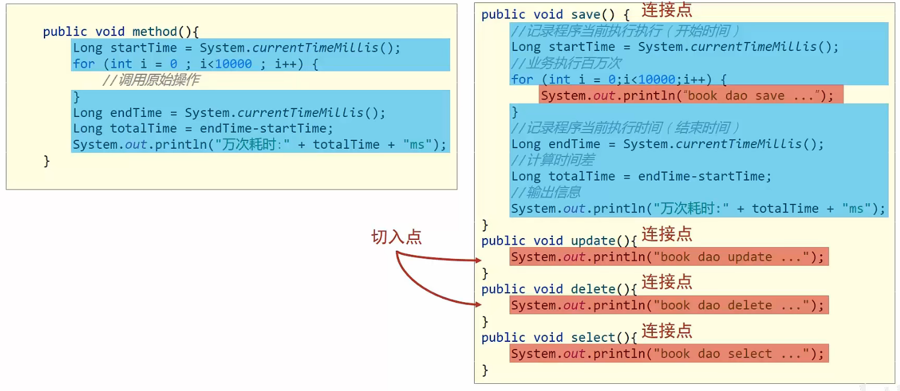

###  AOP入门案例

-  **导入依赖**

```xml
<dependency>
    <groupId>org.aspectj</groupId>
    <artifactId>aspectjweaver</artifactId>
    <version>1.9.9.1</version>
</dependency>
```

- **修改SpingConfig类**

```java
@Configuration//基本参数
@ComponentScan({"service","dao","aop"})//扫描这几个包里面的bean
@EnableAspectJAutoProxy//注解开发aop
public class SpringConfig {
}
```

- **写AOP核心类**

```java
@Component//告诉spring这是个bean，受spring控制
@Aspect//提醒spring这是个aop
public class MyAop {
    //设置切入点 后面写返回值和方法
    @Pointcut("execution(void dao.BookDaoImpl.update())")
    private void pt(){}
	//在前面插入该代码的意思
    @Before("pt()")
    public void method(){
        System.out.println(new Date());
    }
}
```

### AOP切入点表达式

------

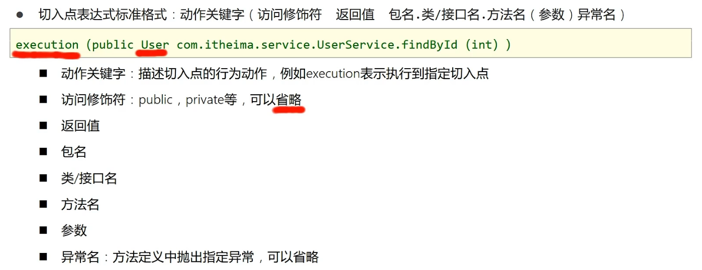

------


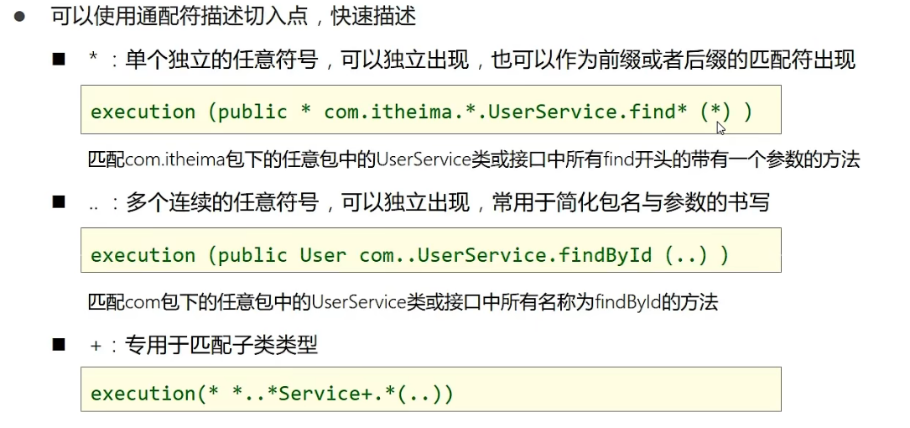

### AOP通知类型

- **前置通知**

------

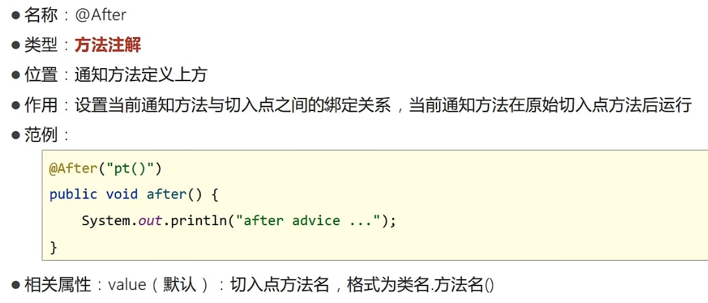

- **后置通知**

> 类似前置

- **环绕通知**

------

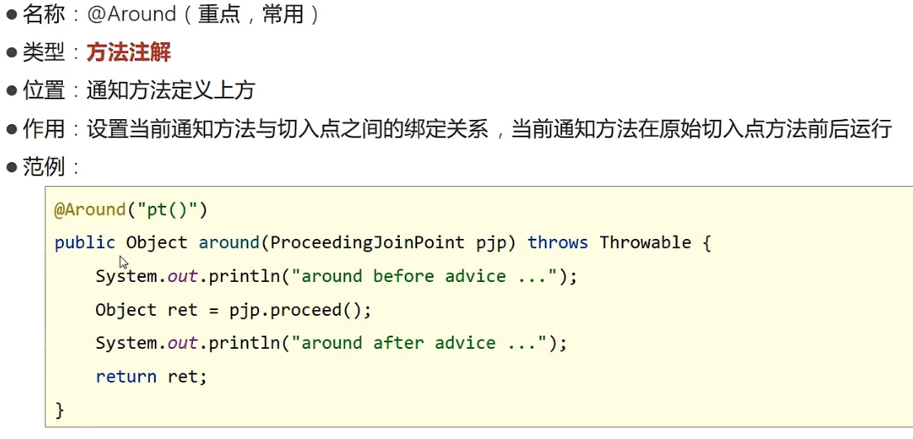

> 注意事项

------

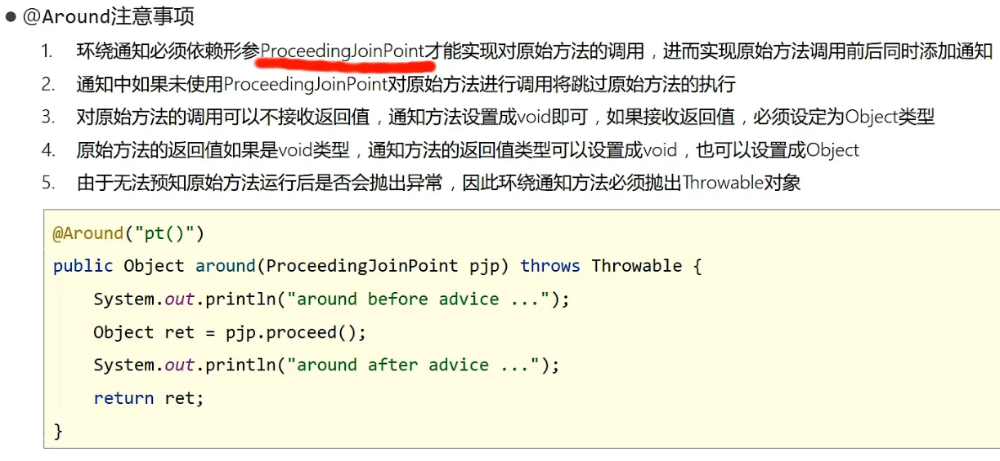

### AOP通知获取参数

------

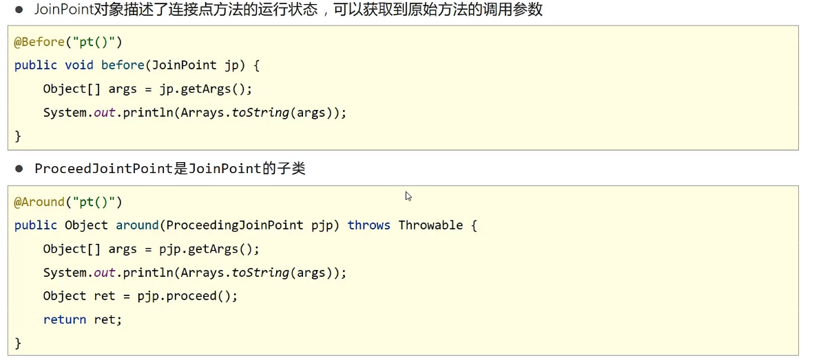

------

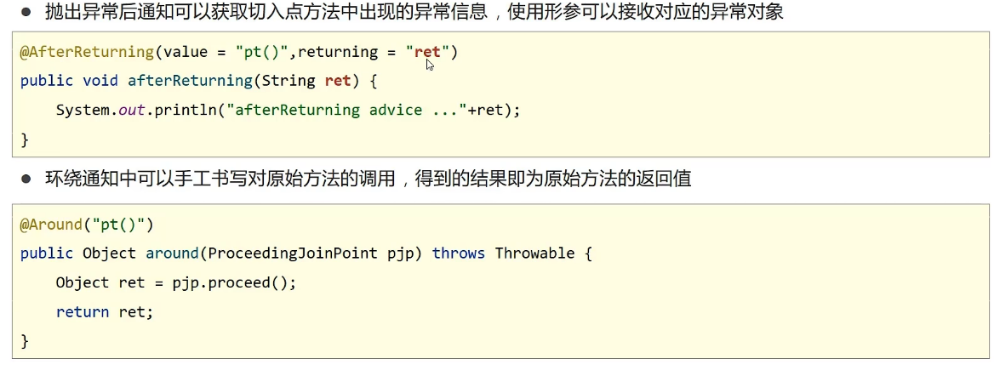

------

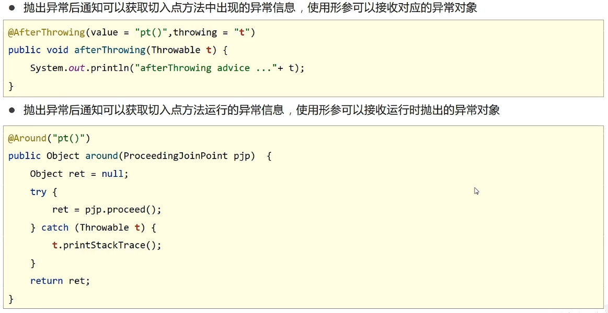

## Spring事物

[黑马程序员2022最新SSM框架教程_Spring+SpringMVC+Maven高级+SpringBoot+MyBatisPlus企业实用开发技术_哔哩哔哩_bilibili](https://www.bilibili.com/video/BV1Fi4y1S7ix?p=40&vd_source=d6945470e58840da44f64f5dc572e207)

## SpringMVC

### 入门案例

- 导入依赖

```xml
<!-- https://mvnrepository.com/artifact/org.springframework/spring-webmvc -->
<dependency>
    <groupId>org.springframework</groupId>
    <artifactId>spring-webmvc</artifactId>
    <version>5.3.21</version>
</dependency>

<!-- https://mvnrepository.com/artifact/javax.servlet/javax.servlet-api -->
<dependency>
    <groupId>javax.servlet</groupId>
    <artifactId>javax.servlet-api</artifactId>
    <version>3.1.0</version>
    <scope>provided</scope>
</dependency>
```

- UserController类

```java
@Controller
public class UserController {

    @RequestMapping("/save")
    @ResponseBody//加上表示响应成json，不加表示响应页面
    public String save(){
        System.out.println("user save ....");
        return "{'flag':'true'}";
    }
}
```

- 新建springMvcConfig类

```java
@Configuration
@ComponentScan("controller")
public class SpringMvcConfig {
}
```

- 设置ServletConfig配置

```java
public class ServletContainerslnitConfig extends AbstractDispatcherServletInitializer {
    @Override
    protected WebApplicationContext createServletApplicationContext() {
        //加载springmvc配置
        AnnotationConfigWebApplicationContext ctx = new AnnotationConfigWebApplicationContext();
        ctx.register(SpringMvcConfig.class);
        return ctx;
    }

    @Override
    protected String[] getServletMappings() {
        //设置哪些请求归属springmvc处理
        return new String[]{"/"};
    }

    @Override
    protected WebApplicationContext createRootApplicationContext() {
        //加载spring配置
        return null;
    }
}
```

### SpringMVC请求

- 导入依赖 用于json的相互转化

```xml
<dependency>
    <groupId>com.fasterxml.jackson.core</groupId>
    <artifactId>jackson-databind</artifactId>
    <version>2.13.3</version>
</dependency>
```

> 接收json数据并且封装到pojo里

```java
@Controller
public class UserSendMsg {
    @RequestMapping("/save")
    @ResponseBody//加上表示响应成json，不加表示响应页面
    public String save(@RequestBody User user){//重点@RequestBody
        System.out.println(user.getName());
        return "ok";
    }
}
```

```json
//前端传参
{
    "name": "hhh",
    "age": 14
}
```

> 接收日期格式

```java
@Controller
public class UserSendMsg {
    @RequestMapping("/save")
    @ResponseBody//加上表示响应成json，不加表示响应页面
    public String save(Date date,@DateTimeFormat(pattern = "yyyy-MM-dd HH:mm:ss") Date date1){
        System.out.println(date);
        System.out.println(date1);
        return "ok";
    }
}
```

*前端传参*

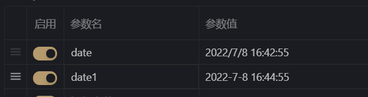

### SpringMVC响应

>  响应页面

```java
@Controller
public class UserSendMsg {
    @RequestMapping("/toPage")
    public String save(){
        return "index.jsp";
    }
}
```

> 响应文本 

```java
@Controller
public class UserSendMsg {
    @RequestMapping("/toText")
    @ResponseBody//加上表示响应成json，不加表示响应页面
    public String save(){
        return "TextOK";
    }
}
```

> 响应json(POJO转json)

```java
@Controller
public class UserSendMsg {
    @RequestMapping("/toJsonPOJO")
    @ResponseBody
    public User save(){
        User sky = new User("sky", 18);
        return sky;
    }
}
```

> 响应json(集合转json)

> 同理。。。

## REST风格

- **简介**

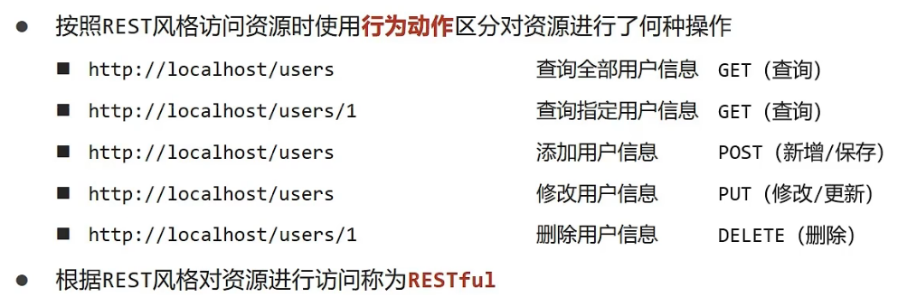

- **入门案例**

```java
@Controller
public class UserSendMsg {
	//保存
    @RequestMapping(value = "/users",method = RequestMethod.POST)
    @ResponseBody
    public String save(){
        System.out.println("users save ......");
        return "OK";
    }
	//删除
    @RequestMapping(value = "/users/{id}",method = RequestMethod.DELETE)
    @ResponseBody
    public String delete(@PathVariable Integer id){//id从路径里面来
        System.out.println("users delete ......"+id);
        return "OK";
    }
	//修改
    @RequestMapping(value = "/users/{id}",method = RequestMethod.PUT)
    @ResponseBody
    public String update(@PathVariable Integer id){//id从路径里面来
        System.out.println("users update ......"+id);
        return "OK";
    }
    //查询
    @RequestMapping(value = "/users/{id}",method = RequestMethod.GET)
    @ResponseBody
    public String getById(@PathVariable Integer id){//id从路径里面来
        System.out.println("users getById ......"+id);
        return "OK";
    }
	//查询
    @RequestMapping(value = "/users",method = RequestMethod.GET)
    @ResponseBody
    public String getAll(){
        System.out.println("users getAll ......");
        return "OK";
    }
}
```

> 入门案例化简

```java
//@Controller
//@ResponseBody
@RestController
@RequestMapping("/users")
public class UserSendMsg {

    @PostMapping
    public String save(){
        System.out.println("users save ......");
        return "OK";
    }

    @DeleteMapping("/{id}")
    public String delete(@PathVariable Integer id){//id从路径里面来
        System.out.println("users delete ......"+id);
        return "OK";
    }

    @PutMapping("/{id}")
    public String update(@PathVariable Integer id){
        System.out.println("users update ......"+id);
        return "OK";
    }

    @GetMapping("/{id}")
    public String getById(@PathVariable Integer id){
        System.out.println("users getById ......"+id);
        return "OK";
    }

    @GetMapping
    public String getAll(){
        System.out.println("users getAll ......");
        return "OK";
    }
}
```

## SSM整合配置

- **基本文件结构**

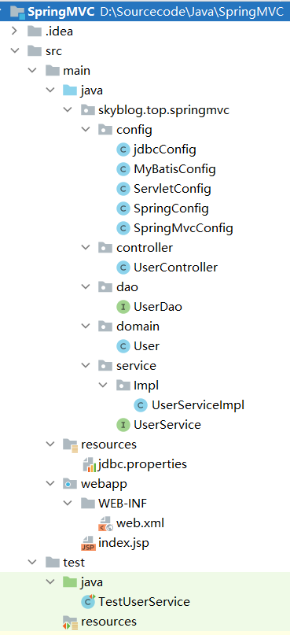

- **依赖**

```xml
<dependencies>
        <!-- https://mvnrepository.com/artifact/org.springframework/spring-webmvc -->
        <dependency>
            <groupId>org.springframework</groupId>
            <artifactId>spring-webmvc</artifactId>
            <version>5.3.21</version>
        </dependency>
        <dependency>
            <groupId>org.springframework</groupId>
            <artifactId>spring-jdbc</artifactId>
            <version>5.3.21</version>
        </dependency>
        <!-- https://mvnrepository.com/artifact/org.springframework/spring-test -->
        <dependency>
            <groupId>org.springframework</groupId>
            <artifactId>spring-test</artifactId>
            <version>5.3.21</version>
            <scope>test</scope>
        </dependency>
        <!-- https://mvnrepository.com/artifact/org.mybatis/mybatis -->
        <dependency>
            <groupId>org.mybatis</groupId>
            <artifactId>mybatis</artifactId>
            <version>3.5.10</version>
        </dependency>
        <!-- https://mvnrepository.com/artifact/org.mybatis/mybatis-spring -->
        <dependency>
            <groupId>org.mybatis</groupId>
            <artifactId>mybatis-spring</artifactId>
            <version>2.0.7</version>
        </dependency>
        <!-- https://mvnrepository.com/artifact/com.alibaba/druid -->
        <dependency>
            <groupId>com.alibaba</groupId>
            <artifactId>druid</artifactId>
            <version>1.2.11</version>
        </dependency>
        <!-- https://mvnrepository.com/artifact/javax.servlet/javax.servlet-api -->
        <dependency>
            <groupId>javax.servlet</groupId>
            <artifactId>javax.servlet-api</artifactId>
            <version>4.0.1</version>
            <scope>provided</scope>
        </dependency>
        <!-- https://mvnrepository.com/artifact/com.fasterxml.jackson.core/jackson-databind -->
        <dependency>
            <groupId>com.fasterxml.jackson.core</groupId>
            <artifactId>jackson-databind</artifactId>
            <version>2.13.3</version>
        </dependency>
        <!-- https://mvnrepository.com/artifact/mysql/mysql-connector-java -->
        <dependency>
            <groupId>mysql</groupId>
            <artifactId>mysql-connector-java</artifactId>
            <version>8.0.29</version>
        </dependency>
        <dependency>
            <groupId>junit</groupId>
            <artifactId>junit</artifactId>
            <version>4.13.2</version>
            <scope>test</scope>
        </dependency>
    </dependencies>
```

- **jdbc.properties**

```xml
jdbc.driver = com.mysql.jdbc.Driver
jdbc.url = jdbc:mysql://localhost:3306/db1
jdbc.username=root
jdbc.password=123456
```

- **jdbcConfig.java**

```java
import com.alibaba.druid.pool.DruidDataSource;
import org.springframework.beans.factory.annotation.Value;
import org.springframework.context.annotation.Bean;

import javax.sql.DataSource;

public class jdbcConfig {
    @Value("${jdbc.driver}")
    private String driver;
    @Value("${jdbc.url}")
    private String url;
    @Value("${jdbc.username}")
    private String username;
    @Value("${jdbc.password}")
    private String password;

    @Bean
    public DataSource dataSource(){
        DruidDataSource druidDataSource = new DruidDataSource();
        druidDataSource.setDriverClassName(driver);
        druidDataSource.setUrl(url);
        druidDataSource.setUsername(username);
        druidDataSource.setPassword(password);
        return  druidDataSource;
    }
}
```

- **MyBatisConfig.java**

```java
import org.mybatis.spring.SqlSessionFactoryBean;
import org.mybatis.spring.mapper.MapperScannerConfigurer;
import org.springframework.context.annotation.Bean;

import javax.sql.DataSource;

public class MyBatisConfig {
    @Bean
    public SqlSessionFactoryBean sqlSessionFactoryBean(DataSource dataSource){
        SqlSessionFactoryBean factoryBean = new SqlSessionFactoryBean();
        factoryBean.setDataSource(dataSource);
        factoryBean.setTypeAliasesPackage("skyblog.javaframe.domain");//类型别名
        return factoryBean;
    }

    @Bean
    public MapperScannerConfigurer mapperScannerConfigurer(){
        MapperScannerConfigurer msc = new MapperScannerConfigurer();
        msc.setBasePackage("skyblog.javaframe.dao");
        return msc;
    }
}
```

- **ServletConfig.java**

```java
import org.springframework.web.context.WebApplicationContext;
import org.springframework.web.context.support.AnnotationConfigWebApplicationContext;
import org.springframework.web.servlet.support.AbstractDispatcherServletInitializer;

public class ServletConfig extends AbstractDispatcherServletInitializer {
    @Override
    protected WebApplicationContext createServletApplicationContext() {
        //加载springmvc配置
        AnnotationConfigWebApplicationContext ctx = new AnnotationConfigWebApplicationContext();
        ctx.register(SpringMvcConfig.class);
        return ctx;
    }

    @Override
    protected String[] getServletMappings() {
        //设置哪些请求归属springmvc处理
        return new String[]{"/"};
    }

    @Override
    protected WebApplicationContext createRootApplicationContext() {
        //加载spring配置
        return null;
    }
}
```

- **SpringConfig.java**

```java
@Configuration
@ComponentScan({"skyblog.javaframe.service"})
@PropertySource("jdbc.properties")
@Import({jdbcConfig.class,MyBatisConfig.class})
public class SpringConfig {
}
```

- **SpringMvcConfig.java**

```java
@Configuration
@ComponentScan("skyblog.javaframe.controller")
@EnableWebMvc
public class SpringMvcConfig {
}
```

- **UserDao**

```java
import org.apache.ibatis.annotations.Delete;
import org.apache.ibatis.annotations.Insert;
import org.apache.ibatis.annotations.Select;
import org.apache.ibatis.annotations.Update;
import skyblog.top.springmvc.domain.User;

import java.util.List;

public interface UserDao {
    @Insert("insert into user values(null,#{username},#{password})")
    public void save(User user);

    @Update("update user set username=#{username},password=#{password} where id=#{id}")
    public void update(User user);

    @Delete("delete from user where id=#{id}")
    public void delete(int id);

    @Select("select * from user where id=#{id}")
    public User getById(int id);

    @Select("select * from user")
    public List<User> getAll();
}
```

- **UserService**

```java
import skyblog.top.springmvc.domain.User;

import java.util.List;

public interface UserService {

    public boolean save(User user);

    public boolean update(User user);

    public boolean delete(int id);

    public User getById(int id);

    public List<User> getAll();
}
```

- **UserServiceImpl**

```java
import org.springframework.beans.factory.annotation.Autowired;
import org.springframework.stereotype.Service;
import skyblog.top.springmvc.dao.UserDao;
import skyblog.top.springmvc.domain.User;
import skyblog.top.springmvc.service.UserService;

import java.util.List;

@Service
public class UserServiceImpl implements UserService {
    @Autowired
    private UserDao userDao;

    @Override
    public boolean save(User user) {
        userDao.save(user);
        return true;
    }

    @Override
    public boolean update(User user) {
        userDao.update(user);
        return true;
    }

    @Override
    public boolean delete(int id) {
        userDao.delete(id);
        return true;
    }

    @Override
    public User getById(int id) {
        return userDao.getById(id);
    }

    @Override
    public List<User> getAll() {
        return userDao.getAll();
    }
}
```

- **UserController.java**

```java
import org.springframework.beans.factory.annotation.Autowired;
import org.springframework.stereotype.Controller;
import org.springframework.web.bind.annotation.*;
import skyblog.top.springmvc.domain.User;
import skyblog.top.springmvc.service.UserService;

import java.util.List;

@Controller
@ResponseBody
@RequestMapping("/users")
public class UserController {
    @Autowired
    private UserService userservice;

    @PostMapping
    public boolean save(@RequestBody User user) {
        System.out.println("新增被执行......");
        return userservice.save(user);
    }

    @PutMapping
    public boolean update(@RequestBody User user) {
        System.out.println("修改被执行......");
        return userservice.update(user);
    }

    @DeleteMapping("/{id}")
    public boolean delete(@PathVariable int id) {
        System.out.println("删除被执行......");
        return userservice.delete(id);
    }

    @GetMapping("/{id}")
    public User getById(@PathVariable int id) {
        System.out.println("通过id查询被执行......");
        return userservice.getById(id);
    }

    @GetMapping
    public List<User> getAll() {
        System.out.println("查询所有被执行......");
        return userservice.getAll();
    }
}
```

- **UserService测试**

```java
@RunWith(SpringJUnit4ClassRunner.class)
@ContextConfiguration(classes = SpringConfig.class)
public class TestUserService {
    @Autowired
    private UserService userService;

    @Test
    public void testGetById(){
        User byId = userService.getById(1);
        System.out.println(byId);
    }

    @Test
    public void testGetAll(){
        List<User> all = userService.getAll();
        System.out.println(all);
    }
}
```

- **Spring事物**

## Spring异常处理

### 异常处理方法

> 在controller包下创建一个类

```java
import org.springframework.web.bind.annotation.ExceptionHandler;
import org.springframework.web.bind.annotation.RestControllerAdvice;

@RestControllerAdvice//声明一个类作为异常处理器类
public class ProjectExceptionAdvice {
    @ExceptionHandler(Exception.class)//拦截异常
    public String doException(Exception e){
        System.out.println("出异常啦，哈哈哈哈");
        return "ERROR";
    }
}
```

### 异常处理方案

> 地址：https://www.bilibili.com/video/BV1Fi4y1S7ix?p=65&t=474.7

- **异常分类**

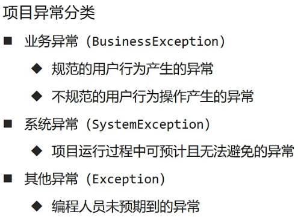

- **异常方案** 

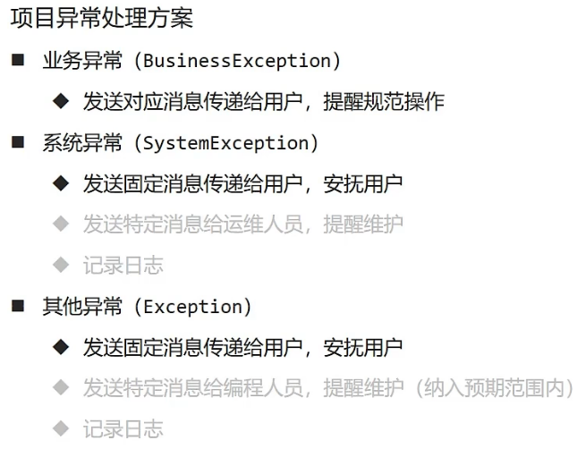

## Spring放行

> **config目录下建一个SpringMvcRelease类**

```java
import org.springframework.context.annotation.Configuration;
import org.springframework.web.servlet.config.annotation.ResourceHandlerRegistry;
import org.springframework.web.servlet.config.annotation.WebMvcConfigurationSupport;

@Configuration
public class SpringMvcRelease extends WebMvcConfigurationSupport {
    @Override
    protected void addResourceHandlers(ResourceHandlerRegistry registry) {
        registry.addResourceHandler("/pages/**").addResourceLocations("/pages/");
    }
}
```

> **SpringMvcConfig**

```java
import org.springframework.context.annotation.ComponentScan;
import org.springframework.context.annotation.Configuration;
import org.springframework.web.servlet.config.annotation.EnableWebMvc;

@Configuration
@EnableWebMvc
@ComponentScan({"skyblog.top.springmvc.controller","skyblog.top.springmvc.config"})
public class SpringMvcConfig {
}
```

## SpringMVC拦截器

### 入门案例

> 在controller目录下新建intercept目录，在其中创建ProJectInterceptor类作为拦截器

- **ProJectInterceptor类**

```java
import org.springframework.stereotype.Component;
import org.springframework.web.servlet.HandlerInterceptor;
import org.springframework.web.servlet.ModelAndView;

import javax.servlet.http.HttpServletRequest;
import javax.servlet.http.HttpServletResponse;

@Component
public class ProJectInterceptor implements HandlerInterceptor {
    @Override
    public boolean preHandle(HttpServletRequest request, HttpServletResponse response, Object handler) throws Exception {
        System.out.println("拦截前的操作......");
        return true;
    }

    @Override
    public void postHandle(HttpServletRequest request, HttpServletResponse response, Object handler, ModelAndView modelAndView) throws Exception {
        System.out.println("拦截后的操作......");
    }

    @Override
    public void afterCompletion(HttpServletRequest request, HttpServletResponse response, Object handler, Exception ex) throws Exception {
        System.out.println("完成后的操作......");
    }
}
```

- **SpringMvcRelease配置**

```java
import org.springframework.beans.factory.annotation.Autowired;
import org.springframework.context.annotation.Configuration;
import org.springframework.web.servlet.config.annotation.InterceptorRegistry;
import org.springframework.web.servlet.config.annotation.ResourceHandlerRegistry;
import org.springframework.web.servlet.config.annotation.WebMvcConfigurationSupport;
import skyblog.top.springmvc.controller.interceptor.ProJectInterceptor;

@Configuration
public class SpringMvcRelease extends WebMvcConfigurationSupport {
    @Autowired
    private ProJectInterceptor jectInterceptor;
    @Override
    protected void addResourceHandlers(ResourceHandlerRegistry registry) {
        registry.addResourceHandler("/pages/**").addResourceLocations("/pages/");
    }

    @Override
    protected void addInterceptors(InterceptorRegistry registry) {
        registry.addInterceptor(jectInterceptor).addPathPatterns("/users/*");
    }
}
```

### 拦截器的参数

> 略......

### 拦截器链的配置

> https://www.bilibili.com/video/BV1Fi4y1S7ix?p=74&t=429.5

