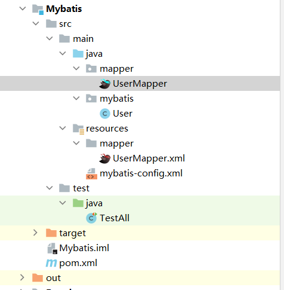

[TOC]

# JDBC

## 数据库链接

### 方法①

```java
public static void main(String[] args) throws SQLException {
        //创建驱动对象
        Driver driver = new Driver();
        //数据库链接地址
        String url = "jdbc:mysql://localhost:3306/db1";
        //
        Properties properties = new Properties();
        properties.setProperty("user","root");
        properties.setProperty("password","123456");
        //链接数据库
        Connection connect = driver.connect(url, properties);

        System.out.println(connect);

    }
```

### 方法②

```java
 public static void main(String[] args) throws ClassNotFoundException, InstantiationException, IllegalAccessException, SQLException {
        //使用反射获取Driver实现类
        Class aClass = Class.forName("com.mysql.jdbc.Driver");
        Driver driver = (Driver) aClass.newInstance();

        Properties properties = new Properties();
        properties.setProperty("user", "root");
        properties.setProperty("password", "123456");
        //数据库链接地址
        String url = "jdbc:mysql://localhost:3306/db1";
        //链接数据库
        Connection connect = driver.connect(url, properties);

        System.out.println(connect);

    }
```

### 方法③

```java
public static void main(String[] args) throws SQLException {
        //创建驱动
        Driver driver = new Driver();
        String url="jdbc:mysql://localhost:3306/db1";
        String password = "123456";
        String user = "root";
        //注册驱动
        DriverManager.registerDriver(driver);
        //链接数据库
        Connection connection = DriverManager.getConnection(url, user, password);
        System.out.println(connection);
        
    }
```

### 方法④

```java
public static void main(String[] args) throws ClassNotFoundException, SQLException {
        String url="jdbc:mysql://localhost:3306/db1";
        String password = "123456";
        String user = "root";
        Class.forName("com.mysql.jdbc.Driver");
        //无需注册驱动
        //DriverManager.registerDriver(driver);
        //链接数据库
        Connection connection = DriverManager.getConnection(url, user, password);
        System.out.println(connection);
    }
```

### 方法⑤

```java
public static void main(String[] args) throws IOException, ClassNotFoundException, SQLException {
        //读取配置文件
        InputStream is = ConnectionDemo5.class.getClassLoader().getResourceAsStream("jdbc.properties");

        Properties properties = new Properties();
        properties.load(is);

        String user = properties.getProperty("user");
        String password = properties.getProperty("password");
        String url = properties.getProperty("url");
        String classDriver = properties.getProperty("classDriver");
        //加载驱动（自动注册）
        Class.forName(classDriver);
        //链接数据库
        Connection connection = DriverManager.getConnection(url, user, password);

        System.out.println(connection);

    }
```

## 数据【增删改】通用

```java
/**
     * 通用增删改
     * @param args
     * @throws Exception
     */
    public static void main(String[] args) throws Exception {
        //定义sql语句
        String sql = "update emp set ename=? where id = ?";
        //传参
        ModifyTheDatabase(sql,"xixixi",13);
    }

    /**
     * 通用增删改方法实现
     * @param sql
     * @param args
     * @throws Exception
     */
    public static void ModifyTheDatabase(String sql,Object ...args) throws Exception {
        //连接数据库
        Connection connection = JDBCUtils.getConnection();
        //准备sql语句
        PreparedStatement preparedStatement = connection.prepareStatement(sql);
        //设置sql语句
        for (int i = 0; i < args.length; i++) {
            preparedStatement.setObject(i+1,args[i]);
        }
        //执行
        preparedStatement.execute();
        //释放资源
        JDBCUtils.colseResource(connection,preparedStatement);

    }
```

## 数据【单表查询】通用

```java
public static void main(String[] args) throws Exception {
        Emp result = null;
        try {
            //调用查询方法并传递？被替换后的参数
            result = queryToObject("select ename from emp where id = ?", 12);
        } catch (Exception e) {
            e.printStackTrace();
        }
        System.out.println(result);
    }

    private static Emp queryToObject(String sql, Object... args) throws Exception {
        //链接数据库
        Connection conn = JDBCUtils.getConnection();
        //日常准备sql
        PreparedStatement ps = conn.prepareStatement(sql);
        //为每个？替换参数
        for (int i = 0; i < args.length; i++) {
            ps.setObject(i + 1, args[i]);
        }
        //执行sql并且返回结果
        ResultSet resultSet = ps.executeQuery();
        //得到表的元数据
        ResultSetMetaData metaData = resultSet.getMetaData();
        //得到表有多少列
        int columnCount = metaData.getColumnCount();

        if (resultSet.next()) {
            Emp emp = new Emp();
            String columnName = null;
            for (int i = 0; i < columnCount; i++) {
                //得到对应列的值
                Object value = resultSet.getObject(i + 1);
                //得到列的名称
                columnName = metaData.getColumnName(i + 1);
                //通过反射得到Emp对应的类名的属性
                Field declaredField = Emp.class.getDeclaredField(columnName);
                //强制打开属性权限
                declaredField.setAccessible(true);
                //设置改属性的值为得到的对应列的值
                declaredField.set(emp, value);
            }
            //释放资源
            JDBCUtils.colseResource(conn, ps);
            //返回该对象
            return emp;

        }
        return null;

    }
```

## 数据【多表查询】通用

```java
/**
     * 通用表查询
     *
     * @param args
     */
    public static void main(String[] args) {
        try {
            //调用查询方法并传递？被替换后的参数
            Emp emp = queryToObject(Emp.class, "select * from emp where id = ?", 12);
            System.out.println(emp);
        } catch (Exception e) {
            e.printStackTrace();
        }
    }

    /**
     * 通用表查询实现
     *
     * @param clazz
     * @param sql
     * @param args
     * @param <T>
     * @return
     * @throws Exception
     */
    public static <T> T queryToObject(Class<T> clazz, String sql, Object... args) throws Exception {
        //链接数据库
        Connection conn = JDBCUtils.getConnection();
        //日常准备sql
        PreparedStatement ps = conn.prepareStatement(sql);
        //为每个？替换参数
        for (int i = 0; i < args.length; i++) {
            ps.setObject(i + 1, args[i]);
        }
        //执行sql并且返回结果
        ResultSet resultSet = ps.executeQuery();
        //得到表的元数据
        ResultSetMetaData metaData = resultSet.getMetaData();
        //得到表有多少列
        int columnCount = metaData.getColumnCount();

        if (resultSet.next()) {
            //通过反射来创建对象
            T t = clazz.newInstance();
            String columnName = null;
            for (int i = 0; i < columnCount; i++) {
                //得到对应列的值
                Object value = resultSet.getObject(i + 1);
                //得到列的名称
                columnName = metaData.getColumnName(i + 1);
                //通过反射得到Emp对应的类名的属性
                Field declaredField = Emp.class.getDeclaredField(columnName);
                //强制打开属性权限
                declaredField.setAccessible(true);
                //设置改属性的值为得到的对应列的值
                declaredField.set(t, value);
            }
            //释放资源
            JDBCUtils.colseResource(conn, ps);
            //返回该对象
            return t;

        }
        return null;

    }
```

## JDBCUtils工具类

```java
public class JDBCUtils {
    /**
     * 数据库链接实现方法
     *
     * @return
     * @throws Exception
     */
    public static Connection getConnection() throws Exception {
        //读取配置文件
        InputStream is = ClassLoader.getSystemClassLoader().getResourceAsStream("jdbc.properties");
        //加载配置文件到properties
        Properties properties = new Properties();
        properties.load(is);
        //获取文件对应内容
        String user = properties.getProperty("user");
        String password = properties.getProperty("password");
        String url = properties.getProperty("url");
        //链接数据库
        return DriverManager.getConnection(url, user, password);
    }

    /**
     * 资源释放方法实现
     *
     * @param connection
     * @param statement
     */

    public static void colseResource(Connection connection, Statement statement) {
        try {
            if (connection != null) {
                connection.close();
            }
        } catch (SQLException e) {
            e.printStackTrace();
        }
        try {
            if (statement != null) {
                statement.close();
            }
        } catch (SQLException e) {
            e.printStackTrace();
        }
    }
}
```

# Mybatis框架

> Mybatis官网：[mybatis – MyBatis 3 | 简介](https://mybatis.org/mybatis-3/zh/index.html)

## 初始准备

### 1.加入Mybatis依赖

```
<dependency>
    <groupId>org.mybatis</groupId>
    <artifactId>mybatis</artifactId>
    <version>3.5.9</version>
</dependency>
```

### 2.加入Mysql依赖

```
<dependency>
    <groupId>mysql</groupId>
    <artifactId>mysql-connector-java</artifactId>
    <version>8.0.28</version>
</dependency>
```

### 3.加入Junit依赖

```
<dependency>
    <groupId>junit</groupId>
    <artifactId>junit</artifactId>
    <version>4.12</version>
</dependency>
```

### 4.创建并且配置mybatis-config.xml

[alert class="danger"]该文件用于配置数据库链接的基本信息[/alert]

```java
<?xml version="1.0" encoding="UTF-8" ?>
<!DOCTYPE configuration
        PUBLIC "-//mybatis.org//DTD Config 3.0//EN"
        "http://mybatis.org/dtd/mybatis-3-config.dtd">
<configuration>
    <environments default="development">
        <environment id="development">
            <transactionManager type="JDBC"/>
            <dataSource type="POOLED">
                <property name="driver" value="com.mysql.jdbc.Driver"/>
                <property name="url" value="jdbc:mysql:///db1?useSSL=false"/>
                <property name="username" value="root"/>
                <property name="password" value="123456"/>
            </dataSource>
        </environment>
    </environments>
    <mappers>
        <mapper resource="UserMapper.xml"/>
    </mappers>
</configuration>
```

### 5.创建并且配置UserMapper.xml

> 该文件用于配置sql语句

```java
<?xml version="1.0" encoding="UTF-8" ?>
<!DOCTYPE mapper
        PUBLIC "-//mybatis.org//DTD Mapper 3.0//EN"
        "http://mybatis.org/dtd/mybatis-3-mapper.dtd">
<mapper namespace="test">
    <select id="selectAll" resultType="blog.sky.tomcatweb.Mybatis.User">
        select * from user;
    </select>
</mapper>
```

## 代码实现

### 基本实现代码

> [推荐用Mapper做代理减少硬编码](https://www.bilibili.com/video/BV1Qf4y1T7Hx?p=50)

```java
public class MybatisDemo {
    public static void main(String[] args) throws IOException {
        //加载配置文件
        String resource = "mybatis-config.xml";
        InputStream inputStream = Resources.getResourceAsStream(resource);
        SqlSessionFactory sqlSessionFactory = new SqlSessionFactoryBuilder().build(inputStream);
        //执行UserMapper中的sql
        SqlSession sqlSession = sqlSessionFactory.openSession();
        //填写UserMapper下的sql（推荐用Mapper做代理减少硬编码）
        List<User> users = sqlSession.selectList("test.selectAll");
        System.out.println(users);
        sqlSession.close();
    }
}
```

### 使用Mapper代理

**过程：**

- ①定义与SQL映射文件同名的Mapper接口
- ②将接口和SQL映射文件放同一目录
- ③设置SQL映射文件的namespace为Mapper接口的路径
- ④在Mapper接口中定义方法。方法名=SQL映射文件中sql语句的id，并且保持参数类型和返回值一致
- ⑤通过sqlSection的getMapper方法获取Mapper接口对象，然后执行

***模块结构如图所示***



> **Test部分主要代码**

```java
public class TestAll {
    @Test
    public void TestSelectAll() throws IOException {
        //加载配置文件
        String resource = "mybatis-config.xml";
        InputStream inputStream = Resources.getResourceAsStream(resource);
        SqlSessionFactory sqlSessionFactory = new SqlSessionFactoryBuilder().build(inputStream);
        //工厂获取sqlSeccion对象
        SqlSession sqlSession = sqlSessionFactory.openSession();
        //使用Mapper代理，获取Mapper接口的代理对象
        UserMapper userMapper = sqlSession.getMapper(UserMapper.class);
        //执行接口中的方法（对应的sql）
        List<User> users = userMapper.selectAll();
        //打印输出
        System.out.println(users);
        //释放资源
        sqlSession.commit();
    }
}
```

