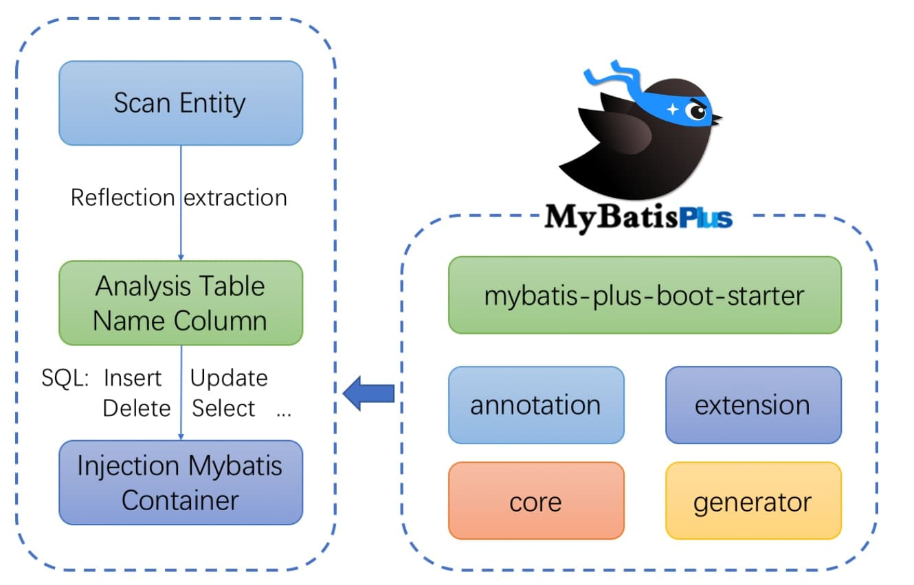

# MyBatisPlus从入门到实践

## 简介

[MyBatis-Plus (opens new window)](https://github.com/baomidou/mybatis-plus)（简称 MP）是一个 [MyBatis (opens new window)](https://www.mybatis.org/mybatis-3/)的增强工具，在 MyBatis 的基础上只做增强不做改变，为简化开发、提高效率而生。

**官网**：[MyBatis-Plus (baomidou.com)](https://baomidou.com/)

## 特点

- **无侵入**：只做增强不做改变，引入它不会对现有工程产生影响，如丝般顺滑
- **损耗小**：启动即会自动注入基本 CURD，性能基本无损耗，直接面向对象操作
- **强大的 CRUD 操作**：内置通用 Mapper、通用 Service，仅仅通过少量配置即可实现单表大部分 CRUD 操作，更有强大的条件构造器，满足各类使用需求
- **支持 Lambda 形式调用**：通过 Lambda 表达式，方便的编写各类查询条件，无需再担心字段写错
- **支持主键自动生成**：支持多达 4 种主键策略（内含分布式唯一 ID 生成器 - Sequence），可自由配置，完美解决主键问题
- **支持 ActiveRecord 模式**：支持 ActiveRecord 形式调用，实体类只需继承 Model 类即可进行强大的 CRUD 操作
- **支持自定义全局通用操作**：支持全局通用方法注入（ Write once, use anywhere ）
- **内置代码生成器**：采用代码或者 Maven 插件可快速生成 Mapper 、 Model 、 Service 、 Controller 层代码，支持模板引擎，更有超多自定义配置等您来使用
- **内置分页插件**：基于 MyBatis 物理分页，开发者无需关心具体操作，配置好插件之后，写分页等同于普通 List 查询
- **分页插件支持多种数据库**：支持 MySQL、MariaDB、Oracle、DB2、H2、HSQL、SQLite、Postgre、SQLServer 等多种数据库
- **内置性能分析插件**：可输出 SQL 语句以及其执行时间，建议开发测试时启用该功能，能快速揪出慢查询
- **内置全局拦截插件**：提供全表 delete 、 update 操作智能分析阻断，也可自定义拦截规则，预防误操作

## 框架结构



## 入门案例

- ### SpringBoot整合Mybatis-plus

```xml
<dependency>
    <groupId>mysql</groupId>
    <artifactId>mysql-connector-java</artifactId>
</dependency>

<dependency>
    <groupId>com.baomidou</groupId>
    <artifactId>mybatis-plus-boot-starter</artifactId>
    <version>3.5.2</version>
</dependency>

<dependency>
    <groupId>com.alibaba</groupId>
    <artifactId>druid</artifactId>
    <version>1.2.11</version>
</dependency>
```

- ### 配置yml数据源信息

```yaml
spring:
  datasource:
    driver-class-name: com.mysql.cj.jdbc.Driver
    url: jdbc:mysql://localhost:3306/db1
    username: root
    password: 123456
    type: com.alibaba.druid.pool.DruidDataSource
```

- ### Dao层

```java
import com.baomidou.mybatisplus.core.mapper.BaseMapper;
import org.apache.ibatis.annotations.Mapper;
import skyblog.domain.User;

@Mapper
public interface UserDao extends BaseMapper<User> { //自动生成sql无需手写
}
```

- ### 测试

```java
import org.junit.jupiter.api.Test;
import org.springframework.beans.factory.annotation.Autowired;
import org.springframework.boot.test.context.SpringBootTest;
import skyblog.dao.UserDao;
import skyblog.domain.User;

import java.util.List;

@SpringBootTest
class ApplicationTests {
    @Autowired
    private UserDao userDao;

    @Test
    void getAll() {
        User user = userDao.selectById(1);
        System.out.println(user);
    }
}
```

##   查询

[条件构造器 | MyBatis-Plus (baomidou.com)](https://baomidou.com/pages/10c804/#abstractwrapper)

### 分页查询

- #### 添加Page拦截器

```java
import com.baomidou.mybatisplus.extension.plugins.MybatisPlusInterceptor;
import com.baomidou.mybatisplus.extension.plugins.inner.PaginationInnerInterceptor;
import org.springframework.context.annotation.Bean;
import org.springframework.context.annotation.Configuration;

@Configuration
public class MpConfig {
    @Bean
    public MybatisPlusInterceptor mybatisPlusInterceptor(){
        //定义Mp拦截器
        MybatisPlusInterceptor mybatisPlusInterceptor = new MybatisPlusInterceptor();
        //拦截器里面添加Page拦截器
        mybatisPlusInterceptor.addInnerInterceptor(new PaginationInnerInterceptor());
        return  mybatisPlusInterceptor;
    }
}
```

- #### 测试

```java
import com.baomidou.mybatisplus.extension.plugins.pagination.Page;
import org.junit.jupiter.api.Test;
import org.springframework.beans.factory.annotation.Autowired;
import org.springframework.boot.test.context.SpringBootTest;
import skyblog.dao.UserDao;

@SpringBootTest
class ApplicationTests {
    @Autowired
    private UserDao userDao;

    @Test
    void getByPage(){
        Page page = new Page(1,2);
        userDao.selectPage(page,null);
        System.out.println("当前页码："+page.getCurrent());
        System.out.println("每页显示的数目："+page.getSize());
        System.out.println("一共有多少页："+page.getPages());
        System.out.println("一个有多少条数据："+page.getTotal());
        System.out.println("数据："+page.getRecords());
    }
}
```

- #### 输出

```xml
当前页码：1
每页显示的数目：2
一共有多少页：11
一个有多少条数据：22
数据：[User{id=1, username='UpdateTest', password='123456'}, User{id=4, username='people2', password='123'}]
```

### 等匹配查询

```java
import com.baomidou.mybatisplus.core.conditions.query.LambdaQueryWrapper;
import org.junit.jupiter.api.Test;
import org.springframework.beans.factory.annotation.Autowired;
import org.springframework.boot.test.context.SpringBootTest;
import skyblog.dao.UserDao;
import skyblog.domain.User;
@SpringBootTest
class ApplicationTests {
    @Autowired
    private UserDao userDao;

    @Test
    void getByPage(){
        //匹配用户名和密码
        LambdaQueryWrapper<User> lqw = new LambdaQueryWrapper<>();
        lqw.eq(User::getUsername,"sky666").eq(User::getPassword,"123456");
        System.out.println(userDao.selectOne(lqw));
    }
}
```

### 范围查询

```java
import com.baomidou.mybatisplus.core.conditions.query.LambdaQueryWrapper;
import org.junit.jupiter.api.Test;
import org.springframework.beans.factory.annotation.Autowired;
import org.springframework.boot.test.context.SpringBootTest;
import skyblog.dao.UserDao;
import skyblog.domain.User;
@SpringBootTest
class ApplicationTests {
    @Autowired
    private UserDao userDao;

    @Test
    void getByPage(){
        //范围查询
        LambdaQueryWrapper<User> lqw = new LambdaQueryWrapper<>();
        lqw.between(User::getId,2,10);
        System.out.println(userDao.selectList(lqw));
    }
}
```

### 模糊查询

```java
import com.baomidou.mybatisplus.core.conditions.query.LambdaQueryWrapper;
import org.junit.jupiter.api.Test;
import org.springframework.beans.factory.annotation.Autowired;
import org.springframework.boot.test.context.SpringBootTest;
import skyblog.dao.UserDao;
import skyblog.domain.User;
@SpringBootTest
class ApplicationTests {
    @Autowired
    private UserDao userDao;

    @Test
    void getByPage(){
        //模糊查询
        LambdaQueryWrapper<User> lqw = new LambdaQueryWrapper<>();
        lqw.like(User::getUsername,"sky");
        System.out.println(userDao.selectList(lqw));
    }
}
```

## 删除

### 普通删除

```java
import org.junit.jupiter.api.Test;
import org.springframework.beans.factory.annotation.Autowired;
import org.springframework.boot.test.context.SpringBootTest;
import skyblog.dao.UserDao;
import java.util.ArrayList;

@SpringBootTest
class ApplicationTests {
    @Autowired
    private UserDao userDao;

    @Test
    void getByPage(){
        ArrayList<Long> longs = new ArrayList<>();
        longs.add(1550033459488088066L);
        longs.add(1550034549189177346L);
        userDao.deleteBatchIds(longs);//多项删除
    }
}
```

### 逻辑删除

- #### 添加逻辑删除字段

> 通过写yml配置文件亦可

```java
@TableName("users")
public class User {
    @TableId(type = IdType.ASSIGN_ID)
    private Long id;
    private String username;
    private String password;
    @TableLogic(value = "0",delval = "1")//设置逻辑删除字段
    private Integer deleted;
}
```

- #### 测试

```java
import org.junit.jupiter.api.Test;
import org.springframework.beans.factory.annotation.Autowired;
import org.springframework.boot.test.context.SpringBootTest;
import skyblog.dao.UserDao;

@SpringBootTest
class ApplicationTests {
    @Autowired
    private UserDao userDao;

    @Test
    void getByPage(){
        userDao.deleteById(1);
    }
}
```

- #### 结果

```xml
==>  Preparing: UPDATE users SET deleted=1 WHERE id=? AND deleted=0
==> Parameters: 1(Integer)
<==    Updates: 1
```

## 映射


### 字段映射

```java
@TableName("users")//表名映射
public class User {
    private Integer id;
    private String username;
    @TableField(value = "password",select = false)//字段映射，不参与查询
    private String password;
    @TableField(exist = false)//设置为不存在
    private String Online;
    }
```

### 表名映射

> **@TableName("users")//表名映射**

## ID生成策略

- #### domain中做配置

```java
@TableName("users")
public class User {
    @TableId(type = IdType.ASSIGN_ID)//雪花算法
    private Long id;
    private String username;
    private String password;
    }
```

- #### 测试

```java
mport org.junit.jupiter.api.Test;
import org.springframework.beans.factory.annotation.Autowired;
import org.springframework.boot.test.context.SpringBootTest;
import skyblog.dao.UserDao;
import skyblog.domain.User;
@SpringBootTest
class ApplicationTests {
    @Autowired
    private UserDao userDao;

    @Test
    void getByPage(){
        User user = new User(null,"sky","555555");
        userDao.insert(user);
    }
}
```

- #### 结果

```xml
==> Preparing: INSERT INTO users ( id, username, password ) VALUES ( ?, ?, ? )
==> Parameters: 1550034549189177346(Long), sky(String), 555555(String)
```

## 锁

### 乐观锁

- #### 添加乐观锁字段

```java
@TableName("users")
public class User {
    @TableId(type = IdType.ASSIGN_ID)
    private Long id;
    private String username;
    private String password;
    @TableLogic(value = "0",delval = "1")
    private Integer deleted;
    @Version//乐观锁字段
    private Integer version;
}
```

- #### 添加拦截器

```java
import com.baomidou.mybatisplus.extension.plugins.MybatisPlusInterceptor;
import com.baomidou.mybatisplus.extension.plugins.inner.OptimisticLockerInnerInterceptor;
import com.baomidou.mybatisplus.extension.plugins.inner.PaginationInnerInterceptor;
import org.springframework.context.annotation.Bean;
import org.springframework.context.annotation.Configuration;

@Configuration
public class MpConfig {
    @Bean
    public MybatisPlusInterceptor mybatisPlusInterceptor(){
        //定义Mp拦截器
        MybatisPlusInterceptor mybatisPlusInterceptor = new MybatisPlusInterceptor();
        //拦截器里面添加Page拦截器
        mybatisPlusInterceptor.addInnerInterceptor(new PaginationInnerInterceptor());
        //添加乐观锁拦截器
        mybatisPlusInterceptor.addInnerInterceptor(new OptimisticLockerInnerInterceptor());
        return  mybatisPlusInterceptor;
    }
}
```

- #### 测试

```java
import org.junit.jupiter.api.Test;
import org.springframework.beans.factory.annotation.Autowired;
import org.springframework.boot.test.context.SpringBootTest;
import skyblog.dao.UserDao;
import skyblog.domain.User;

@SpringBootTest
class ApplicationTests {
    @Autowired
    private UserDao userDao;

    @Test
    void getByPage(){
        //模拟两个用户同时访问同一个数据
        User user1 = userDao.selectById(4);
        User user2 = userDao.selectById(4);

        user1.setUsername("user1");
        userDao.updateById(user1);

        user2.setUsername("user2");
        userDao.updateById(user2);
    }
}
```

- #### 结果

```xml
==>  Preparing: SELECT id,username,password,deleted,version FROM users WHERE id=? AND deleted=0
==> Parameters: 4(Integer)
<==    Columns: id, username, password, deleted, version
<==        Row: 4, people2, 123, 0, 1
<==      Total: 1

==>  Preparing: SELECT id,username,password,deleted,version FROM users WHERE id=? AND deleted=0
==> Parameters: 4(Integer)
<==    Columns: id, username, password, deleted, version
<==        Row: 4, people2, 123, 0, 1
<==      Total: 1

==>  Preparing: UPDATE users SET username=?, password=?, version=? WHERE id=? AND version=? AND deleted=0
==> Parameters: user1(String), 123(String), 2(Integer), 4(Long), 1(Integer)
<==    Updates: 1

==>  Preparing: UPDATE users SET username=?, password=?, version=? WHERE id=? AND version=? AND deleted=0
==> Parameters: user2(String), 123(String), 2(Integer), 4(Long), 1(Integer)
<==    Updates: 0
```

- #### 原理解释

> 当两个用户同时访问同一个数据时，只有第一个用户能够修改成功，因为当第二个用户访问时。version的值已经发生改变，所以修改操作无法找到相应的数据，导致修改失败。

## 代码生成器

https://www.bilibili.com/video/BV12T4y1B7C3?p=14&t=846.1
