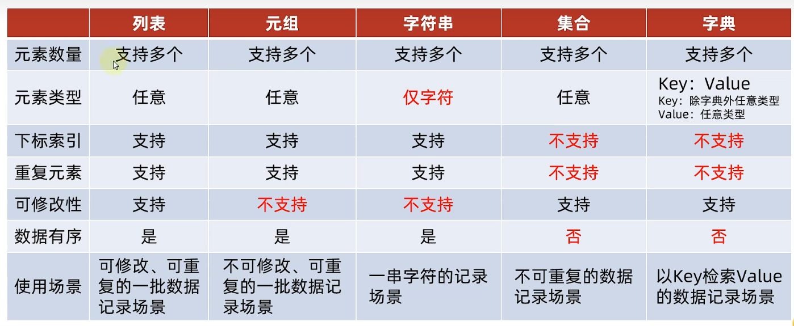

# Python基础笔记

## 🔸数据类型


## 🔸注释

```python
#我是字符串
print("Hello World")
#整数
print(123)
#浮点数
print(12.3)

"""
我是多行
注释
"""
```

## 🔸数据类型的转换

```python
# int转str
int_str = str("123")
print(type(int_str), int_str)

# float转str
float_str = str("12.3")
print(type(float_str), float_str)

# str转int
str_int = int("123")
print(type(str_int), str_int)

# str转float
str_float = float("123.4")
print(type(str_float), str_float)

# int转float
int_float = float(123)
print(type(int_float), int_float)

# float转int
float_int = int(12.34)
print(type(float_int), float_int)
```

```
<class 'str'> 123
<class 'str'> 12.3
<class 'int'> 123
<class 'float'> 123.4
<class 'float'> 123.0
<class 'int'> 12
```

## 🔸运算符


## 🔸字符串

### 🔹三种定义方法

```python
# 字符串的三种定义方法
# 单引号
name = 'Sky'
# 双引号
name1 = "Sky"
# 三引号
name2 = """Sky"""
```

### 🔹拼接

```python
tel = 110
address = "地球"
print("电话:",tel,"地址:",address)
#报错，只能str相互拼接
print("电话:"+tel,"地址:"+address)
```

### 🔹格式化字符串

#### ◼%占位

> %s 转为字符串 占位
>
> %d 转为整数 占位
>
> %f 转为浮点数 占位

```python
name = "SkyLikeYou"
tel = 10087
msg = "姓名：%s 电话：%s" % (name, tel)
print(msg)
```

#### ◼f模式占位

```python
name = "SkyLikeYou"
tel = 10087
print(f"姓名：{name},电话：{tel}")
```

## 🔸输入

```python
name = input("请输入姓名：")
print(f"你是：{name}")
```

## 🔸if语句

> if 条件：

```python
age = 10
if age >= 18:
    print("成年啦！！！")
else:
    print("未成年~")
```

## 🔸while语句

### 🔹while 条件：

```python
i = 0
while i < 100:
    print(i)
    i += 1
```

### **🔹猜数字游戏**

```python
import random

num = random.randint(1, 100)
count = 0
input_num = int(input("请输入你猜测的数字："))
while True:
    count += 1
    if input_num == num:
        print(f"猜中啦！！！你一共猜了{count}次")
        break
    else:
        if input_num > num:
            print("猜大啦！！！")
        else:
            print("猜小啦！！！")
    input_num = int(input("请输入你猜测的数字："))
```

## 🔸for循环

### 🔹遍历字符串

```python
name = "sky"
for x in name:
    print(x)
```

### 🔹range遍历

```python
for x in range(10):
    # 输出0~9
    print(x) 
    
for x in range(2, 10):
    # 输出2~9
    print(x)

for x in range(0, 10, 2):
    # 输出0,2,4,6,8
    print(x)
```

## 🔸函数

### 🔹基本定义

> def 函数名(参数):
>
> ​		代码内容

```python
def init_main(msg):
    print(f"信息：{msg}")


init_main("HelloWorld")
```

> 带返回值

```python
def init_main():
    return "HelloWorld"


print(init_main())
```

### 🔹多返回值

```python
def main():
    return 1, 2, "666"


x, y, z = main()
print(x, y, z)
```

### 🔹参数

```python
# 不定长参数
def main(*num):
    print(num)


# 关键字不定长
def main2(**args):
    print(args)


main(1, 3, 45, 7)
main2(name="sky", age=20)
```

```
(1, 3, 45, 7)
{'name': 'sky', 'age': 20}
```

## 🔸列表

### 🔹遍历

```python
object_list = [1234, "Sky", 13.14, True]
for x in object_list:
    print(x)
```

### 🔹基本函数

```python
object_list = [4, 3, 8, 5]
# 求列表长度
count = len(object_list)
print(count)

# 查找某元素下标
index = object_list.index(3)
print(index)

# 指定下标插入值
object_list.insert(2, 99)
print(object_list)

# 追加元素
object_list.append(999)
print(object_list)

# 追加新列表
object_list.extend([666, 777])
print(object_list)

# 删除元素方法一(删除下标为1的元素)
del object_list[1]
print(object_list)

# 删除元素方法二(弹出下标为1的元素)
object_list.pop(1)
print(object_list)

# 删除元素方法三(移除第一个值为5的元素)
object_list.remove(5)
print(object_list)

# 统计元素个数
print(object_list.count(999))

# 清空列表
object_list.clear()
print(object_list)
```

## 🔸元组

### 🔹特点

- 允许重复
- 不可修改(无法增加和删除)

### 🔹定义

```python
# 定义元组
t1 = (1, 'sky', True)
t2 = ()
t3 = tuple()
t4 = (333,)
```

### 🔹遍历

```python
# 遍历元组
for x in t1:
    print(x)
```

## 🔸切片

### 🔹基本定义

> List[开始下标：结束下标：步长]

### 🔹代码实现

```python
my_list = [1, 2, 3, 4, 5, 6]
# 从0开始到4，步长为1可以省略不写
result1 = my_list[0:4]
print(result1)

my_str = "012345678"
# 从头到尾，步长为2
result2 = my_str[::2]
print(result2)
```

```
[1, 2, 3, 4]
02468
```

## 🔸集合

### 🔹基本定义

> {xxx,xxxx,xxx,xxx,...}

```python
my_set = {"sky", "ct", "sky666", 33, "sky"}
my_set_empty = set()  # 空集合
print(my_set)
print(my_set_empty)
```

### 🔹基本函数

```python
# 空集合
my_set_empty = set()

# 添加元素
my_set_empty.add("sky")
my_set_empty.add("ct")
my_set_empty.add("sky666")
print(my_set_empty)

# 移除元素
my_set_empty.remove("ct")
print(my_set_empty)

# 随机取出元素
elem = my_set_empty.pop()
print(elem)
```

## 🔸字典

### 🔹基本定义

```python
# 基本定义
my_dict = {"sky": 666, "ct": 888, "痳化腾": 999}
print(my_dict)

# 字典嵌套
my_dict2 = {
    "sky": {
        "Java成绩": 100,
        "C语言成绩": 99
    }, "ct": {
        "Java成绩": 98,
        "C语言成绩": 97
    }
}
print(my_dict2)
```

### 🔹遍历

```python
# 遍历字典方法一
keys = my_dict.keys()
for key in keys:
    print(my_dict[key])
    
# 遍历字典方法二
for key in my_dict:
    print(my_dict[key])
```

### 🔹基本函数

```python
# 新增元素
my_dict["wxy"] = 555
print(my_dict)

# 删除元素
my_dict.pop("ct")
```

## 🔸数据容器的异同



## 🔸文件操作

### 🔹读取文件

```python
f = open("D:/test.txt", "r", encoding="UTF-8")

print(f"读取文件的全部行，封装到列表中{f.readlines()}")
f.close()

print(f"读取全部内容：{f.read()}")
f.close()

print(f"读取16个字节：{f.read(16)}")
f.close()
```

### 🔹写入文件

```python
f = open("D:/test.txt", "w", encoding="UTF-8")

# 写入文件
f.write("HELL!!!")
f.close()
```

### 🔹追加内容

```python
f = open("D:/test.txt", "a", encoding="UTF-8")

# 追加操作
f.write("\nHELL!!!")
f.close()
```

## 🔸异常

```python
try:
    f = open("D:/testsss.txt", "r", encoding="UTF-8")
except:
    print("出异常啦！！！")
    
try:
    f = open("D:/testsss.txt", "r", encoding="UTF-8")
except FileNotFoundError as e:
    print(e)
```

## 🔸模块

```python
# 导入模块
import time
# 导入time模块中的sleep功能
from time import sleep

print(sleep(23))
```
