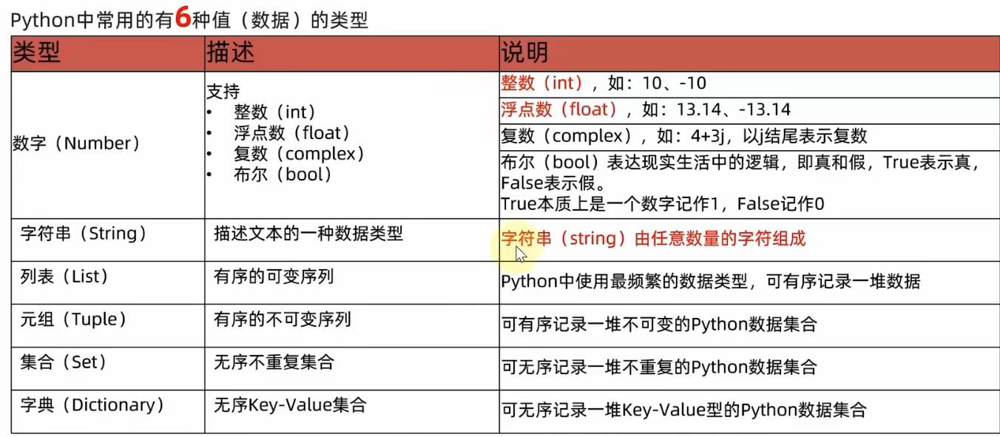
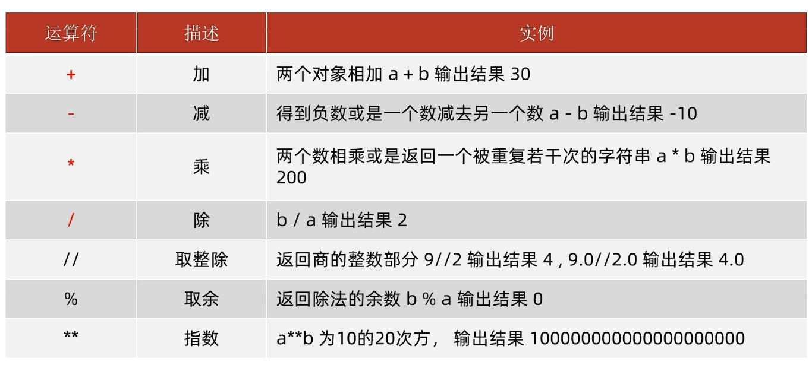

# Python基础笔记

## 数据类型



## 注释

```python
#我是字符串
print("Hello World")
#整数
print(123)
#浮点数
print(12.3)

"""
我是多行
注释
"""
```

## 数据类型的转换

```python
# int转str
int_str = str("123")
print(type(int_str), int_str)

# float转str
float_str = str("12.3")
print(type(float_str), float_str)

# str转int
str_int = int("123")
print(type(str_int), str_int)

# str转float
str_float = float("123.4")
print(type(str_float), str_float)

# int转float
int_float = float(123)
print(type(int_float), int_float)

# float转int
float_int = int(12.34)
print(type(float_int), float_int)
```

```
<class 'str'> 123
<class 'str'> 12.3
<class 'int'> 123
<class 'float'> 123.4
<class 'float'> 123.0
<class 'int'> 12
```

## 运算符



## 字符串

### 三种定义方法

```python
# 字符串的三种定义方法
# 单引号
name = 'Sky'
# 双引号
name1 = "Sky"
# 三引号
name2 = """Sky"""
```

### 拼接

```python
tel = 110
address = "地球"
print("电话:",tel,"地址:",address)
#报错，只能str相互拼接
print("电话:"+tel,"地址:"+address)
```

### 格式化字符串

> %s 转为字符串 占位
>
> %d 转为整数 占位
>
> %f 转为浮点数 占位

```python
name = "SkyLikeYou"
tel = 10087
msg = "姓名：%s 电话：%s" % (name, tel)
print(msg)
```

> f模式占位

```python
name = "SkyLikeYou"
tel = 10087
print(f"姓名：{name},电话：{tel}")
```

## 输入

```python
name = input("请输入姓名：")
print(f"你是：{name}")
```

## if语句

> if 条件：

```python
age = 10
if age >= 18:
    print("成年啦！！！")
else:
    print("未成年~")
```

## while语句

> while 条件：

```python
i = 0
while i < 100:
    print(i)
    i += 1
```

> **猜数字游戏**

```python
import random

num = random.randint(1, 100)
count = 0
input_num = int(input("请输入你猜测的数字："))
while True:
    count += 1
    if input_num == num:
        print(f"猜中啦！！！你一共猜了{count}次")
        break
    else:
        if input_num > num:
            print("猜大啦！！！")
        else:
            print("猜小啦！！！")
    input_num = int(input("请输入你猜测的数字："))
```

## for循环

> 遍历字符串

```python
name = "sky"
for x in name:
    print(x)
```

> range遍历

```python
for x in range(10):
    # 输出0~9
    print(x) 
    
for x in range(2, 10):
    # 输出2~9
    print(x)

for x in range(0, 10, 2):
    # 输出0,2,4,6,8
    print(x)
```

## 函数

### 基本定义

> def 函数名(参数):
>
> ​		代码内容

```python
def init_main(msg):
    print(f"信息：{msg}")


init_main("HelloWorld")
```

> 带返回值

```python
def init_main():
    return "HelloWorld"


print(init_main())
```

## 列表

> 遍历列表

```python
object_list = [1234, "Sky", 13.14, True]
for x in object_list:
    print(x)
```

> 下标索引
