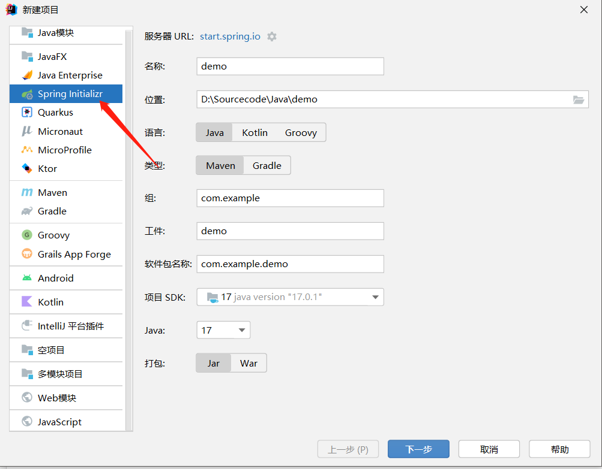
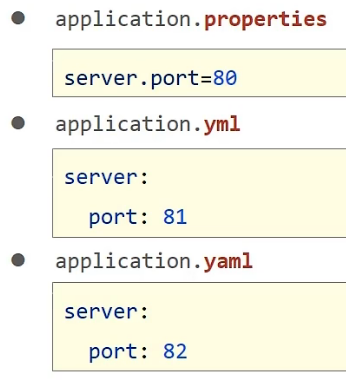

# SpringBoot知识体系笔记

## 概述


## 入门案例

- ### 创建SpringBoot工程

------



- ### 手写Controller层

```java
import org.springframework.web.bind.annotation.GetMapping;
import org.springframework.web.bind.annotation.RequestMapping;
import org.springframework.web.bind.annotation.RestController;

@RestController
@RequestMapping("/users")
public class UserController {
    @GetMapping()
    public String getAll(){
        System.out.println("getAll");
        return "OK";
    }
}
```

- ### 运行Application

## SpringBoot配置

### 3种基本配置格式

------




###  配置文件加载的优先级

> properties > yml > yaml

###   yml封装数据

https://www.bilibili.com/video/BV15b4y1a7yG?p=25&t=1.3

## SpringBoot整合第三方技术

### 整合Junit

> Boot已经自动整合 

```java
import org.junit.jupiter.api.Test;
import org.springframework.boot.test.context.SpringBootTest;

@SpringBootTest
class ApplicationTests {

    @Test
    void getByPage(){
        System.out.println("test......");
    }
}
```

