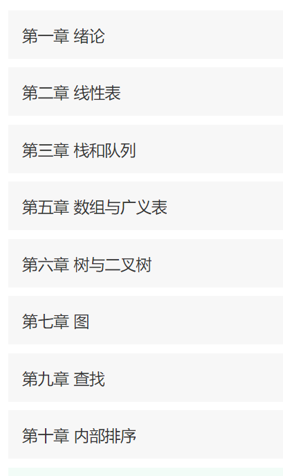
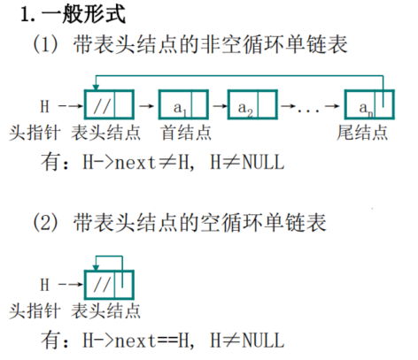
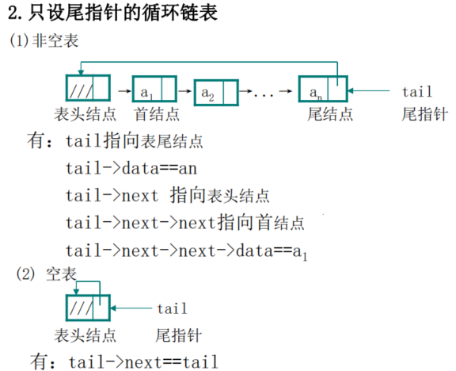
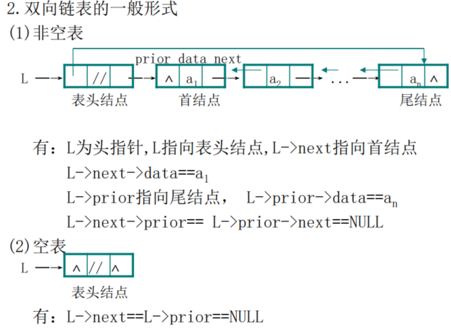
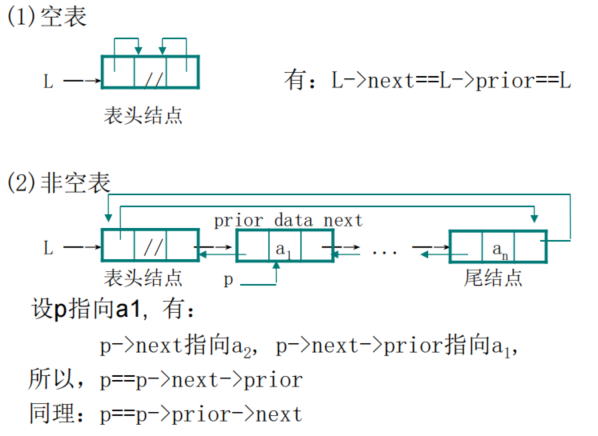
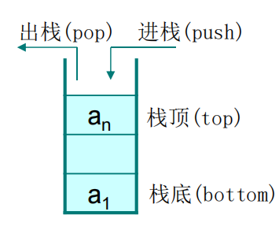

# 数据结构&算法【C版】

# 🟠数据结构

- **概念**

> 数据结构是[计算机](https://baike.baidu.com/item/计算机/140338)存储、组织[数据](https://baike.baidu.com/item/数据)的方式。数据结构是指相互之间存在一种或多种特定关系的[数据元素](https://baike.baidu.com/item/数据元素/715313)的集合。通常情况下，精心选择的数据结构可以带来更高的运行或者存储[效率](https://baike.baidu.com/item/效率/868847)。数据结构往往同高效的检索[算法](https://baike.baidu.com/item/算法/209025)和[索引](https://baike.baidu.com/item/索引/5716853)技术有关

- **内容**



## 🔸时间复杂度和空间复杂度

> **时间复杂度是指执行算法所需要的计算工作量；而空间复杂度是指执行这个算法所需要的内存空间**
>
> O(频度)、O(1)、O(n)、O(n^2)

> 时间复杂度

```c
//2n+1
//n
//O(n)
for(int i = 0 ; i < n ; i++)     //<- 从 0 到 n，执行 n+1 次
{
    a++;                         //<- 从 0 到 n-1，执行 n 次
}

//2*n*m+2*n+1
//2*n2+2*n+1
//n^2
//O(n^2)
for(int i = 0 ; i < n ; i++)           // n+1
{ 
    for(int j = 0 ; j < m ; j++)       // n*(m+1)
    {
        num++;                         // n*m
    }
}

```

> 空间复杂度

```c
//O(1)
int n;
scanf("%d", &n);
int a[10];

//O(n)
int n;
scanf("%d", &n);
int a[n];
```

> 如果程序所占用的存储空间和输入值无关，则该程序的空间复杂度就为 O(1)；反之，如果有关，则需要进一步判断它们之间的系：
> 如果随着输入值 n 的增大，程序申请的临时空间成线性增长，则程序的空间复杂度用 O(n) 表示;
> 如果随着输入值 n 的增大，程序申请的临时空间成 n^2 关系增长，则程序的空间复杂度用 O(n^2) 表示；
> 如果随着输入值 n 的增大，程序申请的临时空间成 n^3 关系增长，则程序的空间复杂度用 O(n^3) 表示；

## 🔸线性表

### 🔹顺序存储

#### 🔹概念

- **基本操作**

  | 函数名                 | 解释                    |
  | ---------------------- | ----------------------- |
  | IniList(&L)            | 构造空表L               |
  | ListLength (L)         | 求表L的长度             |
  | GetElem(L,i,&e)        | 取元素ai,由e返回ai      |
  | PriorElem(L,ce,&pre_e) | 求ce的前驱,由pre_e返回  |
  | InsertElem(&L,i,e)     | 在元素ai之前插入新元素e |
  | DeleteElem(&L,i)       | 删除第i个元素           |
  | EmptyList(L)           | 判断L是否为空表         |

- **优点：**

  - 是一种随机存取结构，存取任何元素的时间是一个常数，速度快；

  - 结构简单，逻辑上相邻的元素在物理上也是相邻的；

  - 不使用指针，节省存储空间。

  **缺点：**

  - 插入和删除元素要移动大量元素，消耗大量时间；

  - 需要一个连续的存储空间；

  - 插入元素可能发生“溢出”；

  - 自由区中的存储空间不能被其它数据占用(共享)。

#### 🔹数组实现

```c

//线性表
#include<stdio.h>
//插入数据
void Insect(int location, int value,int arr[]) {
	int length;
	for (length = 0; arr[length] != '\0'; length++);
	//右移数据
	for (int i = 0; i <= length - location; i++) {
		arr[length - i ] = arr[length - 1 - i];
	}
	//插入数据
	arr[location - 1] = value;
}

//删除数据
void Delete(int location,int arr[]) {
	int length;
	for (length = 0; arr[length] != '\0'; length++);
	//左移数据
	for (int i = 0; i < length - location; i++) {
		arr[location - 1 + i] = arr[location + i];
	}
	//将最后一个元素制空
	arr[length - 1] = '\0';
}

//查找数据
int Serch(int value, int arr[]) {
	int length;
	for (length = 0; arr[length] != '\0'; length++);

	for (int i = 0; i < length; i++) {
		if (arr[i] == value) {
			return i;
		}
	}
	return -1;
}

//列出数据
void List(int arr[]) {
	for (int i = 0; arr[i] != '\0'; i++) {
		printf("%d ", arr[i]);
	}
}

int main() {
	int arr[20] = {24,34,54,65,76,34,76,34,87,53};
	int length;
	for (length = 0; arr[length] != '\0'; length++);
	int result = Serch(887, arr);
	printf("位置%d ", result);
	List(arr);
}
```

#### 🔹结构体静态实现

```c
#include<stdio.h>
#define MAX_LENGTH 100
 struct sqList
{
	int elem[MAX_LENGTH];
	int length;
};

 int Insert(sqList *list, int i, int e) {
	 if (i<0 || i>list->length) return -1;
	 if (list->length >= MAX_LENGTH) return -1;
	 for (int j = 0; j < list->length - i; j++) {
		 list->elem[list->length -j] = list->elem[list->length-j-1];
	 }
	 list->elem[i] = e;
	 list->length++;
	 return 1;
 }

 int DeleteElem(sqList* list,int i) {
	 if (i<0 || i>=list->length) return -1;
	 for (int j = 0; j < list->length - i; j++) {
		 list->elem[i+j] = list->elem[i+j+1];
	 }
	 list->length--;
	 return 1;
 }

 void ListAll(sqList list) {
	 for (int i = 0; i < list.length; i++) {
		 printf("%d\n", list.elem[i]);
	}
 }


 int main() {
	 sqList list;
	 for (int i = 0; i < 88; i++) {
		 list.elem[i] = i;
	 }
	 list.length = 88;
	 Insert(&list, 1, 999);
	 DeleteElem(&list, 88);
	 ListAll(list);
	 //printf("%d", list.elem[5]);
 }
```

#### 🔹结构体动态实现

```c
#include<stdio.h>
#include<stdlib.h>
#define INIT_LENGTH 20
#define EX_LENGTH 10
struct sqList
{
	int* elem; //存储空间基地址
	int length; //表长
	int listSize;  //分配的存储容量
};
int Insert(sqList* list, int i, int e) {
	if (i<0 || i>list->length) return -1;//i值不合法直接退出
	if (list->length >= list->listSize) {//溢出时扩充，等号不能少
		int* newbase;
		//为新空间重新分配一个大小（扩容EX_LENGTH）
		newbase = (int *) realloc(list->elem, ((list->listSize + EX_LENGTH) * sizeof(int)));
		if (newbase == NULL) return -1;//分配失败
		list->elem = newbase; //指向新空间地址
		list->listSize += EX_LENGTH;
	}
	for (int j = 0; j < list->length - i; j++) {
		list->elem[list->length - j] = list->elem[list->length - 1 - j]; //右移元素
	}
	list->elem[i] = e;
	list->length++;
	return 1;
}

int  DeleteElem(sqList* list, int i) {
	if (i<0 || i>=list->length) return -1;//等号不能少
	for (int j = 0; j < list->length - i; j++) {
		list->elem[i+j] = list->elem[i + 1+j];//左移元素
	}
	list->length--;
	return 1;
}

void ListAll(sqList list) {
	for (int i = 0; i < list.length; i++) {
		printf("%d\n", list.elem[i]);
	}
}

int main() {
	sqList list;
	list.listSize = INIT_LENGTH;//初始化表大小
	list.elem =(int*)malloc(sizeof(int)*list.listSize);//给元素分配相应大小
	for (int i = 0; i < 10; i++) { //for循环赋值
		list.elem[i] = i;
	}
	list.length = 10;
	Insert(&list, 0, 999);
	DeleteElem(&list, 7);
	ListAll(list);
}
```

### 🔸链式存储

#### 🔹概念

#### 🔹单链表

```c
#include<stdio.h>
#include <malloc.h>

typedef struct linkednode {
	int data;
	struct linkednode* next;
}snode,*ptr;

//有序插入
void InsertByOrder(snode* head,int e) {
	ptr q, p;
	q = head;
	p = head->next;
	while (p && e>p->data)
	{
		q = p;
		p = p->next;
	}
	ptr f;
	f =(ptr) malloc(sizeof(snode));//分配要插入的node的空间
	f->data = e;//装配数据
	f->next = p;
	q->next = f;
}

//在末尾插入元素
void InsertAtTheEnd(snode** last, int e) {//ptr* last重点，形参无法改变实参
	ptr p;
	p = (ptr)malloc(sizeof(snode));
	p->data = e;
	(*last)->next = p;
	(*last) = p;
	(*last)->next = NULL;
}

//在特定位置插入元素
int InsertAtLocation(snode* head, int i, int e) {
	ptr p;
	p = head;
	for (int j = 0; j < i - 1; j++) {
		if (p != NULL)
			p = p->next;
		else
			break;
	}
	if (i < 1 || p == NULL) return -1;//判断插入点是否错误
	ptr f;
	f = (ptr)malloc(sizeof(snode));
	f->data = e;
	f->next = p->next;
	p->next = f;
	return 1;
}

//删除特定位置的元素
int DeleteAtLocation(snode* head, int e) {
	ptr q, p;
	q = head;
	p = head->next;
	while (p && p->data!=e)//查找元素为e的节点
	{
		q = p;
		p = p->next;
	}
	if (p != NULL) {//判断要删除的节点是否存在
		q->next = p->next;
		free(p); //释放p
		return 1;
	}
	else
	{
		return -1;
	}
}

//初始化链表
void InitList(snode* head,snode** last) {
	ptr p;
	int x;
	scanf("%d", &x);
	while (x != 0)
	{
		p = (ptr)malloc(sizeof(snode));//分配节点内存
		p->data = x;//装入节点数据
		（*last）->next = p;
		（*last） = p;
		scanf("%d", &x);
	}
	last->next = NULL;//尾结点next置为空指针
}

//输出链表
void ListAll(snode* head) {
	ptr p = head;
	while (true)
	{
		if (p->next == NULL) return;
		else
		{
			printf("%d\n", p->next->data);
			p = p->next;
		}
	}
}

int main() {
	ptr head,last;
	head = (ptr)malloc(sizeof(snode));//分配表头内存
	head->next = NULL;//设为空表
	last = head;

	InsertAtTheEnd(&last, 99);
	InsertAtTheEnd(&last, 959);
	InsertAtTheEnd(&last, 979);
	InsertAtTheEnd(&last, 999);
	InsertByOrder(head, 888);
	InsertAtLocation(head, 6, 3333);
	DeleteAtLocation(head, 99);

	ListAll(head);
}
```

#### 🔹循环链表






#### 🔹双向链表



#### 🔹双向循环链表



## 🔸栈

### 🔹概念

- **示意图**



- **栈的基本操作**

  | 函数名       | 解释                                                         |
  | ------------ | ------------------------------------------------------------ |
  | Initstack(s) | 置s为空栈                                                    |
  | Push(s,e)    | 元素e进栈s。若s已满，则发生溢出。若不能解决溢出，重新分配空间失败，则插入失败 |
  | Pop(s,e)     | 删除栈s的顶元素，并送入e 。若s为空栈,发生“下溢”(underflow)；为空栈时，表示某项任务已完成 |
  | Gettop(s,e)  | 栈s的顶元素拷贝到e。若s为空栈，则结束拷贝                    |
  | Empty(s)     | 判断s是否为空栈。若s为空栈,则Empty(s)为true；否则为false     |

### 🔹顺序栈

#### ◼结构体静态实现

```C
#include<stdio.h>
#define MAX_LENGTH 20
typedef struct MyStruct
{
	int elem[MAX_LENGTH];//数组作为栈
	int top; //栈顶
}sqStack;
//初始化栈
void initStack(sqStack* stack) {
	for (int i = 0; i < MAX_LENGTH; i++) {
		(*stack).elem[i] = 0;
		(*stack).top = 0;
	}
}
//出栈
int pop(sqStack* stack) {
	if ((*stack).top==0)//判断是否空栈
	{
		return -1;
	}
	else
	{
		(* stack).top--;
		//返回弹出的值
		return (* stack).elem[(*stack).top];
	}
	
}
//入栈
int push(sqStack* stack, int elem) {
	if ((*stack).top>=MAX_LENGTH)//判断是否溢出
	{
		return -1;
	}
	else {
		(*stack).elem[(*stack).top]=elem;
		(*stack).top++;
		return 1;
	}
	
}
//弹出所有元素
void listAll(sqStack* stack) {
	int x;
	while (true)
	{
		if ((x = pop(stack))==-1)
		{
			return;
		}
		else
		{
			printf("%d\n", x);
		}
		
	}
}
int main() {
	sqStack stack;
	initStack(&stack);
	push(&stack, 123);
	push(&stack, 77);
	push(&stack, 88);
	push(&stack, 99);
	listAll(&stack);
}
```

#### ◼结构体动态实现

```c
#include<stdio.h>
#include <malloc.h>

#define INIT_SIZE 20 //定义初始化栈大小
#define EX_SIZE 10 //定义每次扩展栈大小

typedef struct MyStruct
{
	int* base; //指向栈元素空间
	int top;  //顶指针
	int stackSize;//栈元素空间大小
}sqStack;

void initStack(sqStack* stack) {
	//分配初始化大小
	stack->base =(int*) malloc(sizeof(int) * INIT_SIZE);
	stack->stackSize = INIT_SIZE;
	stack->top = 0;
}

int push(sqStack* stack, int value) {
	if (stack->top >= stack->stackSize) {//判断是否溢出，溢出则扩展
		//扩展栈大小
		int* newBase =(int *) realloc(stack->base, sizeof(int) * (stack->stackSize + EX_SIZE));
		if (!newBase) {//判断是否分配成功，不成功溢出
			printf("溢出");
			return -1;
		}
		//释放先前空间，替换新空间替代
		free(stack->base);
		stack->base = newBase;
		stack->stackSize += EX_SIZE;
	}
	//推入元素
	stack->base[stack->top] = value;
	stack->top++;
	return 1;
}

int pop(sqStack* stack) {
	if (stack->top == 0) {//是否空栈，空栈则error
		return -1;
	}
	stack->top--;
	return stack->base[stack->top];
}

int main() {
	sqStack stack;
	initStack(&stack);
	push(&stack, 222);
	push(&stack, 456);
	push(&stack, 666);
	printf("%d\n", pop(&stack));
	printf("%d\n", pop(&stack));
	printf("%d\n", pop(&stack));
	printf("%d\n", pop(&stack));
}
```

#### ◼链式栈

xxx

## 🔸队列

### 🔹概念

> 只允许在表的一端删除元素,在另一端插入元素的线性表

| 函数名        | 解释                  |
| ------------- | --------------------- |
| InitQueue(q)  | 初始化,将q置为空队列  |
| QueueEmpty(q) | 判断q是否为空队列     |
| EnQueue(q,e)  | 将e插入队列q的尾端    |
| DeQueue(q,e)  | 取走队列q的首元素,送e |
| QetHead(q,e)  | 读取队列q的首元素,送e |
| QueueClear(q) | 置q为空队列           |

