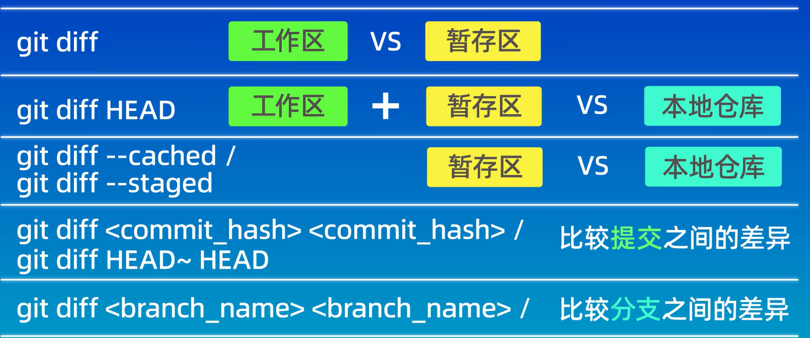

# Git从入门到精通


## 🔸实例教程

### 🔹拉取远程仓库并且[推送

```shell
git init //本地无仓库需要执行该命令
git pull https://gitee.com/sky6600/noteRep.git 你的分支名  //拉取远程仓库
git add .   //添加暂存区
git commit -m "xxxx"   //提交到本地仓库
git branch "你的分支名"   //创建你的分支
git push https://gitee.com/sky6600/noteRep.git 你的分支名 //推送你的分支到远程对应分支
```

## 🔸基本命令

### 🔹设置信息

> 一次设置即可

```shell
git config --global user.name "xxxx"
git config --global user.email "xxxx@qq.com"
```

### 🔹本地仓库

```shell
git init //初始化仓库
git status	//查看状态

git add [文件名]	//添加到暂存区
git rm <file>	//把文件从工作区和暂存区同时删除
git rm --cached <file>   //把文件从暂存区删除，但保留在当前工作区中
git rm -r *   //递归删除某个目录下的所有子目录和文件删除后不要忘记提交
    
git commit -m "xxx"	//提交到本地仓库
git reflog	//简介查看日志
    
git reset --soft
git reset --hard [版本号]	//返回历史版本
git reset --mixed
```

### 🔹分支操作

```shell
查看分支列表:
$ git branch
创建分支：
$ git branch branch-name 
切换分支：
$ git checkout branch-name 
$ git switch branch-name 【推荐】
合并分支:
$ git merge branch-name //合并到当前分支
删除分支:
$ git branch -d branch-name 【已合并】 
$ git branch -D branch-name 【未合并】 
```

### 🔹远程仓库

```shell
git remote add [别名] [远程地址]	//创建别名
git remote -v	//查看别名
git push [远程仓库] [本地分支]:[远程分支]	//推送到远程仓库
git pull [远程仓库] [远程分支]:[本地分支]	//拉取代码到本地仓库 
git clone [远程仓库] [远程分支]:[本地分支]	//克隆别人的代码到本地仓库

pull和clone的区别：pull是本地有版本库存在的情况，拉取最新的代码合并到本地库。clone是本地啥都没有，直接将代码下载下来
```

## 🔸比较差异



## 🔸git.ignore

```
*.class

*.log

*.ctxt

.mtj.tmp/

*.jar
*.war
*.nar
*.ear
*.zip
*.tar.gz
*.rar

hs_err_pid*

.classpath
.project
.settings
target
.idea
*.iml
```

