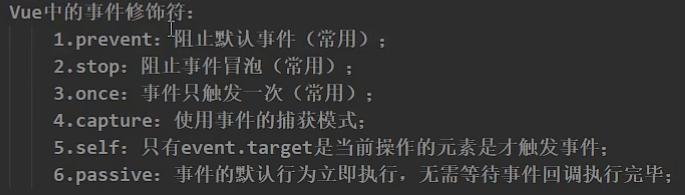
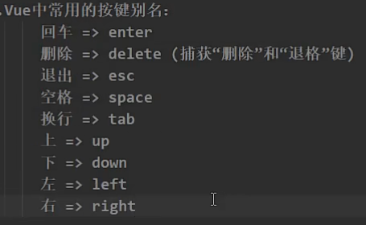

# Vue2.0快速笔记

## 简介

Vue (读音 /vjuː/，类似于 **view**) 是一套用于构建用户界面的**渐进式框架**。与其它大型框架不同的是，Vue 被设计为可以自底向上逐层应用。Vue 的核心库只关注视图层，不仅易于上手，还便于与第三方库或既有项目整合。另一方面，当与[现代化的工具链](https://cn.vuejs.org/v2/guide/single-file-components.html)以及各种[支持类库](https://github.com/vuejs/awesome-vue#libraries--plugins)结合使用时，Vue 也完全能够为复杂的单页应用提供驱动。

## 入门案例

```html
<body>
    <div id="root">
        <p>Hello,{{name}}</p>
    </div>

    <script type="text/javascript">
        Vue.config.productionTip = false; //关闭开发版本提示

        new Vue({
            el:"#root",
            data:{
                name:'Sky'
            }
        })   
    </script>
</body>
```

```
Hello，Sky
```

## 数据绑定

### v-bind

> 单向数据绑定

```html
<body>
  <div id="app">
    <span v-bind:title="msg">
      悬停鼠标,查看动态绑定信息！
    </span>
  </div>
  <script>
    new Vue({
      el: '#app',
      data: {
        msg: '现在时间:' + new Date().toLocaleString()
      }
    })
  </script>
</body>		
```

> 简写

```html
<body>
  <div id="app">
    <span v-bind="msg">
      悬停鼠标,查看动态绑定信息！
    </span>
  </div>
  <script>
    new Vue({
      el: '#app',
      data: {
        msg: '现在时间:' + new Date().toLocaleString()
      }
    })
  </script>
</body>		
```

### v-model

> 双向绑定

```html
<body>
    <div id="root">
        <p>双向绑定案例</p>
        <input type="text" v-model:value="name">
        <p>{{name}}</p>
    </div>
    <script type="text/javascript">
        new Vue({
            el:"#root",
            data:{
                name:'Sky'
            }
        })
    </script>
</body>
```

> 简写

```html
<body>
    <div id="root">
        <p>双向绑定案例</p>
        <input type="text" v-model="name">
        <p>{{name}}</p>
    </div>
    <script type="text/javascript">
        new Vue({
            el:"#root",
            data:{
                name:'Sky'
            }
        })
    </script>
</body>
```

## 事件处理

### 事件绑定

```html
<body>
    <div id="root">
        {{name}} 
        <button v-on:click="showName">点我</button>
    </div>
    <script type="text/javascript">
        vm = new Vue({
            el:"#root",
            data:{
                name:'点我显示名字'
            },
            methods:{
                showName(event){
                    alert("sky")
                }
            }
        })
    </script>
</body>
```

> 简写

```html
<body>
    <div id="root">
        {{name}} 
        <button @click="showName">点我</button>
    </div>
    <script type="text/javascript">
        vm = new Vue({
            el:"#root",
            data:{
                name:'点我显示名字'
            },
            methods:{
                showName(event){
                    alert("sky")
                }
            }
        })
    </script>
</body>
```

### 事件修饰符

****

```html
<body>
    <div id="root">
        {{name}} 
        <button @click.once="showName">点我</button> //执行一次
    </div>
    <script type="text/javascript">
        vm = new Vue({
            el:"#root",
            data:{
                name:'点我显示名字'
            },
            methods:{
                showName(event){
                    alert("sky")
                }
            }
        })
    </script>
</body>
```

## 键盘事件

### 常用按键别名



### 绑定键盘事件

```html
<body>
    <div id="root">
        <input type="text" placeholder="请输入~" @keyup="showName">
    </div>
    <script type="text/javascript">
        vm = new Vue({
            el: "#root",
            data: {
                msg: 'null'
            },
            methods: {
                showName(e) {
                    alert("你输入的是：" + e.key)
                }
            }
        })
    </script>
</body>	
```

### 定义别名

```html
<body>
    <div id="root">
        <input type="text" placeholder="请输入~" @keyup.huiche="showName">
    </div>
    <script type="text/javascript">
        //定义别名
        Vue.config.keyCodes = {
            "huiche": 13,
        };

        vm = new Vue({
            el: "#root",
            data: {
                msg: 'null'
            },
            methods: {
                showName(e) {
                    alert("你输入的是：" + e.key)
                }
            }
        })
    </script>
</body>	
```

## 计算属性

### 简单案例

```html
<body>
    <div id="root">
        姓氏：<input type="text" v-model="firstname"> <br>
        名：<input type="text" v-model="lastname"> <br>
        全名：<span>{{fullname}}</span>
    </div>

</body>

<script>
    new Vue({
        el: "#root",
        data: {
            firstname:"陈",
            lastname:"sky",
        },
        computed:{ //做属性计算
            fullname:{
                get(){
                    return this.firstname + this.lastname 
                }
            }
        }
    })
</script>
```

### 天气案例

```html
<body>
    <div id="root">
        <p>今晚月色{{info}}</p>
        <button @click="change">切换</button>
    </div>

</body>

<script>
    new Vue({
        el: "#root",
        data:{
            istrue:true
        },
        methods: {
            change(){
                this.istrue = !this.istrue
            }
        },
        computed:{
            info(){
                return this.istrue ? '真美':'真垃圾'
            }
        }
    })
</script>
```

## 监视

### 基本监视

```html
<body>
    <div id="root">
        <p>今晚月色{{info}}</p>
        <button @click="change">切换</button>
    </div>

</body>

<script>
    new Vue({
        el: "#root",
        data:{
            isTrue:true
        },
        methods: {
            change(){
                this.isTrue = !this.isTrue
            }
        },
        computed:{
            info(){
                return this.isTrue ? '真美':'真垃圾'
            }
        },
        watch:{
            isTrue:{
                //isTrue被修改时调用
                handler(newValue,oldValue){
                    console.log("被修改了",newValue,oldValue)
                }
            }
        }
    })
</script>
```

### 深度监视

> 监视多级属性的某些属性

```html
<body>
    <div id="root">
        <p>a等于{{numbers.a}}</p>
        <p>b等于{{numbers.b}}</p>
        <button @click="numbers.a++">a++</button>
        <button @click="numbers.b++">b++</button>
    </div>
</body>

<script>
    new Vue({
        el: "#root",
        data:{
            numbers:{
                a:1,
                b:1
            }
        },
        watch:{
            'numbers.a':{
                //numbers.a被修改时调用
                handler(newValue,oldValue){
                    console.log("被修改了",newValue,oldValue)
                }
            },
            'numbers.b':{
                //numbers.b被修改时调用
                handler(newValue,oldValue){
                    console.log("被修改了",newValue,oldValue)
                }
            }
        }
    })
</script>
```

> 监视多级属性的全部属性

```html
<body>
    <div id="root">
        <p>a等于{{numbers.a}}</p>
        <p>b等于{{numbers.b}}</p>
        <button @click="numbers.a++">a++</button>
        <button @click="numbers.b++">b++</button>
    </div>
</body>

<script>
    new Vue({
        el: "#root",
        data:{
            numbers:{
                a:1,
                b:1
            }
        },
        watch:{
            numbers:{
                deep:true,//开启深度监视
                //numbers被修改时调用
                handler(){
                    console.log("numbers被修改了")
                }
            }
        }
    })
</script>
```

> 简写

```html
<body>
    <div id="root">
        <p>a等于{{numbers.a}}</p>
        <p>b等于{{numbers.b}}</p>
        <button @click="numbers.a++">a++</button>
        <button @click="numbers.b++">b++</button>
    </div>
</body>

<script>
    new Vue({
        el: "#root",
        data:{
            numbers:{
                a:1,
                b:1
            }
        },
        watch:{
            //numbers里面无需其他属性的时候可以简写
           'numbers.a'(newValue,oldValue){
               console.log("numbers被修改了",newValue,oldValue)
           },
            'numbers.b'(newValue,oldValue){
                console.log("numbers被修改了",newValue,oldValue)
            }
        }
    })
</script>
```

## 绑定CSS

```html
<style>
    .font1 {
        font-size: large;
    }

    .font2 {
        color: #e96f92;
    }

    .font3 {
        font-weight: bold;
    }
</style>
<body>
<div id="root">
            <span class="font1" :class="a" @click="changeFont">
            {{msg}}
            </span>
</div>
</body>
<script>
    new Vue({
        el: "#root",
        data: {
            msg: "这是我的字体",
            a: ''
        },
        methods: {
            changeFont() {
                this.a = "font2 font3"
            }
        }
    })
</script>
```

## 绑定style

> 对象的写法

```html
<body>
<div id="root">
    <div class="div1" :style="styleObj">{{msg}}</div>
</div>
</body>
<script>
    new Vue({
        el: "#root",
        data: {
            msg: "这是我的字体",
            styleObj: { //样式对象
                fontsize: '40px',
                color: 'red',
                backgroundColor: 'organ'
            }
        }
    })
</script>
```

> 数组的写法

```html
<body>
<div id="root">
    <div class="div1" :style="[styleObj,styleObj2]">{{msg}}</div>
</div>
</body>
<script>
    new Vue({
        el: "#root",
        data: {
            msg: "这是我的字体",
            styleObj: {
                fontsize: '40px',
                color: 'red',
            },
            styleObj2: {
                backgroundColor: 'black'
            }
        }
    })
</script>
```

## 条件渲染

> v-show 适用于切换频繁

```html
<body>
<div id="root">
    <p>n等于:{{n}}</p>
    <button @click="add">n++</button>
    <br>
    <span v-show="n===1">n等于1时出现</span>
    <span v-show="n===2">n等于2时出现</span>
    <span v-show="n===3">n等于3时出现</span>
</div>
</body>
<script>
    new Vue({
        el: "#root",
        data: {
            n:0
        },
        methods:{
            add(){
                this.n++
            }
        }
    })
</script>
```

> v-if 适用于切换不频繁 

```html
<body>
<div id="root">
    <p>n等于:{{n}}</p>
    <button @click="add">n++</button>
    <br>
    <span v-if="n===1">n等于1时出现</span>
    <span v-else-if="n===2">n等于2时出现</span>
    <span v-else-if="n===3">n等于3时出现</span>
    <span v-else>n大于等于3时出现</span>
</div>
</body>
<script>
    new Vue({
        el: "#root",
        data: {
            n:1
        },
        methods:{
            add(){
                this.n++
            }
        }
    })
</script>
```

## 列表渲染

```html
<body>
<div id="root">
    <!--    :key最好写上去 不然react等等会报错-->
    <p v-for="p in persons" :key="p.id">{{p.name}}</p>
	<!--    p:数据 i:索引值-->
    <p v-for="(p,i) in persons" :key="p.id">{{p.name}}</p>
</div>
</body>
<script>
    new Vue({
        el: "#root",
        data: {
            persons: [
                {
                    id: 1,
                    name: 'sky',
                    age: 18
                },
                {
                    id: 2,
                    name: 'ikun',
                    age: 20
                },
                {
                    id: 3,
                    name: 'shuge',
                    age: 22
                },
            ]
        }
    })
</script>
```
