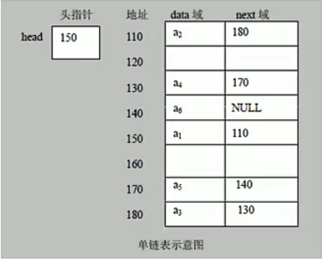
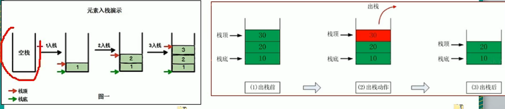
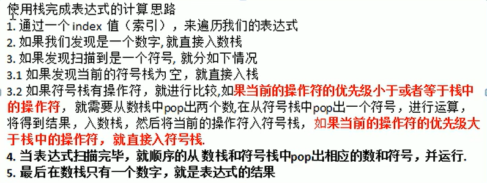
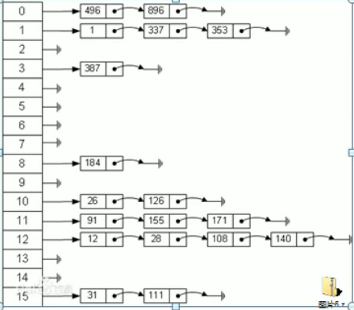
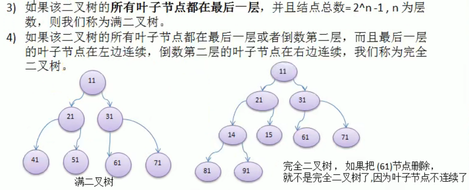
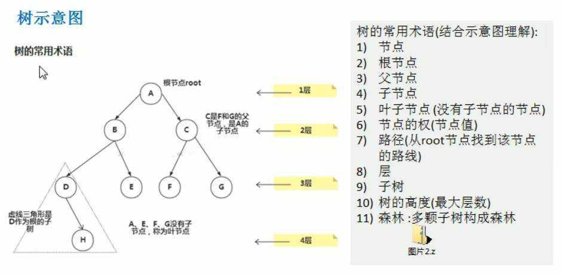

# 数据结构&算法

[TOC]

## 数据结构

### 稀疏数组

- **概念**

  > 一种数组数据的压缩方法
  >
  > 第一行默认存储原始数组的行列和有几个有效数字
  >
  > ​       row（有效数字的行）   col（有效数字的列）   val（值）
  >
  > 0     11									11 								   2
  >
  > 1	 1      								 2									  1
  >
  > 2	 2									   3									 2

- **代码实现**

```java
public class DataStructure {
    public static void main(String[] args) {
        int arr[][] = new int[11][11];
        arr[1][2] = 1;
        arr[2][3] = 2;
        System.out.println("原始数组");
        for (int[] ints : arr) {
            for (int anInt : ints) {
                System.out.print("\t" + anInt);
            }
            System.out.println();
        }

        System.out.println("稀疏数组");
		//sum代表有几个有效数据
        int sum = 0;
        for (int i = 0; i < arr.length; i++) {
            for (int j = 0; j < arr.length; j++) {
                if (arr[i][j] != 0) {
                    sum++;
                }
            }
        }
		//创建稀疏数组
        int spareArr[][] = new int[sum + 1][3];

        spareArr[0][0] = 11;
        spareArr[0][1] = 11;
        spareArr[0][2] = sum;

        int count = 0;
        for (int i = 0; i < arr.length; i++) {
            for (int j = 0; j < arr.length; j++) {
                if (arr[i][j] != 0) {
                    count++;
                    spareArr[count][0] = i;//放行
                    spareArr[count][1] = j;//放列
                    spareArr[count][2] = arr[i][j];
                }
            }
        }
		//打印稀疏数组
        for (int[] ints : spareArr) {
            for (int anInt : ints) {
                System.out.print(anInt + "\t");
            }
            System.out.println();
        }

        System.out.println("稀疏数组恢复后");

        int[][] spareArrAfter = new int[11][11];

        for (int i = 1; i < spareArr.length; i++) {
            spareArrAfter[spareArr[i][0]][spareArr[i][1]] = spareArr[i][2];
        }

        for (int[] ints : spareArrAfter) {
            for (int anInt : ints) {
                System.out.print(anInt + "\t");
            }
            System.out.println();
        }
    }
}
```

> 运行结果

```java
原始数组
	0	0	0	0	0	0	0	0	0	0	0
	0	0	1	0	0	0	0	0	0	0	0
	0	0	0	2	0	0	0	0	0	0	0
	0	0	0	0	0	0	0	0	0	0	0
	0	0	0	0	0	0	0	0	0	0	0
	0	0	0	0	0	0	0	0	0	0	0
	0	0	0	0	0	0	0	0	0	0	0
	0	0	0	0	0	0	0	0	0	0	0
	0	0	0	0	0	0	0	0	0	0	0
	0	0	0	0	0	0	0	0	0	0	0
	0	0	0	0	0	0	0	0	0	0	0
稀疏数组
11	11	2	
1	2	1	
2	3	2	
稀疏数组恢复后
0	0	0	0	0	0	0	0	0	0	0	
0	0	1	0	0	0	0	0	0	0	0	
0	0	0	2	0	0	0	0	0	0	0	
0	0	0	0	0	0	0	0	0	0	0	
0	0	0	0	0	0	0	0	0	0	0	
0	0	0	0	0	0	0	0	0	0	0	
0	0	0	0	0	0	0	0	0	0	0	
0	0	0	0	0	0	0	0	0	0	0	
0	0	0	0	0	0	0	0	0	0	0	
0	0	0	0	0	0	0	0	0	0	0	
0	0	0	0	0	0	0	0	0	0	0	

Process finished with exit code 0

```


### 单链表

- **概念**

  > 链表是有序的列表，以节点的方式存储
  >
  > 每个节点包涵数据（data）和指向下一节点（next）
  >
  > 链表各节点不一定是连续存储
  >
  > 链表分为带头节点和不带头节点，具体看需求 


- **原理**

​													                                       **单链表的内存原理**




------

- **代码实现**

> 创建Node类，实现方便创建节点

```java
public class Node {
    public int no;//记录节点位置
    public String name;//节点数据
    public String nickName;//节点数据
    public Node next;//指向下一节点

    public Node() {

    }

    public Node(int no, String name, String nickName) {
        this.no = no;
        this.name = name;
        this.nickName = nickName;
    }

    @Override
    public String toString() {
        return "Node{" +
                "no=" + no +
                ", name='" + name + '\'' +
                ", nickName='" + nickName + '\'' +

                '}';
    }
}
```

> 单链表的基本增删改查

```java
public class SingleLinkedListMain {
    //新建一个链表头
    Node head = new Node(0, "", "");

    /**
     * 向链表添加数据
     *
     * @param node
     */
    public void add(Node node) {
        Node temp = head; //链表头不变，定义中间变量temp来帮忙
        while (true) {
            if (temp.next == null) { //说明找到链表尾巴了，break
                break;
            }
            temp = temp.next; //后移节点
        }
        temp.next = node;//将节点添加至链表尾部
    }

    /**
     * 有顺序的添加
     *
     * @param node
     */
    public void addByOder(Node node) {
        Node temp = head;//链表头不变，定义中间变量temp来帮忙
        boolean flag = false;//判断是否存在该节点，存在为true
        while (true) {
            if (temp.next == null) {//说明找到链表尾巴了，break
                break;
            }
            if (temp.next.no > node.no) {//通过no变量找到node节点应该添加的位置
                break;
            } else if (temp.next.no == node.no) {//检查节点是否存在
                flag = true;
                break;
            }
            temp = temp.next;//后移节点
        }
        if (flag) {
            System.out.println("节点存在无法添加！");
            return;
        } else {
            //说白了就是把node节点放temp和temp.next之间
            node.next = temp.next;//将node节点的下一个节点连接为temp的下一个节点
            temp.next = node;//将temp的下一个节点连接为node节点
        }

    }

    /**
     * 修改链表中的内容
     *
     * @param node
     */
    public void update(Node node) {
        Node temp = head;//链表头不变，定义中间变量temp来帮忙
        boolean flag = false;//用来判断节点是否存在，存在为true
        while (true) {
            if (temp.next == null) {//说明找到链表尾巴了，break
                break;
            }
            if (temp.next.no == node.no) {//通过no值，找到要修改的节点位置
                flag = true;
                break;
            }
            temp = temp.next;//后移节点
        }
        if (flag) {
            //修改节点内容
            temp.next.name = node.name;
            temp.next.nickName = node.nickName;
        } else {
            System.out.println("没找到该节点");
        }
    }

    /**
     * 删除节点
     *
     * @param no
     */
    public void del(int no) {
        Node temp = head;//链表头不变，定义中间变量temp来帮忙
        boolean flag = false;//判断对应no值得节点是否存在
        while (true) {
            if (temp.next == null) {//说明找到链表尾巴了，break
                break;
            } else if (temp.next.no == no) {//通过no值找到要删除的节点的前一个位置（temp）
                flag = true;
                break;
            }
            temp = temp.next;//后移节点
        }
        if (flag) {
            temp.next = temp.next.next;//跳过被删除的节点，直接将temp与被删除的节点的后一个节点相连
        } else {
            System.out.println("没有找到该节点");
        }
    }


    /**
     * 列出链表中的内容
     */
    public void list() {
        Node temp = head;//链表头不变，定义中间变量temp来帮忙
        while (true) {
            if (temp.next == null) {//说明找到链表尾巴了，打印后break
                //！！！最后一个节点也有数据也要打出来！！！这里容易错！！！
                System.out.println(temp);
                break;
            }
            System.out.println(temp);
            temp = temp.next;//后移节点
        }
    }

    public static void main(String[] args) {
        //新建四个节点
        Node node1 = new Node(1, "23", "325");
        Node node2 = new Node(2, "23", "325");
        Node node3 = new Node(3, "23", "325");
        Node node4 = new Node(4, "23", "325");
        //将四个节点有序添加到链表中
        SingleLinkedListMain singleLinkedListMain = new SingleLinkedListMain();
        singleLinkedListMain.addByOder(node4);
        singleLinkedListMain.addByOder(node3);
        singleLinkedListMain.addByOder(node1);
        singleLinkedListMain.addByOder(node2);
        //列出链表内容
        singleLinkedListMain.list();

    }
}
```

> 翻转单链表

```java
/**
 *  翻转链表
 * @param head
 */
public void reversetList(Node head){//把头传进来（传链表也行）
    //如果链表为空或者只有一个节点，无需翻转
    if (head.next == null || head.next.next == null){
        return;
    }
    //新建一个头节点
    Node reversetHead = new Node(0, "", "");
    Node cur = head.next;//新建指针（变量）cur
    Node curnext = null;//用于保存cur的下一个节点
    while (cur != null) {
        curnext = cur.next;//先保存cur的下一个节点
        cur.next = reversetHead.next;//将cur连接到新头节点的后面
        reversetHead.next = cur;//将新节点的头部和cur连上
        cur = curnext;//将指针指向下一个节点
    }
    head.next = reversetHead.next;//把需要翻转的链表的头连接到新头部的第一个节点
}
```

### 双链表

- **概念**

  > 相对于单链表多了一个pre指向前一个链表

- **代码实现**

​																							**双链表节点的创建**

```java
public class Node {
    public int no;//序号
    public String data;//数据
    public Node pre;//指向前一个节点
    public Node next;//指向下一个节点

    public Node() {

    }

    public Node(int no, String data) {
        this.no = no;
        this.data = data;
    }


    @Override
    public String toString() {
        return "Node{" +
                "no=" + no +
                ", data='" + data + '\'' +
                '}';
    }
}
```

> 基本增删改查

```java
public class DoubleLinkList {

    Node head = new Node(0, "");

    /**
     * 添加数据
     *
     * @param node
     */
    public void add(Node node) {
        Node temp = head;
        while (true) {
            if (temp.next == null) {
                break;
            }
            temp = temp.next;
        }
        temp.next = node;
        node.pre = temp;//让node指向前一个
    }
    
    /**
     * 删除数据
     *
     * @param no
     */
    public void del(int no) {
        Node temp = head.next;//从第一个元素开始比较简洁
        boolean flag = false;
        while (true) {
            if (temp == null) {
                break;
            } else if (temp.no == no) {
                flag = true;
                break;
            }
            temp = temp.next;
        }
        if (flag) {
            if (temp.next == null) {//最后一个元素要特殊处理
                temp.pre.next = null;
                temp.pre = null;
            } else {
                temp.pre.next = temp.next;
                temp.next = temp.pre;
            }
        } else {
            System.out.println("没找到该节点");
        }
    }

    public void update(Node node) {
        Node temp = head;
        boolean flag = false;
        while (true) {
            if (temp.next == null) {
                break;
            }
            if (temp.next.no == node.no) {
                flag = true;
                break;
            }
            temp = temp.next;
        }
        if (flag) {
            temp.next.data = node.data;
        } else {
            System.out.println("没找到该节点");
        }
    }


    /**
     * 列出链表内容
     */
    public void list() {
        Node temp = head;
        while (true) {
            if (temp.next == null) {
                System.out.println(temp);
                break;
            } else {
                System.out.println(temp);
                temp = temp.next;
            }
        }
    }


    public static void main(String[] args) {
        Node node1 = new Node(1, "hahah");
        Node node2 = new Node(2, "22222");
        DoubleLinkList doubleLinkList = new DoubleLinkList();
        doubleLinkList.add(node1);
        doubleLinkList.add(node2);

        node1.data = "111111111";
        node2.data = "222222222";
        doubleLinkList.update(node1);
        doubleLinkList.update(node2);
        doubleLinkList.list();

    }
}
```

### 栈

- **概念**

  > 一种先入后出的数据结构

------

- **原理**																					

​																							**出栈&入栈示意图**



------

- **代码实现**

> 栈的创建与基本操作

```java
public class ArrayStack {
    private final int maxSize;//栈的大小
    private final int[] stack;//用数组实现栈
    private int top = -1;//top代表栈的顶部

    public ArrayStack(int maxSize) {
        this.maxSize = maxSize;
        stack = new int[maxSize];
    }

    /**
     * 判断栈是否满了
     *
     * @return
     */
    public boolean isFull() {
        return top == maxSize - 1;
    }

    /**
     * 判断栈是否为空
     *
     * @return
     */
    public boolean isEmpty() {
        return top == -1;
    }

    /**
     * 向栈中添加数据
     *
     * @param data
     */
    public void push(int data) {
        if (isFull()) {
            System.out.println("栈已满，无法添加");
            return;
        } else {
            top++;
            stack[top] = data;
        }
    }

    /**
     * 拿出栈顶部的数据
     *
     * @return
     */
    public int pop() {
        if (isEmpty()) {
            throw new RuntimeException("栈是空的");
        }
        return stack[top--];
    }

    /**
     * 列出栈中的内容
     */
    public void list() {
        if (isEmpty()) {
            System.out.println("栈是空的");
            return;
        }
        for (int i = top; i >= 0; i--) {
            System.out.println(stack[i]);//从顶部开始拿数据
        }
    }
}
```

- **前缀表达式(波兰表达式)**

> 前缀表达式又称波兰式，前缀表达式的运算符位于操作数之前
> 举例说明：（3+4）×5-6对应的前缀表达式就是-×+3456
>
> 从有至左扫描表达式，遇到数字时，将数字压入堆栈，遇到运算符时，弹出栈顶的两个
> 数，用运算符对它们做相应的计算（栈顶元素和次顶元素），并将结果入栈；重复上
> 述过程直到表达式最左端，最后运算得出的值即为表达式的结果
> 例如：（3+4）×5-6对应的前缀表达式就是·×+3456，针对前缀表达式求值步骤如下：
> 1）从右至左扫描，将6、5、4、3压入堆栈
> 2）遇到+运算符，因此弹出3和4（3为栈顶元素，4为次顶元素），计算出3+4的值，得7，再将7入栈
> 3）接下来是×运算符，因此弹出7和5，计算出7×5=35，将35入栈
> 4）最后是-运算符，计算出35-6的值，即29，由此得出最终结果

- **中缀表达式**

> 中缀表达式就是常见的运算表达式，如（3+4）×5-6
> 中缀表达式的求值是我们人最熟悉的，但是对计算机来说却不好操作（前面我们讲的案例
> 就能看的这个问题），因此，在计算结果时，往往会将中缀表达式转成其它表达式来操作
> （一般转成后缀表达式.）

- **后缀表达式**

> 后缀表达式又称逆波兰表达式，与前缀表达式相似，只是运算符位于操作数之后
> 中举例说明：（3+4）×5-6对应的后缀表达式就是34+5×6-
>
> 从左至右扫描表达式，遇到数字时，将数字压入堆栈，遇到运算符时，弹出栈顶的两个
> 数，用运算符对它们做相应的计算（次顶元素和栈顶元素），并将结果入栈；重复上
> 述过程直到表达式最右端，最后运算得出的值即为表达式的结果
> 例如：（3+4）×5-6对应的前缀表达式就是34+5×6-，针对后缀表达式求值步骤如下：
> 1）从左至右扫描，将3和4压入堆栈：
> 2）遇到+运算符，因此弹出4和3（4为栈顶元素，3为次顶元素），计算出3+4的值，得7，再将7入栈：
> 3）将5入栈；
> 4）接下来是×运算符，因此弹出5和7，计算出7×5=35，将35入栈：
> 5）将6入栈：
> 6）最后是-运算符，计算出35-6的值，即29，由此得出最终结果

- **应用**

> 利用栈制作一个简易计算器
>
> 流程如下：（中缀表达式实现复杂，省略）



### 递归

- **概念**

  > 调用自身进行运算

- **注意事项**

  > 1）执行一个方法时，就创建一个新的受保护的独立空间（栈空间）
  > 2）方法的局部变量是独立的，不会相互影响，比如变量
  > 3）如果方法中使用的是引用类型变量（比如数组），就会共享该引用类型的数据
  > 4）递归必须向退出递归的条件逼近，否则就是无限递归，出现StackOverflowError死龟了
  > 5）当一个方法执行完毕，或者遇到return，就会返回，遵守谁调用，就将结果返回给谁，同时当方法执行完毕或者返回时，该方法也就执行完毕。

- **迷宫回溯实现**

### 哈希表

- **概念**

> 散列表（Hash table，也叫哈希表）
> 是根据关键码值（Key value）而直接进
> 行访问的数据结构。也就是说，它通
> 过把关键码值映射到表中一个位置来
> 访问记录，以加快查找的速度。这个
> 映射函数叫做散列函数，存放记录的
> 数组叫做散列表

- **内存原理**

------



- **代码实现**

```java
public class HashTableMain {
    public static void main(String[] args) {
        HashTab hashTab = new HashTab(7);
        Scanner scanner = new Scanner(System.in);
        while (true) {
            System.out.println("add：添加员工");
            System.out.println("list：列出员工");
            System.out.println("find：查询员工");

            String s = scanner.nextLine();
            switch (s) {
                case "add":
                    System.out.println("请输入员工id");
                    int id = Integer.parseInt(scanner.nextLine());
                    System.out.println("请输入员工姓名");
                    String name = scanner.nextLine();
                    Emp newEmp = new Emp(id, name);
                    hashTab.add(newEmp);
                    System.out.println("添加成功");
                    break;
                case "list":
                    hashTab.list();
                    break;
                case "find":
                    System.out.println("请输入需要查询的id");
                    id = Integer.parseInt(scanner.nextLine());
                    hashTab.findEmpById(id);
                    break;
                default:
                    System.out.println("别乱输入");
                    break;
            }
        }
    }
}

//哈希表表层实现
class HashTab {
    private EmpLinkedList[] empLinkedLists;
    private int size;

    public HashTab(int size) {
        this.size = size;
        empLinkedLists = new EmpLinkedList[size];
        //初始化每一条链表
        for (int i = 0; i < size; i++) {
            empLinkedLists[i] = new EmpLinkedList();
        }
    }

    //添加员工
    public void add(Emp emp) {
        int empNum = hashSize(emp.id);
        empLinkedLists[empNum].add(emp);
    }

    //遍历员工
    public void list() {
        for (int i = 0; i < size; i++) {
            System.out.println("第"+(i+1)+"条链表数据为：");
            empLinkedLists[i].list();
        }
    }

    //查询员工
    public void findEmpById(int id){
        int empNum = hashSize(id);
        Emp result = empLinkedLists[empNum].findEmpById(id);
        if (result!=null){
            System.out.println(result.name);
        }else {
            System.out.println("没有找到该人");
        }
    }

    private int hashSize(int id) {
        return id % size;
    }
}

//链表节点实现
class Emp {
    public int id;
    public String name;
    public Emp next;

    public Emp(int id, String name) {
        this.id = id;
        this.name = name;
    }
}

//链表实现
class EmpLinkedList {
    private Emp head;

    //添加数据
    public void add(Emp emp) {
        //第一位员工数据
        if (head == null) {
            head = emp;
        } else {
            //不是第一位员工
            Emp temp = head;
            while (true) {
                if (temp.next == null) {
                    temp.next = emp;
                    return;
                } else {
                    temp = temp.next;
                }
            }
        }

    }

    //列出链表内容
    public void list() {
        if (head == null) {
            System.out.println("信息为空");
        } else {
            Emp temp = head;
            while (true) {
                if (temp != null) {
                    System.out.print("ID:"+temp.id +"姓名:"+ temp.name);
                    temp = temp.next;
                } else {
                    System.out.println();
                    return;
                }
            }
        }

    }

    //查询功能
    public Emp findEmpById(int id) {
        if (head == null) {
            return null;
        } else {
            while (true) {
                Emp temp = head;
                if (temp.id == id) {
                    return temp;
                } else {
                    if (temp == null) {
                        return null;
                    } else {
                        temp = temp.next;
                    }
                }
            }
        }
    }
}
```

### 二叉树

- **概念**

> 树有很多种,每个节点最多只能有两个子节点的一种形式称为二叉树。
>
>  二叉树的子节点分为左节点和右节点。



-  **示意图** 

------



## 算法