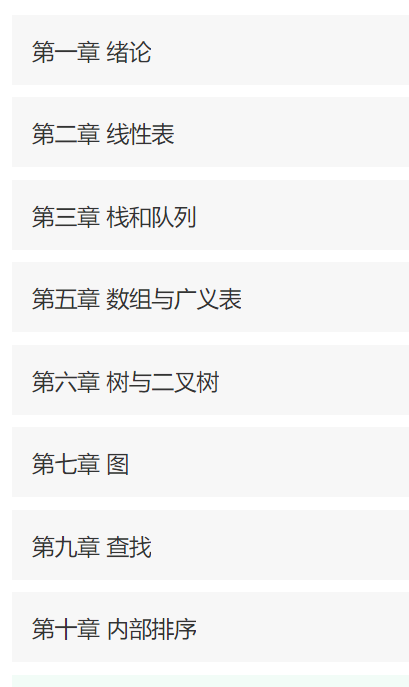

# 数据结构&算法【C版】

## 数据结构

- **概念**

> 数据结构是[计算机](https://baike.baidu.com/item/计算机/140338)存储、组织[数据](https://baike.baidu.com/item/数据)的方式。数据结构是指相互之间存在一种或多种特定关系的[数据元素](https://baike.baidu.com/item/数据元素/715313)的集合。通常情况下，精心选择的数据结构可以带来更高的运行或者存储[效率](https://baike.baidu.com/item/效率/868847)。数据结构往往同高效的检索[算法](https://baike.baidu.com/item/算法/209025)和[索引](https://baike.baidu.com/item/索引/5716853)技术有关

- **内容**



### 时间复杂度和空间复杂度

> **时间复杂度是指执行算法所需要的计算工作量；而空间复杂度是指执行这个算法所需要的内存空间**
>
> O(频度)、O(1)、O(n)、O(n^2)

> 时间复杂度

```c
//2n+1
//n
//O(n)
for(int i = 0 ; i < n ; i++)     //<- 从 0 到 n，执行 n+1 次
{
    a++;                         //<- 从 0 到 n-1，执行 n 次
}

//2*n*m+2*n+1
//2*n2+2*n+1
//n^2
//O(n^2)
for(int i = 0 ; i < n ; i++)           // n+1
{ 
    for(int j = 0 ; j < m ; j++)       // n*(m+1)
    {
        num++;                         // n*m
    }
}

```

> 空间复杂度

```c
//O(1)
int n;
scanf("%d", &n);
int a[10];

//O(n)
int n;
scanf("%d", &n);
int a[n];
```

> 如果程序所占用的存储空间和输入值无关，则该程序的空间复杂度就为 O(1)；反之，如果有关，则需要进一步判断它们之间的系：
> 如果随着输入值 n 的增大，程序申请的临时空间成线性增长，则程序的空间复杂度用 O(n) 表示;
> 如果随着输入值 n 的增大，程序申请的临时空间成 n^2 关系增长，则程序的空间复杂度用 O(n^2) 表示；
> 如果随着输入值 n 的增大，程序申请的临时空间成 n^3 关系增长，则程序的空间复杂度用 O(n^3) 表示；

### 顺序存储

- **基本操作**

  - 1.IniList(&L) //构造空表L。

  - 2.ListLength (L) //求表L的长度

  - 3.GetElem(L,i,&e) //取元素ai,由e返回ai

  - 4.PriorElem(L,ce,&pre_e) //求ce的前驱,由pre_e返回

  - 5.InsertElem(&L,i,e) //在元素ai之前插入新元素e

  - 6.DeleteElem(&L,i) //删除第i个元素

  - 7.EmptyList(L) //判断L是否为空表

- **优点：**

  - (1)是一种随机存取结构，存取任何元素的时间是一个常数，速度快；

  - (2)结构简单，逻辑上相邻的元素在物理上也是相邻的；

  - (3)不使用指针，节省存储空间。

  **缺点：**

  - (1)插入和删除元素要移动大量元素，消耗大量时间；

  - (2)需要一个连续的存储空间；

  - (3)插入元素可能发生“溢出”；

  - (4)自由区中的存储空间不能被其它数据占用(共享)。

> 数组实现

```c

//线性表
#include<stdio.h>
//插入数据
void Insect(int location, int value,int arr[]) {
	int length;
	for (length = 0; arr[length] != '\0'; length++);
	//右移数据
	for (int i = 0; i <= length - location; i++) {
		arr[length - i ] = arr[length - 1 - i];
	}
	//插入数据
	arr[location - 1] = value;
}

//删除数据
void Delete(int location,int arr[]) {
	int length;
	for (length = 0; arr[length] != '\0'; length++);
	//左移数据
	for (int i = 0; i < length - location; i++) {
		arr[location - 1 + i] = arr[location + i];
	}
	//将最后一个元素制空
	arr[length - 1] = '\0';
}

//查找数据
int Serch(int value, int arr[]) {
	int length;
	for (length = 0; arr[length] != '\0'; length++);

	for (int i = 0; i < length; i++) {
		if (arr[i] == value) {
			return i;
		}
	}
	return -1;
}

//列出数据
void List(int arr[]) {
	for (int i = 0; arr[i] != '\0'; i++) {
		printf("%d ", arr[i]);
	}
}

int main() {
	int arr[20] = {24,34,54,65,76,34,76,34,87,53};
	int length;
	for (length = 0; arr[length] != '\0'; length++);
	int result = Serch(887, arr);
	printf("位置%d ", result);
	List(arr);
}
```

> 结构体静态实现

```c
#include<stdio.h>
#define MAX_LENGTH 100
 struct sqList
{
	int elem[MAX_LENGTH];
	int length;
};

 int Insert(sqList *list, int i, int e) {
	 if (i<0 || i>list->length) return -1;
	 if (list->length >= MAX_LENGTH) return -1;
	 for (int j = 0; j < list->length - i; j++) {
		 list->elem[list->length -j] = list->elem[list->length-j-1];
	 }
	 list->elem[i] = e;
	 list->length++;
	 return 1;
 }

 int DeleteElem(sqList* list,int i) {
	 if (i<0 || i>=list->length) return -1;
	 for (int j = 0; j < list->length - i; j++) {
		 list->elem[i+j] = list->elem[i+j+1];
	 }
	 list->length--;
	 return 1;
 }

 void ListAll(sqList list) {
	 for (int i = 0; i < list.length; i++) {
		 printf("%d\n", list.elem[i]);
	}
 }


 int main() {
	 sqList list;
	 for (int i = 0; i < 88; i++) {
		 list.elem[i] = i;
	 }
	 list.length = 88;
	 Insert(&list, 1, 999);
	 DeleteElem(&list, 88);
	 ListAll(list);
	 //printf("%d", list.elem[5]);
 }
```

> 结构体动态实现

```c
#include<stdio.h>
#include<stdlib.h>
#define INIT_LENGTH 20
#define EX_LENGTH 10
struct sqList
{
	int* elem; //存储空间基地址
	int length; //表长
	int listSize;  //分配的存储容量
};
int Insert(sqList* list, int i, int e) {
	if (i<0 || i>list->length) return -1;//i值不合法直接退出
	if (list->length >= list->listSize) {//溢出时扩充，等号不能少
		int* newbase;
		//为新空间重新分配一个大小（扩容EX_LENGTH）
		newbase = (int *) realloc(list->elem, ((list->listSize + EX_LENGTH) * sizeof(int)));
		if (newbase == NULL) return -1;//分配失败
		list->elem = newbase; //指向新空间地址
		list->listSize += EX_LENGTH;
	}
	for (int j = 0; j < list->length - i; j++) {
		list->elem[list->length - j] = list->elem[list->length - 1 - j]; //右移元素
	}
	list->elem[i] = e;
	list->length++;
	return 1;
}

int  DeleteElem(sqList* list, int i) {
	if (i<0 || i>=list->length) return -1;//等号不能少
	for (int j = 0; j < list->length - i; j++) {
		list->elem[i+j] = list->elem[i + 1+j];//左移元素
	}
	list->length--;
	return 1;
}

void ListAll(sqList list) {
	for (int i = 0; i < list.length; i++) {
		printf("%d\n", list.elem[i]);
	}
}

int main() {
	sqList list;
	list.listSize = INIT_LENGTH;//初始化表大小
	list.elem =(int*)malloc(sizeof(int)*list.listSize);//给元素分配相应大小
	for (int i = 0; i < 10; i++) { //for循环赋值
		list.elem[i] = i;
	}
	list.length = 10;
	Insert(&list, 0, 999);
	DeleteElem(&list, 7);
	ListAll(list);
}
```

### 链式存储
