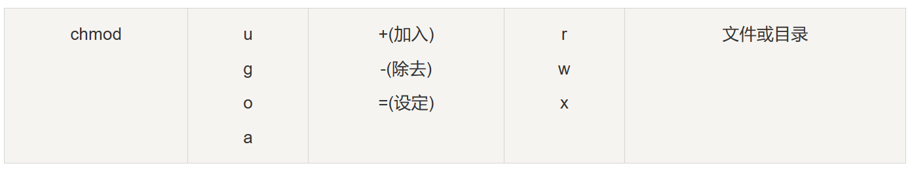

# Linux文件属性

## Linux 文件基本属性

在 Linux 中，文件的基本属性和权限可以使用 `ll` 或 `ls -l` 命令来显示，如下所示：

```shell
drwxr-xr-x 2 root  root  4096 Feb 15 14:46 cron
```

- **第一个字符**代表文件的类型，可以是：
  - **d**: 目录 (directory)
  - **-**: 普通文件 (regular file)
  - **l**: 链接文件 (symbolic link)
  - **b**: 块设备文件 (block device)
  - **c**: 字符设备文件 (character device)

接下来的字符以三个一组，每组表示文件的权限，其中：
- **r** 代表可读权限 (read)
- **w** 代表可写权限 (write)
- **x** 代表可执行权限 (execute)
- 如果没有相应的权限，会显示减号 **-**。

文件的权限分为三种身份：**owner（拥有者）/group（组）/others（其他）**。每个身份拥有自己的读（read）、写（write）、和执行（execute）权限。权限字符以这样的方式组织：

- owner = rwx
- group = r-x
- others = r-x

每个权限（r/w/x）都有相应的权重：
- r (读权限): 4
- w (写权限): 2
- x (执行权限): 1

每种身份的权限可以通过将对应的权重相加来计算。例如，对于权限字符串 **-rwxrwx---**，分数如下：

- owner = rwx = 4 (读) + 2 (写) + 1 (执行) = 7
- group = rwx = 4 (读) + 2 (写) + 1 (执行) = 7
- others = --- = 0 (无读) + 0 (无写) + 0 (无执行) = 0

这种权限表示方法允许您轻松地了解文件的类型和哪些用户类别具有哪些权限。通常情况下，root 用户拥有超级用户权限，可以忽略文件权限，但其他用户受到文件权限的限制。

------

## 更改文件属性

### `chgrp`

更改文件属组

```
chgrp [-R] 属组名 文件名
```

- -R：递归更改文件属组，就是在更改某个目录文件的属组时，如果加上 **-R** 的参数，那么该目录下的所有文件的属组都会更改。

### `chown`

更改文件所有者（owner），也可以同时更改文件所属组。

```
chown [–R] 所有者 文件名
chown [-R] 所有者:属组名 文件名
```

### `chmod`

更改文件9个属性

```
 chmod [-R] xyz 文件或目录
```

- **xyz** : 数字类型的权限属性，为 **rwx** 属性数值的相加。
- **-R** : 进行递归(recursive)的持续变更，以及连同次目录下的所有文件都会变更

还有一个改变权限的方法，从之前的介绍中我们可以发现，基本上就九个权限分别是：

- user：用户
- group：组
- others：其他
- a:  全部



# Linux 文件与目录管理

## `ls` - 列出目录内容

`ls` 命令用于列出目录内的文件和子目录。

```shell
ls [选项] [目录]
```

常用选项：
- `-a`：显示所有文件，包括隐藏文件以点号开头的文件。
- `-l`：以长格式显示文件信息。
- `-h`：人类易读格式。

## `cd` - 切换目录

`cd` 命令用于改变当前工作目录。

```shell
cd [目录路径]
```

常用示例：
- `cd /path/to/directory`：切换到指定目录。
- `cd ..`：切换到上级目录。
- `cd ~`：切换到当前用户的主目录。

## `pwd` - 显示当前目录

`pwd` 命令用于显示当前工作目录的路径。

```shell
pwd
```

## `mkdir` - 创建目录

`mkdir` 命令用于创建新目录。

```shell
mkdir [目录名]
```

常用选项：
- `-p`：递归创建多级目录。

## `rmdir` - 删除空目录

`rmdir` 命令用于删除空的目录。

```shell
rmdir [目录名]
```

## `cp` - 复制文件和目录

`cp` 命令用于复制文件或目录。

```shell
cp [选项] 源目标
```

常用选项：
- `-r`：递归复制目录及其内容。
- `-i`：互动模式，提示是否覆盖已存在的文件。

## `rm` - 删除文件和目录

`rm` 命令用于删除文件或目录。

```shell
rm [选项] 文件/目录
```

常用选项：
- `-r`：递归删除目录及其内容。
- `-f`：强制删除，不提示。

## `mv` - 移动文件和目录，或重命名文件

`mv` 命令用于移动文件或目录，或修改文件名。

```shell
mv [选项] 源 目标
```

常用选项：
- `-i`：互动模式，提示是否覆盖已存在的文件。
- `-u`：若目标文件已存在且比源文件新，才会移动或重命名。

这些命令是 Linux 用户日常管理文件和目录时经常使用的基本工具。可以使用 `man` 命令查看这些命令的详细帮助文档，例如 `man ls`。

以下是一些 Linux 命令，用于查看文件的内容：

## `cat` - 查看文件内容

`cat` 命令用于从第一行开始显示文件的内容。

语法：

```shell
cat [选项] 文件
```

常用选项：
- `-A`：显示特殊字符（非空白字符）。
- `-b`：显示行号，只对非空白行编号。
- `-E`：显示行尾的 `$` 符号。
- `-n`：显示行号，包括空白行。
- `-T`：将制表符显示为 `^I`。
- `-v`：显示看不见的特殊字符。

## `tac` - 倒序查看文件内容

`tac` 命令与 `cat` 命令相反，从文件的最后一行开始显示内容。

语法：

```shell
tac 文件
```

## `nl` - 显示文件内容并加上行号

`nl` 命令用于显示文件的内容，并为每一行加上行号。

语法：

```shell
nl [选项] 文件
```

常用选项：
- `-b`：指定行号显示的方式，包括 `t` 和 `a`。
- `-n`：设置行号显示的格式，包括 `ln`、`rn` 和 `rz`。
- `-w`：指定行号字段的宽度。

## `more` - 逐页查看文件内容

`more` 命令用于逐页查看文件的内容，可以使用空格键翻页。

语法：

```shell
more 文件
```

## `less` - 逐页查看文件内容（可向前翻页）

`less` 命令与 `more` 类似，但更强大，允许向前翻页。

语法：

```shell
less 文件
```

在 `less` 中，可以使用以下命令来导航：
- 空格键：向下翻页。
- Enter 键：向下滚动一行。
- /关键字：搜索关键字。
- ?关键字：向上搜索关键字。
- n：重复上一次搜索。
- N：反向重复上一次搜索。
- q：退出 `less`。

## `head` - 查看文件开头部分内容

`head` 命令用于查看文件的开头部分内容。

语法：

```shell
head [选项] 文件
```

常用选项：
- `-n`：指定显示文件的前几行，默认为 10 行。

## `tail` - 查看文件末尾部分内容

`tail` 命令用于查看文件的末尾部分内容。

语法：

```shell
tail [选项] 文件
```

常用选项：
- `-n`：指定显示文件的末尾几行，默认为 10 行。
- `-f`：持续查看文件末尾内容，类似实时日志查看。

这些命令是用于查看文件内容的基本工具，可以根据需要选择适合的命令来查看文件。可使用 `man` 命令查看这些命令的详细帮助文档，例如 `man cat`。Linux 用户和用户组管理

Linux系统是一个多用户多任务的分时操作系统，任何一个要使用系统资源的用户，都必须首先向系统管理员申请一个账号，然后以这个账号的身份进入系统。

用户的账号一方面可以帮助系统管理员对使用系统的用户进行跟踪，并控制他们对系统资源的访问；另一方面也可以帮助用户组织文件，并为用户提供安全性保护。

每个用户账号都拥有一个唯一的用户名和各自的口令。

用户在登录时键入正确的用户名和口令后，就能够进入系统和自己的主目录。

实现用户账号的管理，要完成的工作主要有如下几个方面：

- 用户账号的添加、删除与修改。
- 用户口令的管理。
- 用户组的管理。

------

# Linux账户管理

## 用户账号的管理

用户账号的管理工作主要涉及用户账号的添加、修改和删除。

### 添加新用户账号

添加用户账号是在系统中创建一个新账号，并为新账号分配用户号、用户组、主目录和登录Shell等资源。刚添加的账号是被锁定的，无法使用。

**useradd命令**用于添加新用户账号，其语法如下：

```bash
useradd 选项 用户名
```

参数说明:

- 选项:
  - `-c comment`: 指定一段注释性描述。
  - `-d 目录`: 指定用户主目录，如果此目录不存在，则同时使用-m选项，可以创建主目录。
  - `-g 用户组`: 指定用户所属的用户组。
  - `-G 用户组，用户组`: 指定用户所属的附加组。
  - `-s Shell文件`: 指定用户的登录Shell。
  - `-u 用户号`: 指定用户的用户号，如果同时有-o选项，则可以重复使用其他用户的标识号.

- 用户名: 指定新账号的登录名。

**实例1:**

```bash
useradd -d /home/sam -m sam
```

此命令创建了一个用户sam，其中-d和-m选项用来为登录名sam产生一个主目录/home/sam（/home为默认的用户主目录所在的父目录）。

**实例2:**

```bash
useradd -s /bin/sh -g group -G adm,root gem
```

此命令新建了一个用户gem，该用户的登录Shell是 `/bin/sh`，它属于group用户组，同时又属于adm和root用户组，其中group用户组是其主组。

### 删除用户账号

如果一个用户的账号不再使用，可以从系统中删除。删除用户账号就是要将/etc/passwd等系统文件中的该用户记录删除，必要时还删除用户的主目录。

删除用户账号使用`userdel`命令，其格式如下：

```bash
userdel 选项 用户名
```

常用的选项是 **-r**，它的作用是把用户的主目录一起删除。

例如:

```bash
userdel -r sam
```

此命令删除用户sam在系统文件中的记录（主要是/etc/passwd, /etc/shadow, /etc/group等），同时删除用户的主目录。

### 修改用户账号

修改用户账号是根据实际情况更改用户的相关属性，如用户号、主目录、用户组、登录Shell等。

**usermod命令**用于修改已有用户的信息，其格式如下：

```bash
usermod 选项 用户名
```

常用的选项包括 `-c`, `-d`, `-m`, `-g`, `-G`, `-s`, `-u` 以及 `-o` 等，这些选项的意义与`useradd`命令中的选项一样，可以为用户指定新的资源值。

另外，有些系统可以使用选项：`-l 新用户名`，这个选项指定一个新的账号，即将原来的用户名改为新的用户名。

例如:

```bash
usermod -s /bin/ksh -d /home/z -g developer sam
```

此命令将用户sam的登录Shell修改为ksh，主目录改为/home/z，用户组改为developer。

### 用户口令的管理

用户口令的管理是用户管理的一个重要方面。用户账号刚创建时没有口令，但是被系统锁定，无法使用，必须为其指定口令后才可以使用，即使是指定空口令。

**passwd命令**用于指定和修改用户口令。超级用户可以为自己和其他用户指定口令，普通用户只能用它修改自己的口令。

命令的格式为：

```bash
passwd 选项 用户名
```

可使用的选项:

- `-l`: 锁定口令，即禁用账号。
- `-u`: 口令解锁。
- `-d`: 使账号无口令。
- `-f`: 强迫用户下次登录时修改口令。

如果默认用户名，可以修改当前用户的口令。

例如，假设当前用户是sam，则下面的命令修改该用户自己的口令:

```bash
passwd
Old password: ******
New password: ******
Re-enter new password: ******
```

如果是超级用户，可以用下列形式指定任何用户的口令:

```bash
passwd sam
New password: ******
Re-enter new password: ******
```

普通用户修改自己的口令时，passwd命令会先询问原口令，验证后再要求用户输入两遍新口令，如果两次输入的口令一致，则将这个口令指定给用户；而超级用户为用户指定口令时，就不需要知道原口令。

为了系统安全起见，用户应该选择比较复杂的口令，例如最好使用8位长的口令，口令中包含有大写、小写字母和数字，并且应该与姓名、生日等不相同。

为用户指定空口令时，执行下列形式的命令:

```bash
passwd -d sam
```

此命令将用户sam的口令删除，这样用户sam下一次登录时，系统就不再允许该用户登录了。

可以使用`passwd -l`选项锁定某一用户，使其不能登录，例如:

```bash
passwd -l sam
```

这样，用户sam的账号被锁定，不能登录系统。

------

## 用户组的管理

每 user 都有一个用户组，系统可以对一个用户组中的所有用户进行集中管理。不同 Linux 系统对用户组的规定有所不同，如 Linux 下的用户属于与它同名的用户组，这个用户组在创建用户时同时创建。

用户组的管理涉及用户组的添加、删除和修改。组的增加、删除和修改实际上就是对 `/etc/group` 文件的更新。

### 增加新的用户组

```bash
groupadd 选项 用户组
```

可以使用的选项有：

- `-g GID`: 指定新用户组的组标识号（GID）。
- `-o`: 一般与 `-g` 选项同时使用，表示新用户组的 GID 可以与系统已有用户组的 GID 相同。

**实例1：**

```bash
groupadd group1
```

此命令向系统中增加了一个新组group1，新组的组标识号是在当前已有的最大组标识号的基础上加1。

**实例2：**

```bash
groupadd -g 101 group2
```

此命令向系统中增加了一个新组group2，同时指定新组的组标识号是101。

### 删除用户组

```bash
groupdel 用户组
```

**例如：**

```bash
groupdel group1
```

此命令从系统中删除组group1。

### 修改用户组的属性

```bash
groupmod 选项 用户组
```

常用的选项有：

- `-g GID`: 为用户组指定新的组标识号。
- `-o`: 与 `-g` 选项同时使用，用户组的新 GID 可以与系统已有用户组的 GID 相同.
- `-n 新用户组`: 将用户组的名字改为新名字。

**实例1：**

```bash
groupmod -g 102 group2
```

此命令将组group2的组标识号修改为102。

**实例2：**

```bash
groupmod -g 10000 -n group3 group2
```

此命令将组group2的标识号改为10000，组名修改为group3。

### 用户组切换

用户可以在登录后，使用命令newgrp切换到其他用户组，这个命令的参数就是目的用户组。例如:

```bash
newgrp root
```

这条命令将当前用户切换到root用户组，前提条件是root用户组确实是该用户的主组或附加组。

类似于用户账号的管理，用户组的管理也可以通过集成的系统管理工具来完成。

## 用户相关文件

`/etc/passwd` 文件包含了关于用户账号的基本信息，对所有用户都是可读的。以下是 `/etc/passwd` 文件的格式和字段含义：

```
用户名:口令:用户标识号:组标识号:注释性描述:主目录:登录Shell
```

让我们解释每个字段的含义：

1. **用户名 (Username)**: 登录名，通常不超过8个字符，由大小写字母和数字组成。登录名不能包含冒号(:)，因为它在这里是字段分隔符。为了兼容性，最好不要包含点字符(.)，以及不以连字符(-)或加号(+)开头。

2. **口令 (Password)**: 在过去，这里存放用户的密码，但现在通常被替代为一个特殊字符（如"x"或"*"），而真正的密码存放在`/etc/shadow`文件中，这是为了增加安全性。

3. **用户标识号 (User ID)**: 用于在系统内部标识用户的整数。通常与用户名一一对应，但可以多个用户名共享相同的用户标识号。0通常为超级用户（root）的标识号，1至99由系统保留，用户标识号从100开始分配给普通用户。

4. **组标识号 (Group ID)**: 用户所属的主要用户组的标识号，对应着`/etc/group`文件中的一条记录。

5. **注释性描述 (Comment)**: 存储用户的个人信息，如姓名、电话、地址等。这个字段没有特定的格式要求，通常用作用户的说明或备注。

6. **主目录 (Home Directory)**: 用户登录后所在的起始工作目录。通常以用户名命名，每个用户有自己的主目录。这个目录通常包含用户的个人文件和设置。

7. **登录Shell (Login Shell)**: 用户登录后启动的命令解释器或程序。常见的Shell包括sh、bash、zsh、csh等。这个字段决定用户登录后可以运行哪种Shell。

此外，还有一些伪用户（pseudo users）的记录，它们的登录Shell为空，因此不能用于登录。这些伪用户通常用于系统管理和特定的系统进程，如bin、sys、adm、uucp、lp、nobody等。

`/etc/passwd`文件中的信息对于用户账号的基本管理非常重要，但为了提高安全性，实际的密码通常存储在`/etc/shadow`文件中，而`/etc/passwd`中的密码字段会被替代为一个特殊字符。这可以防止未经授权的访问和保护用户密码。

## 批量用户添加

要批量添加用户，您可以使用以下步骤：

1. **创建用户文件：** 首先，创建一个文本文件，按照`/etc/passwd`文件的格式编写要添加的用户信息。每行包括用户名、用户标识号、组标识号、注释性描述、主目录和登录Shell。通常，密码字段留空或包含特殊字符，因为密码会在后续步骤中设置。例如：

   ```
   用户名::用户标识号:组标识号:注释性描述:主目录:登录Shell
   ```

2. **导入用户数据：** 使用`newusers`命令，将用户信息从创建的用户文件导入系统，并创建用户帐户：

   ```
   sudo newusers < user.txt
   ```

3. **取消`shadow password`功能：** 运行`pwunconv`命令，将`/etc/shadow`文件中的密码解码并写回`/etc/passwd`，然后删除`/etc/shadow`中的密码字段：

   ```
   sudo pwunconv
   ```

   这一步是为了准备下一步的密码设置。

4. **编辑密码对照文件：** 创建一个密码对照文件，其中包含用户名和密码的对照。每行格式如下：

   ```
   用户名:密码
   ```

5. **设置用户密码：** 使用`chpasswd`命令，将密码设置为用户密码，该命令会对密码进行编码并将其写入`/etc/passwd`的密码字段中：

   ```
   sudo chpasswd < passwd.txt
   ```

6. **重新启用`shadow password`：** 最后，运行`pwconv`命令，将密码编码为`shadow password`并将结果写入`/etc/shadow`：

   ```
   sudo pwconv
   ```

这些步骤将帮助您批量创建用户帐户，并确保它们的密码得到适当的处理。请在创建用户后检查主目录和权限设置，以确保一切正常。这种方法适用于需要批量添加用户的情况，以提高效率。

# Linux 磁盘管理

### `df` 

`df` 命令用于列出文件系统的整体磁盘使用情况。

**语法**：

```shell
df [-ahikHTm] [目录或文件名]
```

**常用选项**:
- `-a`：列出所有文件系统，包括系统特有的 `/proc` 等文件系统。
- `-k`：以 KB 容量显示各文件系统。
- `-m`：以 MB 容量显示各文件系统。
- `-h`：以易读的 GBytes、MBytes、KBytes 格式显示。
- `-T`：显示文件系统类型以及文件系统名称。
- `-i`：使用 inode 的数量来显示，而非硬盘容量。

### `du` 

`du` 命令用于检查磁盘空间使用情况。

**语法**:
```shell
du [-ahskm] 文件或目录名称
```

**常用选项**:
- `-a`：列出所有文件和目录容量，包括子目录。
- `-h`：以易读的容量格式 (G/M) 显示。
- `-s`：仅显示指定目录或文件的总大小，而不显示其子目录的大小。
- `-S`：包括子目录下的总计，与 `-s` 有些不同。
- `-k`：以 KB 列出容量显示。
- `-m`：以 MB 列出容量显示。

### `fdisk` 

`fdisk` 用于磁盘分区表操作。

**语法**:
```shell
fdisk [-l] 装置名称
```

**常用选项**:
- `-l`：输出后面接的装置所有的分区内容。

###  `mkfs` 

使用 `mkfs` 命令来格式化磁盘。

**语法**:

```shell
mkfs [-t 文件系统格式] 装置文件名
```

**示例**:
```shell
mkfs -t ext3 /dev/hdc6
```

###  `fsck` 

使用 `fsck` 命令来检查和维护文件系统的一致性。

**语法**:

```shell
fsck [-t 文件系统] [-ACay] 装置名称
```

**示例**:
```shell
fsck -C -f -t ext3 /dev/hdc6
```

###  `mount` 

使用 `mount` 命令来挂载磁盘，使用 `umount` 命令来卸载磁盘。

**挂载语法**:

```shell
mount [-t 文件系统] [-L Label名] [-o 额外选项] [-n] 装置文件名 挂载点
```

**卸载语法**:
```shell
umount [-fn] 装置文件名或挂载点
```

以上是有关磁盘管理的常用 Linux 命令。希望这个整理过的格式对你有所帮助。如果你需要更多信息或有任何问题，请随时提问。Linux apt 命令


# apt 软件管理

apt（Advanced Packaging Tool）是一个在 Debian 和 Ubuntu 中的 Shell 前端软件包管理器。

apt 命令提供了查找、安装、升级、删除某一个、一组甚至全部软件包的命令，而且命令简洁而又好记。

apt 命令执行需要超级管理员权限(root)。

## apt基本用法

```
用法： apt [选项] 命令
命令行软件包管理器 apt 提供软件包搜索，管理和信息查询等功能。
它提供的功能与其他 APT 工具相同（像 apt-get 和 apt-cache），
但是默认情况下被设置得更适合交互。

常用命令：
  list - 根据名称列出软件包
  search - 搜索软件包描述
  show - 显示软件包细节
  install - 安装软件包
  reinstall - 重新安装软件包
  remove - 移除软件包
  autoremove - 卸载所有自动安装且不再使用的软件包
  update - 更新可用软件包列表
  upgrade - 通过 安装/升级 软件来更新系统
  full-upgrade - 通过 卸载/安装/升级 来更新系统
  edit-sources - 编辑软件源信息文件
  satisfy - 使系统满足依赖关系字符串
```

------

## apt 常用命令

- 列出所有可更新的软件清单命令：**sudo apt update**

- 升级软件包：**sudo apt upgrade**

  列出可更新的软件包及版本信息：**apt list --upgradeable**

  升级软件包，升级前先删除需要更新软件包：**sudo apt full-upgrade**

- 安装指定的软件命令：**sudo apt install <package_name>**

  安装多个软件包：**sudo apt install <package_1> <package_2> <package_3>**

- 更新指定的软件命令：**sudo apt update <package_name>**

- 显示软件包具体信息,例如：版本号，安装大小，依赖关系等等：**sudo apt show <package_name>**

- 删除软件包命令：**sudo apt remove <package_name>**

- 清理不再使用的依赖和库文件: **sudo apt autoremove**

- 移除软件包及配置文件: **sudo apt purge <package_name>**

- 查找软件包命令： **sudo apt search <keyword>**

- 列出所有已安装的包：**apt list --installed**

- 列出所有已安装的包的版本信息：**apt list --all-versions**

# Vi/Vim

基本上 vi/vim 共分为三种模式，**命令模式（Command Mode）、输入模式（Insert Mode）和命令行模式（Command-Line Mode）**。


## 命令模式

**用户刚刚启动 vi/vim，便进入了命令模式。**

此状态下敲击键盘动作会被 Vim 识别为命令，而非输入字符，比如我们此时按下 **i**，并不会输入一个字符，**i** 被当作了一个命令。

以下是普通模式常用的几个命令：

- **i** -- 切换到输入模式，在光标当前位置开始输入文本。
- **x** -- 删除当前光标所在处的字符。
- **:** -- 切换到**底线命令模式**，以在最底一行输入命令。
- **a** -- 进入插入模式，在光标下一个位置开始输入文本。
- **o**：在当前行的下方插入一个新行，并进入插入模式。
- **O** -- 在当前行的上方插入一个新行，并进入插入模式。
- **dd** -- 删除(剪切)当前行。
- **yy** -- 复制当前行。
- **p**（小写） -- 粘贴剪贴板内容到光标下方。
- **P**（大写）-- 粘贴剪贴板内容到光标上方。
- **u** -- 撤销上一次操作。
- **Ctrl + r** -- 重做上一次撤销的操作。
- **:w** -- 保存文件。
- **:q** -- 退出 Vim 编辑器。
- **:q!** -- 强制退出Vim 编辑器，不保存修改。

若想要编辑文本，只需要启动 Vim，进入了命令模式，按下 **i** 切换到输入模式即可。

命令模式只有一些最基本的命令，因此仍要依靠**底线命令行模式**输入更多命令。

## 输入模式

在命令模式下按下 **i** 就进入了输入模式，使用 **Esc** 键可以返回到普通模式。

在输入模式中，可以使用以下按键：

- **字符按键以及Shift组合**，输入字符
- **ENTER**，回车键，换行
- **BACK SPACE**，退格键，删除光标前一个字符
- **DEL**，删除键，删除光标后一个字符
- **方向键**，在文本中移动光标
- **HOME**/**END**，移动光标到行首/行尾
- **Page Up**/**Page Down**，上/下翻页
- **Insert**，切换光标为输入/替换模式，光标将变成竖线/下划线
- **ESC**，退出输入模式，切换到命令模式

## 底线命令模式

在命令模式下按下 **:**（英文冒号）就进入了底线命令模式。

底线命令模式可以输入单个或多个字符的命令，可用的命令非常多。

在底线命令模式中，基本的命令有（已经省略了冒号）：

- `:w`：保存文件。
- `:q`：退出 Vim 编辑器。
- `:wq`：保存文件并退出 Vim 编辑器。
- `:q!`：强制退出Vim编辑器，不保存修改。

按 **ESC** 键可随时退出底线命令模式。

# vi/vim 按键说明

除了上面简易范例的 i, Esc, :wq 之外，其实 vim 还有非常多的按键可以使用。


## 光标移动、复制粘贴、搜索替换等

| 移动光标的方法                                               |                                                              |
| :----------------------------------------------------------- | ------------------------------------------------------------ |
| h 或 向左箭头键(←)                                           | 光标向左移动一个字符                                         |
| j 或 向下箭头键(↓)                                           | 光标向下移动一个字符                                         |
| k 或 向上箭头键(↑)                                           | 光标向上移动一个字符                                         |
| l 或 向右箭头键(→)                                           | 光标向右移动一个字符                                         |
| 如果你将右手放在键盘上的话，你会发现 hjkl 是排列在一起的，因此可以使用这四个按钮来移动光标。 如果想要进行多次移动的话，例如向下移动 30 行，可以使用 "30j" 或 "30↓" 的组合按键， 亦即加上想要进行的次数(数字)后，按下动作即可！ |                                                              |
| [Ctrl] + [f]                                                 | 屏幕『向下』移动一页，相当于 [Page Down]按键 (常用)          |
| [Ctrl] + [b]                                                 | 屏幕『向上』移动一页，相当于 [Page Up] 按键 (常用)           |
| [Ctrl] + [d]                                                 | 屏幕『向下』移动半页                                         |
| [Ctrl] + [u]                                                 | 屏幕『向上』移动半页                                         |
| +                                                            | 光标移动到非空格符的下一行                                   |
| -                                                            | 光标移动到非空格符的上一行                                   |
| n<space>                                                     | 那个 n 表示『数字』，例如 20 。按下数字后再按空格键，光标会向右移动这一行的 n 个字符。例如 20<space> 则光标会向后面移动 20 个字符距离。 |
| 0 或功能键[Home]                                             | 这是数字『 0 』：移动到这一行的最前面字符处 (常用)           |
| $ 或功能键[End]                                              | 移动到这一行的最后面字符处(常用)                             |
| H                                                            | 光标移动到这个屏幕的最上方那一行的第一个字符                 |
| M                                                            | 光标移动到这个屏幕的中央那一行的第一个字符                   |
| L                                                            | 光标移动到这个屏幕的最下方那一行的第一个字符                 |
| G                                                            | 移动到这个档案的最后一行(常用)                               |
| nG                                                           | n 为数字。移动到这个档案的第 n 行。例如 20G 则会移动到这个档案的第 20 行(可配合 :set nu) |
| gg                                                           | 移动到这个档案的第一行，相当于 1G 啊！ (常用)                |
| n<Enter>                                                     | n 为数字。光标向下移动 n 行(常用)                            |
| 搜索替换                                                     |                                                              |
| /word                                                        | 向光标之下寻找一个名称为 word 的字符串。例如要在档案内搜寻 vbird 这个字符串，就输入 /vbird 即可！ (常用) |
| ?word                                                        | 向光标之上寻找一个字符串名称为 word 的字符串。               |
| n                                                            | 这个 n 是英文按键。代表重复前一个搜寻的动作。举例来说， 如果刚刚我们执行 /vbird 去向下搜寻 vbird 这个字符串，则按下 n 后，会向下继续搜寻下一个名称为 vbird 的字符串。如果是执行 ?vbird 的话，那么按下 n 则会向上继续搜寻名称为 vbird 的字符串！ |
| N                                                            | 这个 N 是英文按键。与 n 刚好相反，为『反向』进行前一个搜寻动作。 例如 /vbird 后，按下 N 则表示『向上』搜寻 vbird 。 |
| 使用 /word 配合 n 及 N 是非常有帮助的！可以让你重复的找到一些你搜寻的关键词！ |                                                              |
| :n1,n2s/word1/word2/g                                        | n1 与 n2 为数字。在第 n1 与 n2 行之间寻找 word1 这个字符串，并将该字符串取代为 word2 ！举例来说，在 100 到 200 行之间搜寻 vbird 并取代为 VBIRD 则： 『:100,200s/vbird/VBIRD/g』。(常用) |
| **:1,$s/word1/word2/g** 或 **:%s/word1/word2/g**             | 从第一行到最后一行寻找 word1 字符串，并将该字符串取代为 word2 ！(常用) |
| **:1,$s/word1/word2/gc** 或 **:%s/word1/word2/gc**           | 从第一行到最后一行寻找 word1 字符串，并将该字符串取代为 word2 ！且在取代前显示提示字符给用户确认 (confirm) 是否需要取代！(常用) |
| 删除、复制与贴上                                             |                                                              |
| x, X                                                         | 在一行字当中，x 为向后删除一个字符 (相当于 [del] 按键)， X 为向前删除一个字符(相当于 [backspace] 亦即是退格键) (常用) |
| nx                                                           | n 为数字，连续向后删除 n 个字符。举例来说，我要连续删除 10 个字符， 『10x』。 |
| dd                                                           | 剪切游标所在的那一整行(常用)，用 p/P 可以粘贴。              |
| ndd                                                          | n 为数字。剪切光标所在的向下 n 行，例如 20dd 则是剪切 20 行(常用)，用 p/P 可以粘贴。 |
| d1G                                                          | 删除光标所在到第一行的所有数据                               |
| dG                                                           | 删除光标所在到最后一行的所有数据                             |
| d$                                                           | 删除游标所在处，到该行的最后一个字符                         |
| d0                                                           | 那个是数字的 0 ，删除游标所在处，到该行的最前面一个字符      |
| yy                                                           | 复制游标所在的那一行(常用)                                   |
| nyy                                                          | n 为数字。复制光标所在的向下 n 行，例如 20yy 则是复制 20 行(常用) |
| y1G                                                          | 复制游标所在行到第一行的所有数据                             |
| yG                                                           | 复制游标所在行到最后一行的所有数据                           |
| y0                                                           | 复制光标所在的那个字符到该行行首的所有数据                   |
| y$                                                           | 复制光标所在的那个字符到该行行尾的所有数据                   |
| p, P                                                         | p 为将已复制的数据在光标下一行贴上，P 则为贴在游标上一行！ 举例来说，我目前光标在第 20 行，且已经复制了 10 行数据。则按下 p 后， 那 10 行数据会贴在原本的 20 行之后，亦即由 21 行开始贴。但如果是按下 P 呢？ 那么原本的第 20 行会被推到变成 30 行。 (常用) |
| J                                                            | 将光标所在行与下一行的数据结合成同一行                       |
| c                                                            | 重复删除多个数据，例如向下删除 10 行，[ 10cj ]               |
| u                                                            | 复原前一个动作。(常用)                                       |
| [Ctrl]+r                                                     | 重做上一个动作。(常用)                                       |
| 这个 u 与 [Ctrl]+r 是很常用的指令！一个是复原，另一个则是重做一次～ 利用这两个功能按键，你的编辑，嘿嘿！很快乐的啦！ |                                                              |
| .                                                            | 不要怀疑！这就是小数点！意思是重复前一个动作的意思。 如果你想要重复删除、重复贴上等等动作，按下小数点『.』就好了！ (常用) |

## 命令模式切换到编辑模式的可用的按钮说明

| 进入输入或取代的编辑模式                                     |                                                              |
| :----------------------------------------------------------- | ------------------------------------------------------------ |
| i, I                                                         | 进入输入模式(Insert mode)： i 为『从目前光标所在处输入』， I 为『在目前所在行的第一个非空格符处开始输入』。 (常用) |
| a, A                                                         | 进入输入模式(Insert mode)： a 为『从目前光标所在的下一个字符处开始输入』， A 为『从光标所在行的最后一个字符处开始输入』。(常用) |
| o, O                                                         | 进入输入模式(Insert mode)： 这是英文字母 o 的大小写。o 为在目前光标所在的下一行处输入新的一行； O 为在目前光标所在的上一行处输入新的一行！(常用) |
| r, R                                                         | 进入取代模式(Replace mode)： r 只会取代光标所在的那一个字符一次；R会一直取代光标所在的文字，直到按下 ESC 为止；(常用) |
| 上面这些按键中，在 vi 画面的左下角处会出现『--INSERT--』或『--REPLACE--』的字样。 由名称就知道该动作了吧！！特别注意的是，我们上面也提过了，你想要在档案里面输入字符时， 一定要在左下角处看到 INSERT 或 REPLACE 才能输入喔！ |                                                              |
| [Esc]                                                        | 退出编辑模式，回到一般模式中(常用)                           |

## 命令切换到指令行模式的可用的按钮说明

| 指令行的储存、离开等指令                                     |                                                              |
| :----------------------------------------------------------- | ------------------------------------------------------------ |
| :w                                                           | 将编辑的数据写入硬盘档案中(常用)                             |
| :w!                                                          | 若文件属性为『只读』时，强制写入该档案。不过，到底能不能写入， 还是跟你对该档案的档案权限有关啊！ |
| :q                                                           | 离开 vi (常用)                                               |
| :q!                                                          | 若曾修改过档案，又不想储存，使用 ! 为强制离开不储存档案。    |
| 注意一下啊，那个惊叹号 (!) 在 vi 当中，常常具有『强制』的意思～ |                                                              |
| :wq                                                          | 储存后离开，若为 :wq! 则为强制储存后离开 (常用)              |
| ZZ                                                           | 这是大写的 Z 喔！如果修改过，保存当前文件，然后退出！效果等同于(保存并退出) |
| ZQ                                                           | 不保存，强制退出。效果等同于 **:q!**。                       |
| :w [filename]                                                | 将编辑的数据储存成另一个档案（类似另存新档）                 |
| :r [filename]                                                | 在编辑的数据中，读入另一个档案的数据。亦即将 『filename』 这个档案内容加到游标所在行后面 |
| :n1,n2 w [filename]                                          | 将 n1 到 n2 的内容储存成 filename 这个档案。                 |
| :! command                                                   | 暂时离开 vi 到指令行模式下执行 command 的显示结果！例如 『:! ls /home』即可在 vi 当中察看 /home 底下以 ls 输出的档案信息！ |
| vim 环境的变更                                               |                                                              |
| :set nu                                                      | 显示行号，设定之后，会在每一行的前缀显示该行的行号           |
| :set nonu                                                    | 与 set nu 相反，为取消行号！                                 |